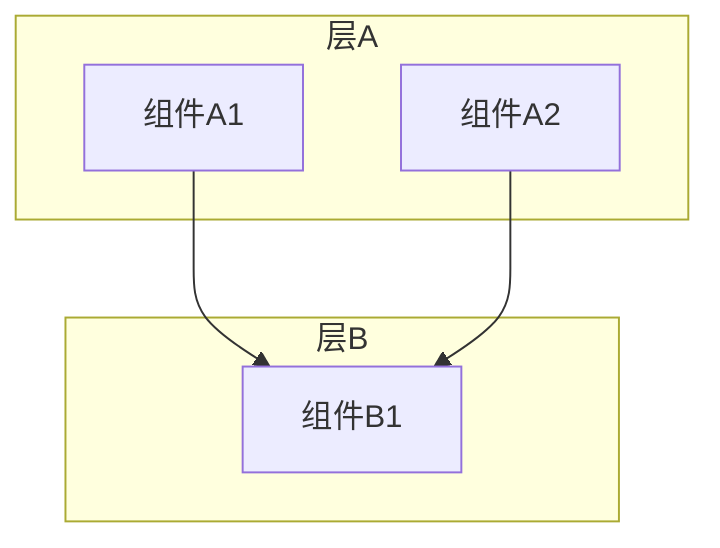
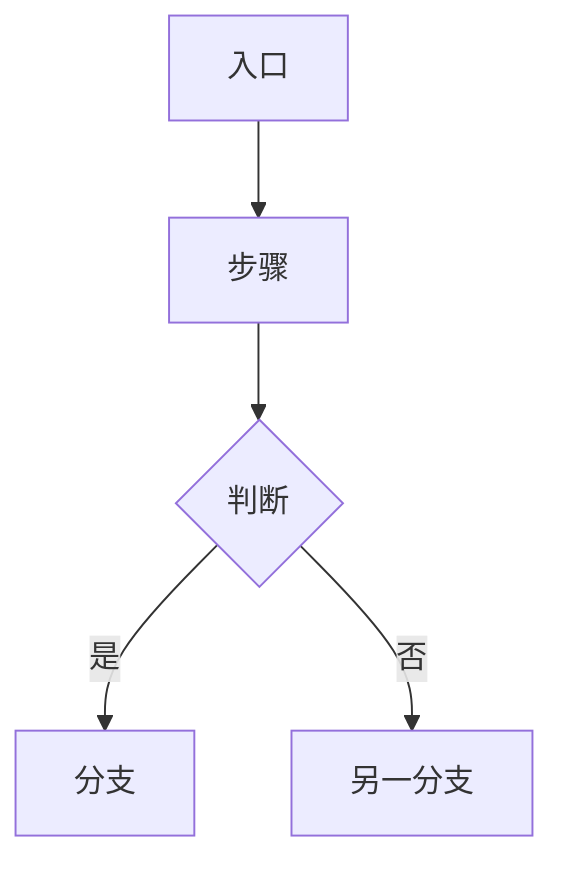
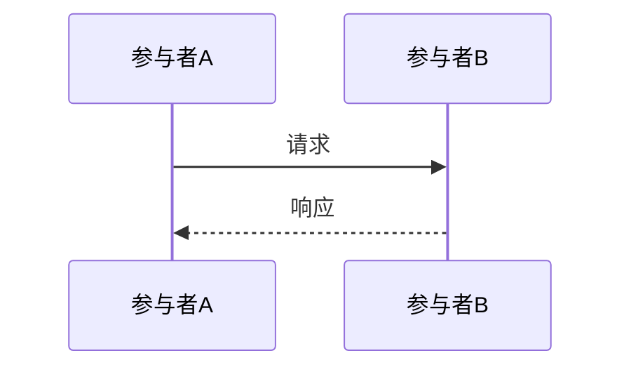
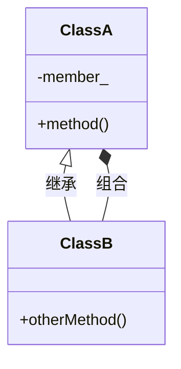

# Runtime 架构文档模版规范

本文档定义 Runtime 架构说明文档的格式要求。

---

## 一、目录结构规范

```
runtime-doc/
├── README.md                 # 文档导航索引（必选）
├── architecture.md           # 系统架构总览（必选）
├── modules/                  # 模块架构文档（可选）
│   ├── runtime/
│   │   └── runtime.md        # Runtime 全局管理
│   ├── device/
│   │   └── device.md         # Device 模块
│   ├── stream/
│   │   └── stream.md         # Stream 模块
│   ├── task/
│   │   └── task.md           # Task 模块
│   ├── memory/
│   │   └── memory.md         # Memory 模块
│   ├── kernel/
│   │   └── kernel.md         # Kernel 模块
│   └── context/
│   │   └── context.md        # Context 模块
│   └── event/
│   │   └── event.md          # Event 模块
│   └── model/
│   │   └── model.md          # Model 模块
│   └── ...
├── features/                 # 特性设计文档（可选）
│   ├── snapshot.md           # 程序快照特性功能
│   └── aclgraph.md           # ACL Graph特性功能
└── constraints/              # 设计约束文档（可选）
    ├── thread_model.md
    └── memory_constraints.md
```

---

## 二、文档模板

1. architecture.md（系统架构总览文档）模板，参见[tpl_architecture.md](tpl_architecture.md)
2. modules/[name].md 模板，参见[tpl_module.md](tpl_module.md)
3. features/[name].md 模板，参见[tpl_feature.md](tpl_feature.md)
4. README.md 模板，参见[tpl_readme.md](tpl_readme.md)

---

## 三、Mermaid 图表规范

### 架构分层图（graph TB）



### 流程图（flowchart TD）



### 时序图（sequenceDiagram）



### 类图（classDiagram）



---

## 四、写作规范

### 代码标注

- 文件位置：`模块/文件名.cc`（相对路径）
- 代码片段：标注来源文件

示例：
```cpp
// 文件位置：device/device.cc
rtError_t Device::Init() {
    // 实现
}
```

### 表格使用

所有接口、模块、文件用表格列出：
- 接口列表
- 模块职责
- 文件索引

### 禁止内容

- ❌ 不存在的类名、方法名
- ❌ 不存在的文件路径
- ❌ 未在源码中找到的功能
- ❌ README/CHANGELOG 等辅助文档