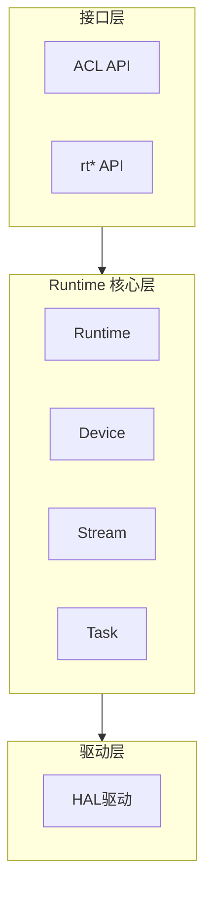

**写作要点：**

1. **必须包含架构图**：使用 mermaid（graph TB/flowchart TD/sequenceDiagram）绘制分层架构和流程
2. **表格化接口和模块职责**：便于快速查阅
3. **设计决策说明**：说明"为什么这样设计"，而非仅描述"是什么"
4. 系统架构应该对功能模块和特性进行概括性提炼后描述，不列举细节代码和代码路径。避免代码频繁变更而影响系统架构说明的准确性。

**系统架构总览文档格式要求：**

```markdown
# Runtime 架构介绍

## 系统架构总览

**功能概述**：CANN Runtime 是华为昇腾 AI 处理器的运行时组件...

### 整体架构图



### 核心模块介绍

#### Runtime 全局管理

**组件职责**：单例管理全局资源

**核心流程**：简述核心流程，如：全局资源初始化，去初始化；资源生命周期管理...

**设计考量**(可选)：描述核心组件设计初衷和背后的考量。

...（其他组件）

### 核心模块类关系

**模块类图**

  [使用mermaid画出Runtime核心模块类关系]

**核心模块关系**


| 关系                   | 说明                                                     |
| ---------------------- | -------------------------------------------------------- |
| **Runtime → Device**  | Runtime 管理所有设备实例，通过 DeviceRetain/Release 管理 |
| **Runtime → Context** | Runtime 管理主上下文，每个设备对应一个主上下文           |

## 特性功能介绍

### [特性名称]

**特性功能说明**
**特性设计初衷**
**特性功能使用场景和价值**

- [场景一]
  可以辅以简清伪码进行说明
- [场景二]

## 设计原则

### 架构设计原则


| 原则 | 说明 | 实现方式 |
| --- | --- | --- |
| 分层设计 | 采用 API/Feature/Core/Driver 四层架构分离，确保各层职责清晰、边界明确 | 目录结构按层级划分：api/、feature/、core/src/、driver/ |
| 核心层精简 | 核心层作为 Runtime 最小功能集合，支持所有形态的复用与依赖 | 定义核心功能集合，基于单一职责原则界定核心对象的能力边界 |
| 特性高内聚 | 特性功能层实现端到端的接口定义与功能实现，确保模块独立性 | 特性以独立目录组织：feature/aclgraph、feature/snapshot、feature/model |
| 特性可插拔 | 特性功能采用独立目录管理，支持按需加载与灵活扩展 | 可按特性目录进行选择性编译和动态加载 |
| 抽象接口 | Device 采用抽象接口设计，实现接口与实现解耦 | Device → GroupDevice → RawDevice 三层继承体系 |
| 硬件差异适配 | 通过 config/ 目录统一管理不同芯片的配置差异 | 按芯片型号组织配置：config/as31xm1/、config/bs9sx1a/ 等 |

### 高性能设计原则
[说明Runtime提供高性能运行时功能，代码遵循高性能设计原则]


```
