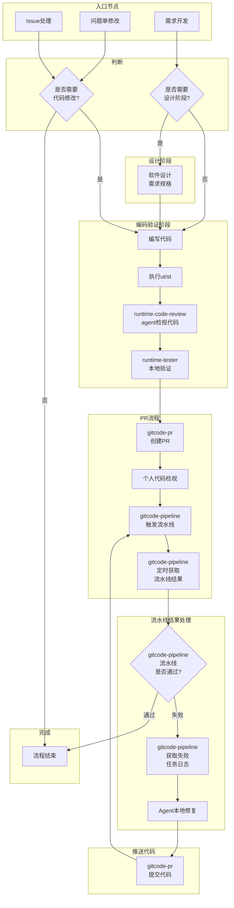

# Runtime 仓 Agent skills 规划

## Runtime 仓 skills 清单

> **说明**：清单中 `[x]` 表示该 skill 已就绪（ready），`[ ]` 表示该 skill 尚在规划中，还未实现。

- [x] **gitcode-issue** — 读取 Issue 详情、读取和回复评论，触发指令 `读取issue 168，并提交pr修复`
- [x] **gitcode-pr** — 创建 PR、cherry-pick 代码到商用分支，触发指令`检视pr 1437` 或 `创建pr到develop分支`
- [ ] **superpowers** — 需求开发（生成软件设计文档、编码、生成测试用例），触发指令`开发需求，要求……`
- [x] **runtime-code-review** — 遵循各种编码规范、模块软件设计约束检视本地代码与 GitCode PR
- [ ] **gitcode-pipeline** — 触发流水线任务、查询流水线状态、获取失败任务日志
- [ ] **runtime-dt-runner** — 编译和执行 UT/ST 用例
- [ ] **runtime-tester** — 生成用例，在带有npu的环境上执行用例
- [ ] **api-doc-generator** — 对外api生成文档
- [ ] **install-cann-toolkit** — 下载最新cann toolkit包，安装

## agent要支持的流程

- 需求开发：完成从软件设计到编码再到验证完整流程，使用gitcode-pr提交pr，个人检视代码，gitcode-pipeline触发流水线，并定时获取结果，如果流水线失败，可获取对应失败任务日志，本地修改代码，再次提交pr监控流水线。
- 问题单修改：修改代码，后续提交pr流程与上面一致。
- 解决issue：使用gitcode-issue读取issue及评论，如果涉及修改代码或文档，与上述流程一致。
- 执行测试用例或样例：使用runtime-test在真实环境中执行用例

## Runtime 仓 skills 路径

- 项目组共享，希望能做到启动agent默认安装或更新
- 仅在runtime仓使用的skills可直接提交到runtime仓`.claude/skills`目录
- 多个仓共用的skills，源码在公共仓（当前是https://gitcode.com/cann-agent/skills），启动agent时会自动下载或者更新skills到`.claude/skills`目录

> **注意**：`gitcode-issue`、`gitcode-pr` 等跨仓共享的 skills 不在 Runtime 仓的 `.claude/skills` 目录中维护。它们的源码存放在公共仓，在 runtime 目录下启动 agent 后会自动下载并安装到本地 `.claude/skills` 目录。

## Agent辅助流程

