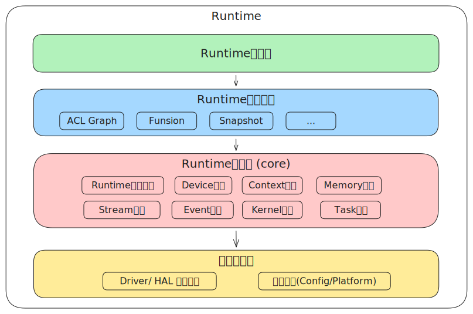
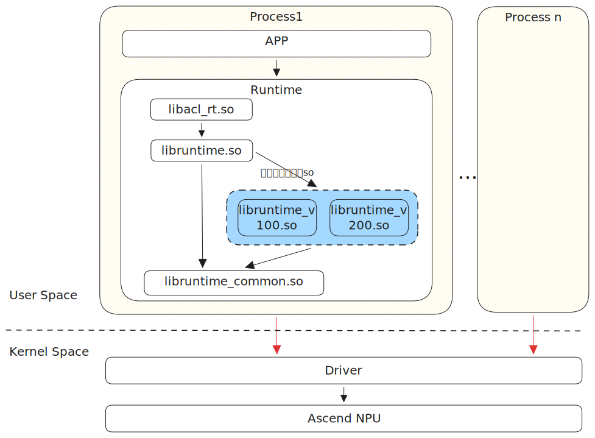
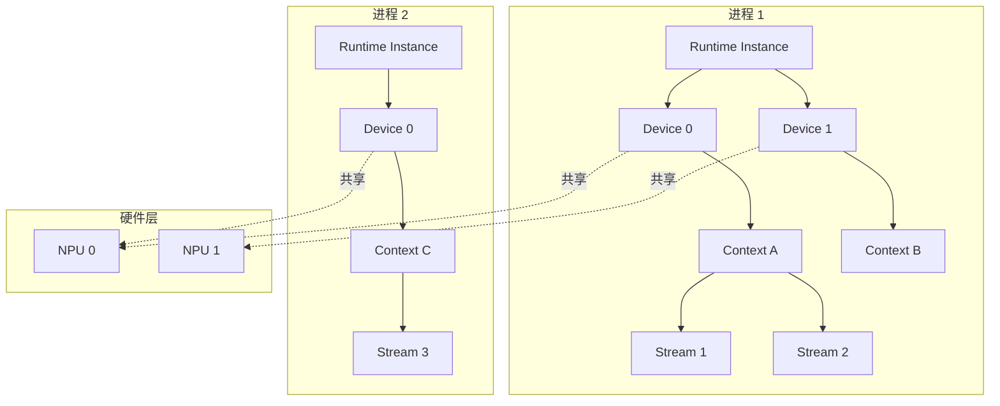
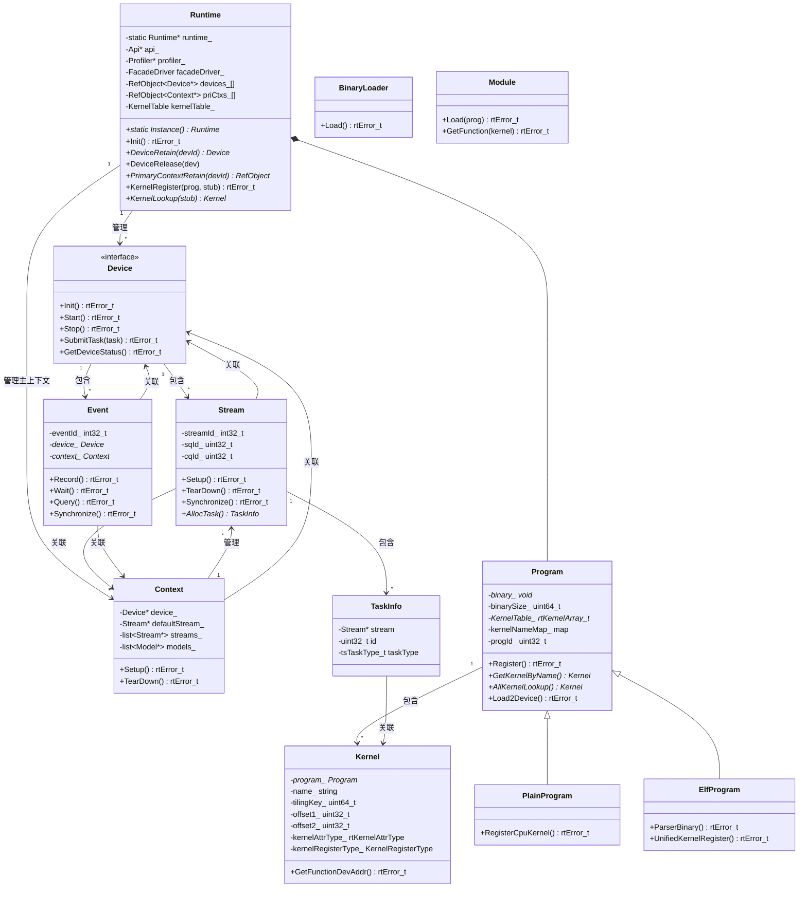
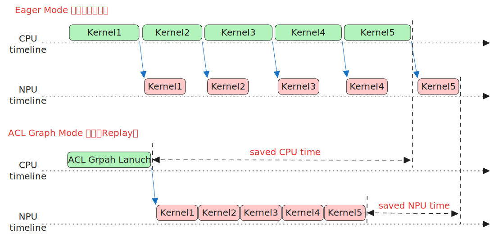
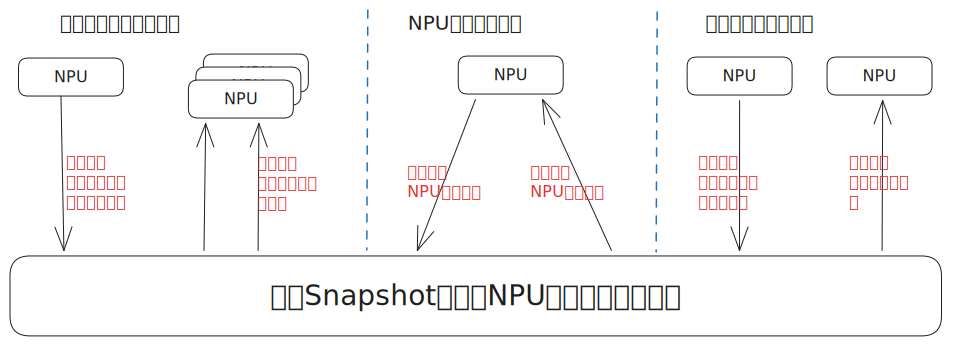
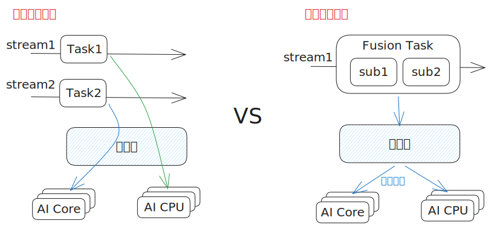

# Runtime 架构介绍

## 1 系统架构总览

**功能概述**：CANN Runtime 是华为昇腾 AI 处理器的运行时组件，提供设备管理、任务调度、内存管理、内核执行等核心功能，是上层AI计算框架（如 Pytorch, Mindspore, Tensorflow）和加速库（如  算子库、通信库、领域加速库、图引擎等）与底层驱动之间的桥梁。

### 1.1 Runtime逻辑架构图

* Runtime 接口层：对外提供 C/C++ 语言 API，封装核心实现和特性功能。主要分为三类：以 rt 为前缀的底层运行时接口（如rtSetDevice、rtMalloc）、以 aclrt 为前缀的 ACL 运行时功能接口（如 aclrtStreamCreate、aclrtLaunchKernel）、以及以aclmdlRI 为前缀的 ACL Graph/Model 特性接口。接口层统一处理参数校验、错误码转换。
* Runtime 特性层：基于核心层能力构筑可插拔的特性功能，包括：ACL Graph（流捕获与图构建）、Model（模型加载与执行）、Fusion（算子融合）、Snapshot（进程快照与故障诊断）等。
* Runtime核心层：提供设备管理（Device）、上下文管理（Context/主上下文）、流管理（Stream/SQ-CQ异步机制）、任务调度（Engine/TaskFactory）、内存管理（MemoryPool）、内核执行（Kernel/Program）、事件同步（Event）、通知机制（Notify）等核心功能，是 Runtime 的核心实现主体。
* 驱动适配层：适配层为 Runtime **核心层** 和**特性层**提供不同代际芯片的抽象和适配，屏蔽硬件和驱动接口差异。通过driver/v100、v200 等版本目录支持多代际芯片；通过 config/ 目录（如 910、310P、BS9SX1A 等）管理芯片特性配置；通过HAL 驱动接口（ascend_hal.h）统一驱动调用入口。

### 1.2 Runtime部署视图

Runtime 以动态库形式部署在用户态进程空间，作为上层应用与底层驱动之间的桥梁。下图展示了 Runtime 在系统中的部署位置和层级关系：

**部署层级说明**：

| 层级 | 组件 | 部署位置 | 说明 |
|------|------|----------|------|
| 应用层 | AI框架、算子库、通信库 | 用户态进程 | PyTorch、MindSpore、TensorFlow 等 AI 框架，以及 ACL 算子库、HCCL 通信库等 |
| Runtime层 | CANN Runtime | 用户态动态库 | 提供 `libacl_rt.so`、`libruntime.so` 、`libruntime_v100/v200.so`、`libruntime_common.so`库文件，以动态链接方式加载到应用进程 |
| 驱动层 | Ascend Driver | 内核态 | 驱动模块 `ascend_km` 运行在内核空间，通过 `/dev/davinci*` 设备文件与用户态交互 |
| 硬件层 | Ascend NPU | 物理设备 | 昇腾 AI 处理器（如 910、310P、950 等），提供 AI Core、AI CPU、CCU 等计算单元 |

**进程模型**：

Runtime 采用进程内单例模式运行：

- **单进程多设备**：一个进程可管理多个 NPU 设备（通过 `aclrtSetDevice` 切换）
- **单进程多上下文**：一个进程可创建多个 Context（每个 Context 关联一个 Device）
- **单进程多 Stream**：一个 Context 可创建多个 Stream，实现任务并行
- **多进程隔离**：不同进程的 Runtime 实例完全隔离，各自维护独立的资源状态

### 1.3 核心模块介绍

#### 1.3.1 Runtime 全局管理

**组件职责**：单例管理全局资源，包括设备、上下文、程序、内核的创建、引用计数和销毁。

**核心流程**：

- 全局资源初始化与去初始化
- 设备获取与释放（DeviceRetain/DeviceRelease）
- 主上下文管理（PrimaryContextRetain/PrimaryContextRelease）
- 内核注册与查找（KernelRegister/KernelLookup）
- 性能分析启停（ProfilerStart/ProfilerStop）

#### 1.3.2 Device 设备管理

**组件职责**：管理昇腾 AI 处理器的设备资源，对外提供计算设备设置，重置，查询和配置功能。内部包括了设备初始化、启动、停止、状态管理、任务提交、资源池管理等能力。

**核心流程**：

- 设备初始化：驱动初始化 → 获取设备属性 → 创建资源池 → 启动调度引擎
- 任务提交：检查设备状态 → Engine.SubmitTask → Stream 分配 → 发送到 SQ
- 错误处理：检测错误 → 设置设备状态 → 停止设备 → 触发回调

#### 1.3.3 Context 上下文管理

**组件职责**：管理计算设备的执行上下文环境。对外提供上下文创建，销毁，属性查询、配置接口。内部关联 Device 和 Stream，管理程序加载和内核执行等。

**核心流程**：

- 上下文创建：关联 Device → 创建默认 Stream
- 程序加载：BinaryLoad → 加载内核二进制到设备
- 内核执行：KernelLaunch → 提交任务到 Stream

#### 1.3.4 Memory 内存管理

**组件职责**：管理设备内存和主机内存的分配、操作和释放。对外提供内存申请释放、内存拷贝、内存设置等接口。内部支持多种内存类型管理、内存池机制、异步内存操作、物理内存管理和进程间内存共享。

**核心流程**：

- 内存分配：参数校验 → 选择内存类型 → 调用驱动分配 → 返回地址
- 内存拷贝：确定拷贝方向 → 创建拷贝任务 → 提交到 Stream → DMA 执行
- 内存释放：地址校验 → 调用驱动释放 → 更新资源池

#### 1.3.5 Stream 流管理

**组件职责**：管理Device提供的逻辑任务队列，对外提供Stream创建、销毁，属性配置，流同步和状态管理等接口。内部通过 SQ/CQ 机制与硬件交互，实现任务的异步执行。

**核心流程**：

- 流创建：分配 streamId → 绑定 SQ/CQ → 初始化资源
- 任务提交：AllocTask → 填充参数 → 发送到 SQ → 等待 CQ 完成
- 流同步：Synchronize → 等待所有任务完成 → 返回结果

#### 1.3.6 Kernel 核函数管理

**组件职责**：管理 AI Core（AI Cube、AI Vector）、AICPU 等算子二进制的注册、查找和执行。支持按核函数名称/核函数标识两种查找方式。

**核心流程**：

- 二进制注册：aclrtBinaryLoadFromFile/FromData → BinaryLoader::Load → Program::Register → UnifiedKernelRegister（ElfProgram）或 RegisterCpuKernel（PlainProgram）
- 内核查找：aclrtBinaryGetFunction → Program::GetKernelByName（按核函数名称）或 aclrtBinaryGetFunctionByEntry → Program::AllKernelLookup（按核函数标识二分查找）
- 设备加载：Program::Load2Device → 分配设备内存 + 4K 对齐 + H2D 拷贝
- 内核执行：Kernel::GetFunctionDevAddr → 返回设备端函数地址 → 配合 ArgLoader 加载参数 → 下发 Task

#### 1.3.7 Task 任务管理

**组件职责**：管理各类任务的创建、执行和回收，支持多种任务类型包括计算类任务，内存拷贝任务，事件同步类任务等等。

**核心流程**：

- 任务分配：TaskFactory.AllocTask → 填充 TaskInfo
- 任务提交：填充 SQE → 发送到 SQ → 等待 CQ
- 任务回收：从 CQ 获取完成状态 → RecycleTask → 更新资源池

#### 1.3.8 Event 事件同步

**组件职责**：提供同步机制（Event是用于流间任务的同步），支持事件记录、等待和状态查询和事件时间戳功能。

**核心流程**：

- 事件记录：EventRecord → 在 Stream 中记录位置
- 事件等待：EventWait → 等待事件完成
- 状态查询：EventQuery → 返回事件状态

### 1.4 核心模块类关系

**模块类图**

**核心模块关系**

| 关系                     | 说明                                                             |
| ------------------------ | ---------------------------------------------------------------- |
| Runtime → Device        | Runtime 管理所有设备实例，通过 DeviceRetain/Release 管理引用计数 |
| Runtime → Context       | Runtime 管理主上下文，每个设备对应一个主上下文                   |
| Runtime → Program       | Runtime 维护 Program，支持内核二进制管理                         |
| Program → Kernel        | Program 包含多个 Kernel，通过 kernelNameMap_ 和 KernelTable_ 支持按名称和 tilingKey 注册查找 |
| PlainProgram → Program  | PlainProgram 继承 Program，管理 CPU 算子简单二进制               |
| ElfProgram → Program    | ElfProgram 继承 Program，管理 ELF 内核解析与注册                 |
| BinaryLoader → Program  | BinaryLoader 加载二进制创建 Program                              |
| Module → Program        | Module 将 Program 二进制加载到设备侧内存                         |
| Device → Stream      | Device 包含多个 Stream 实例                                   |
| Device → Event       | Device 包含多个 Event 实例，管理事件注册与销毁                |
| Context → Stream        | Context 创建和管理 Stream，作为 Stream 的容器                    |
| Context → Device        | Context 关联 Device，持有设备引用                                |
| Stream → TaskInfo       | Stream 分配和管理任务信息                                        |
| Stream → Context        | Stream 关联 Context，持有上下文引用                              |
| Stream → Device         | Stream 关联 Device，持有设备引用                                 |
| Event → Device          | Event 关联 Device，持有设备引用                                  |
| Event → Context         | Event 关联 Context，持有上下文引用                               |
| TaskInfo → Kernel       | TaskInfo 关联 Kernel，指向执行的内核函数                         |

## 2 特性功能介绍

### 2.1 ACL Graph（流捕获）

**特性功能说明**：支持流捕获，允许将 Stream 中的任务序列捕获为可复用的图结构，实现任务下沉到 Device 执行，减少 Host 侧任务下发开销。性能收益如下图所示：

**特性设计初衷**：在主流框架（如 PyTorch）采用的 Eager 模式下，每个操作或任务都是边下发边执行，这种模式带来便捷的调试功能，但同时也带来了 Host 的下发开销。随着性能优化的深入，这些 Host 开销逐渐成为瓶颈。通过捕获 Stream 任务到模型中并执行，可以将相关任务下沉到 Device 上执行，从而减少 Host 开销。

**ACL Graph支持如下功能**：

- **单流捕获**：将单个 Stream 上的任务序列捕获为可复用的图结构，通过 `aclmdlRICaptureBegin/End` 接口将任务暂存到模型中，支持多次调用 `aclmdlRIExecuteAsync` 执行，减少 Host 侧重复下发开销。捕获过程中禁止对 Stream、Event、Device、Context 的同步或查询操作。
- **跨流捕获**：通过 Event 建立 Stream 间依赖关系，将多个 Stream 上的任务捕获到同一模型中。主流调用 `aclmdlRICaptureBegin` 开始捕获，其他 Stream 通过 `aclrtRecordEvent/StreamWaitEvent` 直接或间接依赖主流进入捕获状态，最终需通过 Event 返回主流，实现跨 Stream 任务协同执行。
- **任务更新**：支持运行时更新已捕获任务的参数或任务本身。提供两种方式：分界点捕获（将待更新任务前后分模型执行，适合大量任务更新）和任务组标记更新（通过 `aclmdlRICaptureTaskGrpBegin/End` 标记待更新任务，支持并发更新，适合少量任务更新），适配动态 Shape 或参数调整场景。

### 2.2 Snapshot（进程快照）

**特性功能说明**：对外提供aclrtSnapShot*接口，支持Context/算子/Driver/设备全栈控制信息支持进程状态保存和恢复，用于故障快速恢复。本特性支持回调机制，允许业务层自定义快照状态的保存与恢复逻辑，架构上具备更强的可扩展性。

**特性设计初衷**：大规模AI集群的故障恢复效率直接影响训练任务的可用性与资源利用率。传统故障恢复链路涉及容器调度、进程重建、主机与设备建链、算子编译、权重加载等多个串行环节，单次恢复耗时可达十余分钟，万卡规模下训练中断的算力损失极为可观。快照机制将关键执行状态提前持久化，故障发生后跳过冗长的初始化流程直接从快照点恢复，可将训练任务恢复时间压缩至分钟以内，推理服务冷启动同样获得数量级提升。

**特性功能使用场景和价值**：

- 弹性推理任务快速冷启
- NPU任务快速切换
- 容错的长时运行任务

### 2.3 Fusion（任务融合）

**特性功能说明**：对外提供rtFusionLaunch接口，支持多个不同类型子任务（AI Core、AI CPU、CCU等）的融合执行。由于通过将多个算子或任务组合为一个融合任务提交，减少任务调度开销；更重要的是调度器会采用gang-sched调度模式，在确保融合算子所需的所有计算单元满足后，一并发起调度。

**特性设计初衷**：在传统模式下，若要并行调度多个不同类型的任务时，要将多个任务分别提交到不同 Stream 。然而调度器并不感知不同流上任务的相关性，也就不会确保这些并行任务资源满足后同时调度。因此传统调度方式要么会导致先调度的任务等待后调度的任务，导致核空闲浪费，甚至会产生任务死锁问题。任务融合调度功能应运而生。

**Fusion 支持如下子任务类型**：

- **AI Core 任务**：AI Core 算子执行，支持 AI Core、AI Cube、AI Vector 等不同计算单元。
- **AI CPU 任务**：AI CPU 算子执行，在 CPU 上运行的算子。
- **CCU 任务**：CCU任务(Collective  Communication Unit，集合通信处理单元)。

**典型融合组合模式**：

- AI CPU + AI Core：AI CPU 算子和AI Core算子融合调度执行，实现AI CPU和AI Core的计算并行或通算并行业务。
- CCU + AI Core：CCU 任务和AI Core 算子融合调度执行，实现通算并行业务。

## 3 设计原则

### 3.1 架构设计原则

| 原则         | 说明                                                                  | 实现方式                                                              |
| ------------ | --------------------------------------------------------------------- | --------------------------------------------------------------------- |
| 分层设计     | 采用 API/Feature/Core/Driver 四层架构分离，确保各层职责清晰、边界明确 | 目录结构按层级划分：api/、feature/、core/src/、driver/                |
| 核心层精简   | 核心层作为 Runtime 最小功能集合，支持所有形态的复用与依赖             | 定义核心功能集合，基于单一职责原则界定核心对象的能力边界              |
| 特性高内聚   | 特性功能层实现端到端的接口定义与功能实现，确保模块独立性              | 特性以独立目录组织：feature/aclgraph、feature/snapshot、feature/model |
| 特性可插拔   | 特性功能采用独立目录管理，支持按需加载与灵活扩展                      | 可按特性目录进行选择性编译和动态加载                                  |
| 抽象接口     | Device 采用抽象接口设计，实现接口与实现解耦                           | Device → GroupDevice → RawDevice 三层继承体系                       |
| 硬件差异适配 | 通过 config/ 目录统一管理不同芯片的配置差异                           | 按芯片型号组织配置：config/as31xm1/、config/bs9sx1a/ 等               |

### 3.2 高性能设计原则

Runtime 提供极致性能运行时功能，代码遵循高性能设计原则。

| 原则           | 说明                                         |
| -------------- | -------------------------------------------- |
| 任务预分配     | TaskFactory 预分配任务对象，减少分配开销     |
| 资源池复用     | 内存、Event、Notify 池复用，避免频繁创建销毁 |
| SQ/CQ 池化     | 多 Stream 共享 SQ/CQ 资源                    |
| 原子状态       | 关键状态使用原子操作，减少锁开销             |
| 异步任务提交   | 任务异步提交，不阻塞调用线程                 |
| 内核表快速查找 | KernelTable 采用二分查找，优化查找效率       |

---

_本架构文档基于源码 `src/runtime/core/src/` 分析。_
