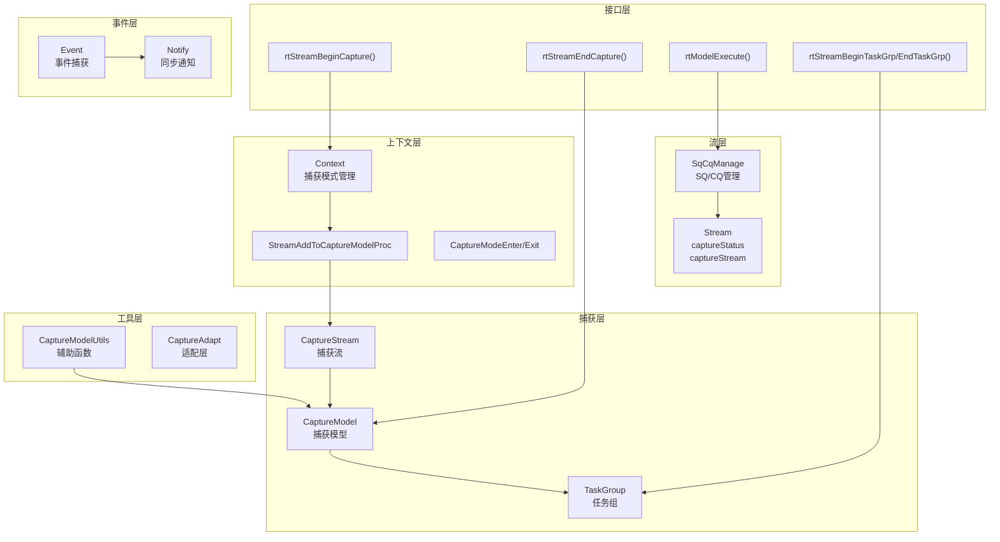
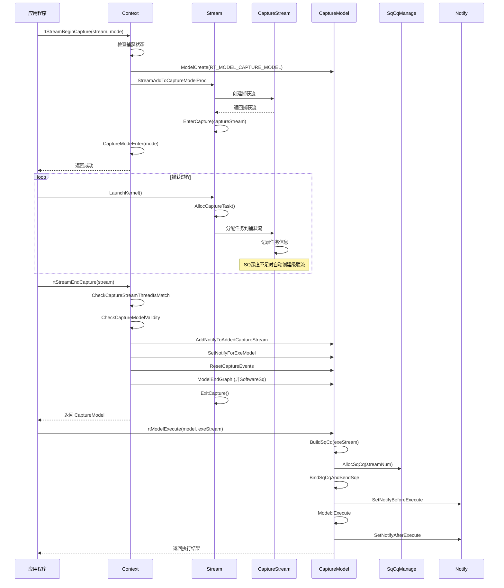
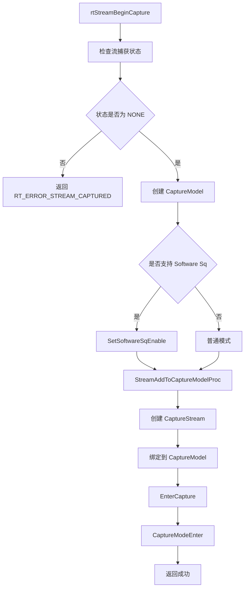
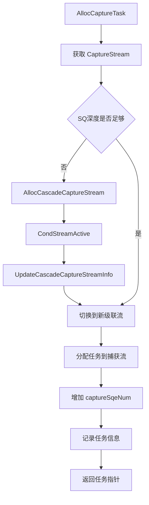
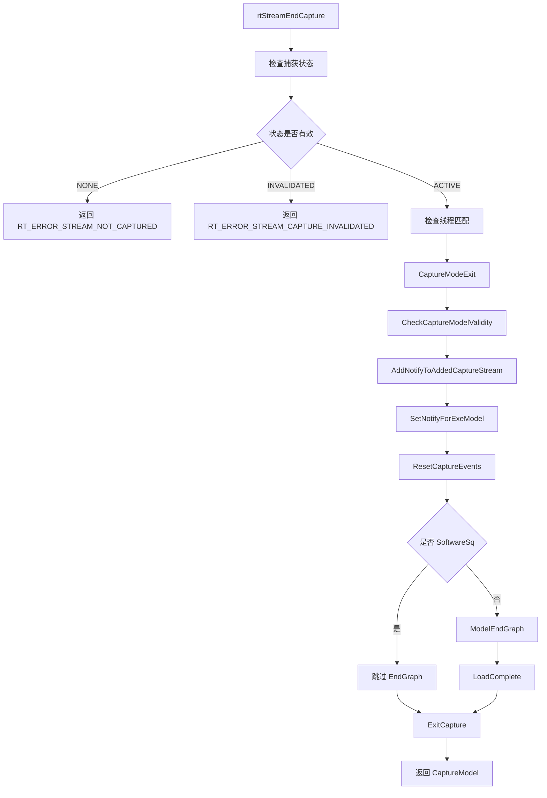
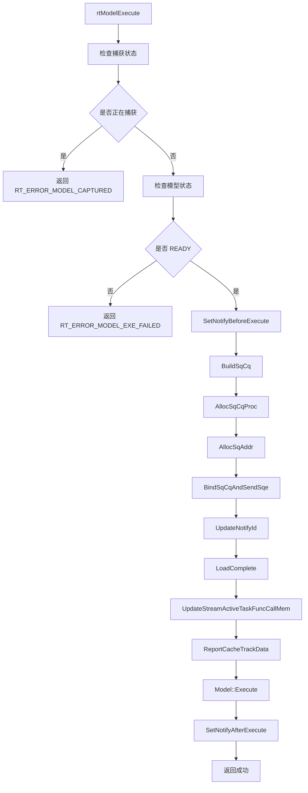
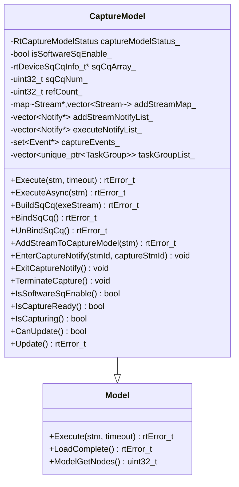
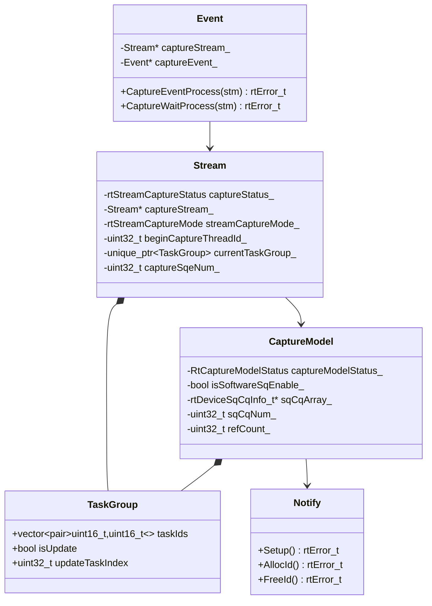
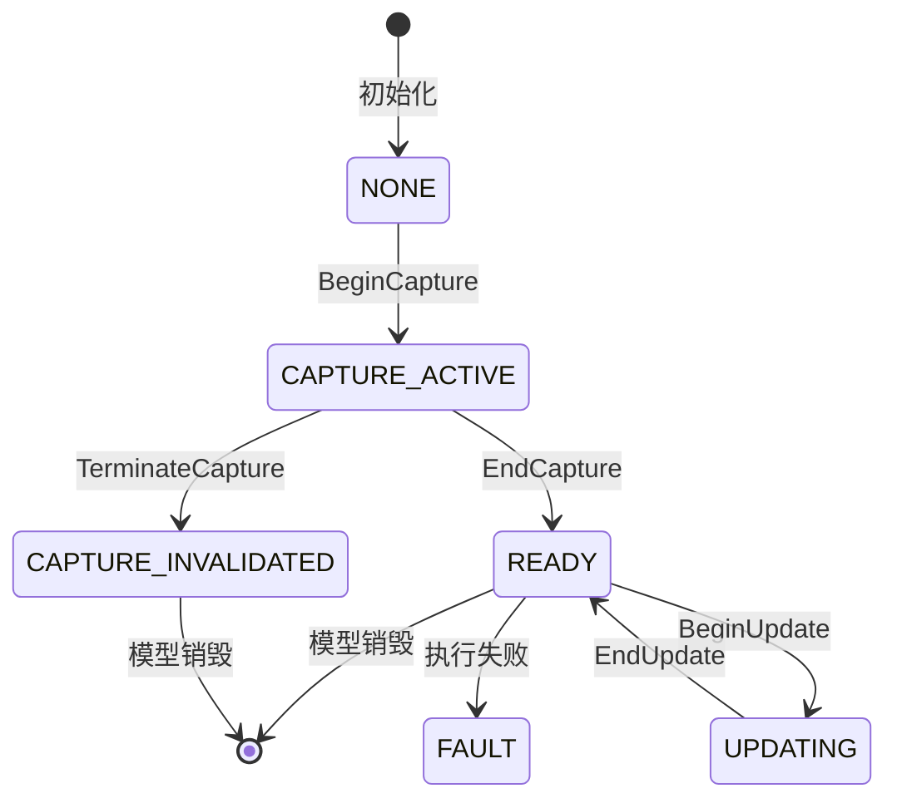

# ACL Graph 特性

## 1. 特性概述

- **特性介绍**：ACL Graph（流捕获）特性支持将单算子流上的任务序列捕获为可复用的 CaptureModel，实现任务序列的优化执行和资源复用。捕获后的图可多次执行，减少调度开销。
- **问题背景**：单算子执行模式下，每次算子执行都需要单独提交任务，存在调度开销。通过捕获算子序列构建优化图，可减少调度开销并实现算子序列复用。
- **设计目标**：
  - 支持流捕获机制（BeginCapture/EndCapture）
  - 支持多捕获模式（GLOBAL/THREAD_LOCAL/RELAXED）
  - 支持级联捕获和扩流机制
  - 支持软件 SQ 动态绑定
  - 支持 TaskGroup 任务组管理
  - 支持图更新和多次执行

## 2. 使用场景与对外接口

### 2.1 使用场景

- **场景一**：单算子流捕获
  ```cpp
  // 开始捕获
  rtError_t ret = rtStreamBeginCapture(stream, RT_STREAM_CAPTURE_MODE_GLOBAL);
  
  // 执行算子序列（任务被记录而非立即执行）
  rtKernelLaunch(stream, kernel1, ...);
  rtKernelLaunch(stream, kernel2, ...);
  
  // 结束捕获，获得 CaptureModel
  rtModel_t captureModel;
  ret = rtStreamEndCapture(stream, &captureModel);
  
  // 多次执行捕获的图
  ret = rtModelExecute(captureModel, exeStream, -1);
  ```

- **场景二**：多流捕获（级联捕获）
  ```cpp
  // 在原始流上开始捕获
  rtStreamBeginCapture(stream1, RT_STREAM_CAPTURE_MODE_GLOBAL);
  
  // 当 SQ 深度不足时，自动创建级联流继续捕获
  // 或主动添加其他流到捕获模型
  rtStreamAddToModel(stream2, captureModel);
  
  // 结束捕获
  rtStreamEndCapture(stream1, &captureModel);
  ```

- **场景三**：TaskGroup 任务组
  ```cpp
  // 开始任务组
  rtStreamBeginTaskGrp(stream);
  
  // 执行一系列任务
  rtKernelLaunch(stream, kernel1, ...);
  rtKernelLaunch(stream, kernel2, ...);
  
  // 结束任务组，获得 TaskGroup handle
  TaskGroup *handle;
  rtStreamEndTaskGrp(stream, &handle);
  
  // 后续可更新任务组中的任务
  rtStreamBeginTaskUpdate(stream, handle);
  rtStreamEndTaskUpdate(stream);
  ```

- **场景四**：模型更新
  ```cpp
  // 检查模型是否支持更新
  rtError_t ret = rtCheckCaptureModelForUpdate(stream);
  
  // 更新模型
  ret = rtModelUpdate(captureModel);
  ```

### 2.2 对外接口

| 接口 | 文件位置 | 说明 |
|------|----------|------|
| `rtStreamBeginCapture()` | `src/runtime/api/api_c_standard_soc.cc:674` | 开始流捕获 |
| `rtStreamEndCapture()` | `src/runtime/api/api_c_standard_soc.cc:695` | 结束流捕获 |
| `rtStreamGetCaptureInfo()` | `context_aclgraph.cc:502` | 获取捕获状态信息 |
| `rtStreamAddToModel()` | `context_aclgraph.cc:554` | 添加流到捕获模型 |
| `rtStreamBeginTaskGrp()` | `context_aclgraph.cc:622` | 开始任务组 |
| `rtStreamEndTaskGrp()` | `context_aclgraph.cc:656` | 结束任务组 |
| `rtStreamBeginTaskUpdate()` | `context_aclgraph.cc:690` | 开始任务更新 |
| `rtStreamEndTaskUpdate()` | `context_aclgraph.cc:708` | 结束任务更新 |
| `rtModelExecute()` | `capture_model.cc:218` | 执行捕获模型 |
| `rtModelExecuteAsync()` | `capture_model.cc:222` | 异步执行捕获模型 |
| `rtModelUpdate()` | `capture_model.cc:776` | 更新捕获模型 |
| `rtThreadExchangeCaptureMode()` | `context_aclgraph.cc:560` | 交换线程捕获模式 |

### 2.3 捕获模式定义

```cpp
// 捕获模式：控制多线程捕获行为
typedef enum {
    RT_STREAM_CAPTURE_MODE_GLOBAL = 0,      // 全局模式：所有线程共享捕获状态
    RT_STREAM_CAPTURE_MODE_THREAD_LOCAL = 1, // 线程本地模式：仅当前线程可操作
    RT_STREAM_CAPTURE_MODE_RELAXED = 2,      // 松弛模式：允许其他线程操作
    RT_STREAM_CAPTURE_MODE_MAX = 3
} rtStreamCaptureMode;
```

### 2.4 捕获状态定义

```cpp
// 流捕获状态
typedef enum {
    RT_STREAM_CAPTURE_STATUS_NONE = 0,       // 未捕获
    RT_STREAM_CAPTURE_STATUS_ACTIVE = 1,     // 正在捕获
    RT_STREAM_CAPTURE_STATUS_INVALIDATED = 2, // 捕获已失效
    RT_STREAM_CAPTURE_STATUS_COMPLETED = 3,  // 捕获已完成
} rtStreamCaptureStatus;

// 模型捕获状态
enum class RtCaptureModelStatus {
    NONE = 0,            // 初始状态
    CAPTURE_ACTIVE,      // 正在捕获
    CAPTURE_INVALIDATED, // 捕获失效
    UPDATING,            // 正在更新
    FAULT,               // 故障状态
    READY,               // 就绪状态（可执行）
};
```

## 3. 架构总览

### 整体设计思路

ACL Graph 通过 **CaptureModel** 管理捕获的图结构，**Stream** 维护捕获状态（captureStatus），捕获过程中通过 **级联流** 和 **TaskGroup** 管理任务序列。执行时通过 **Software SQ** 动态绑定实现高效调度。

### 架构分层图



### 核心模块交互图



## 4. 详细设计

### 4.1 核心流程

#### 流捕获开始流程



**关键代码**：

```cpp
// 文件位置：src/runtime/feature/aclgraph/context_aclgraph.cc:222-273
rtError_t Context::StreamBeginCapture(Stream * const stm, const rtStreamCaptureMode mode)
{
    Model *captureModel = nullptr;

    BufferAllocator::OpenHugeBuff();

    const rtStreamCaptureStatus status = stm->GetCaptureStatus();
    const int32_t streamId = stm->Id_();

    // 检查捕获状态
    if (status != RT_STREAM_CAPTURE_STATUS_NONE) {
        RT_LOG(RT_LOG_ERROR, "stream is already in capture status, device_id=%u, stream_id=%d, status=%s.",
            device_->Id_(), streamId, ((status == RT_STREAM_CAPTURE_STATUS_ACTIVE) ? "active" : "invalidated"));
        return RT_ERROR_STREAM_CAPTURED;
    }

    // 创建 CaptureModel
    rtError_t error = ModelCreate(&captureModel, RT_MODEL_CAPTURE_MODEL);
    if (error != RT_ERROR_NONE) {
        RT_LOG(RT_LOG_ERROR, "Capture model create failed, device_id=%u, original stream_id=%d, retCode=%#x.",
            device_->Id_(), streamId, error);
        return error;
    }

    // 检查是否支持 Software Sq
    if ((stm->Device_()->IsSupportFeature(RtOptionalFeatureType::RT_FEATURE_MODEL_ACL_GRAPH_SOFTWARE_ENABLE)) && 
        (stm->Device_()->CheckFeatureSupport(TS_FEATURE_SOFTWARE_SQ_ENABLE)) &&
        (NpuDriver::CheckIsSupportFeature(device_->Id_(), FEATURE_TRSDRV_SQ_SUPPORT_DYNAMIC_BIND)) &&
        (!Runtime::Instance()->GetConnectUbFlag())) {
        CaptureModel *captureModelTmp = dynamic_cast<CaptureModel *>(captureModel);
        captureModelTmp->SetSoftwareSqEnable();
    }

    std::unique_lock<std::mutex> taskLock(captureLock_);
    error = StreamAddToCaptureModelProc(stm, captureModel, true);
    // ...
    CaptureModeEnter(stm, mode);
    return RT_ERROR_NONE;
}
```

#### 任务捕获分配流程



**关键代码**：

```cpp
// 文件位置：src/runtime/feature/aclgraph/stream_capture.cc:76-131
rtError_t Stream::AllocCaptureTaskWithoutLock(tsTaskType_t taskType, uint32_t sqeNum, TaskInfo **task)
{
    Stream *curCaptureStream = GetCaptureStream();
    if (curCaptureStream == nullptr) {
        return RT_ERROR_STREAM_CAPTURE_EXIT;
    }

    // 检查 SQ 深度是否足够
    if ((curCaptureStream->GetCaptureSqeNum() + CAPTURE_TASK_RESERVED_NUM +
         device_->GetDevProperties().expandStreamRsvTaskNum) >=
         curCaptureStream->GetSqDepth()) {
        // SQ 深度不足，创建级联流
        Stream *newCaptureStream = nullptr;
        Context * const ctx = Context_();
        rtError_t error = AllocCascadeCaptureStream(newCaptureStream, curCaptureStream);
        // ...
        error = CondStreamActive(newCaptureStream, curCaptureStream);
        // ...
        UpdateCascadeCaptureStreamInfo(newCaptureStream, curCaptureStream);
        curCaptureStream = newCaptureStream;
    }

    // 分配任务
    rtError_t errCode = RT_ERROR_TASK_NEW;
    if (curCaptureStream->taskResMang_ == nullptr) {
        *task = device_->GetTaskFactory()->Alloc(curCaptureStream, taskType, errCode);
    }
    if (*task != nullptr) {
        curCaptureStream->AddCaptureSqeNum(sqeNum);
        (*task)->stream = curCaptureStream;
        Runtime::Instance()->AllocTaskSn((*task)->taskSn);
        // ...
    }
    return RT_ERROR_NONE;
}
```

#### 流捕获结束流程



**关键代码**：

```cpp
// 文件位置：src/runtime/feature/aclgraph/context_aclgraph.cc:401-500
rtError_t Context::StreamEndCapture(Stream * const stm, Model ** const captureMdl)
{
    std::unique_lock<std::mutex> taskLock(captureLock_);
    const rtStreamCaptureStatus status = stm->GetCaptureStatus();
    
    // 检查捕获状态
    if (status == RT_STREAM_CAPTURE_STATUS_NONE) {
        return RT_ERROR_STREAM_NOT_CAPTURED;
    }

    Stream *captureStream = stm->GetCaptureStream();
    if (!(captureStream->IsOrigCaptureStream())) {
        return RT_ERROR_STREAM_CAPTURE_UNMATCHED;
    }

    rtError_t error = CheckCaptureStreamThreadIsMatch(stm);
    // ...
    CaptureModeExit(stm);

    Model *captureModel = captureStream->Model_();
    CaptureModel *captureModelTmp = RtPtrToPtr<CaptureModel *, Model *>(captureModel);
    
    // 检查模型有效性
    error = CheckCaptureModelValidity(captureModel);
    // ...

    // 设置 Notify
    error = AddNotifyToAddedCaptureStream(stm, static_cast<CaptureModel *>(captureModelTmp));
    error = SetNotifyForExeModel(captureModelTmp);
    error = captureModelTmp->ResetCaptureEvents(stm);

    // 非 SoftwareSq 模式需要 EndGraph
    if (!captureModelTmp->IsSoftwareSqEnable()) {
        Api * const apiObj = Runtime::Instance()->ApiImpl_();
        error = apiObj->ModelEndGraph(captureModel, captureStream, 0U);
        error = captureModel->LoadComplete();
    }

    stm->ExitCapture();
    *captureMdl = captureModel;
    return RT_ERROR_NONE;
}
```

#### 模型执行流程



**关键代码**：

```cpp
// 文件位置：src/runtime/feature/aclgraph/capture_model.cc:178-217
rtError_t CaptureModel::ExecuteCommon(Stream * const stm, int32_t timeout, const uint8_t executeMode)
{
    RT_LOG(RT_LOG_INFO, "capture model execute, model_id=%u!", Id_());

    if (IsCapturing()) {
        RT_LOG(RT_LOG_ERROR, "model is capturing, can't execute, model_id=%u!", Id_());
        return RT_ERROR_MODEL_CAPTURED;
    }

    if (captureModelStatus_ != RtCaptureModelStatus::READY) {
        RT_LOG(RT_LOG_ERROR, "model is not ready, can't execute, model_id=%u, status=%d", Id_(), captureModelStatus_);
        return RT_ERROR_MODEL_EXE_FAILED;
    }

    rtError_t error;
    // 设置执行前同步
    error = SetNotifyBeforeExecute(stm, this);
    // ...

    // 构建 SQ/CQ
    error = BuildSqCq(stm);
    // ...

    ReportCacheTrackData();
    if (executeMode == RT_MODEL_CAPTURE_EXECUTE_DEFAULT) {
        error = Model::Execute(stm, timeout);
    } else {
        error = Model::ExecuteAsync(stm);
    }
    // ...

    // 设置执行后同步
    error = SetNotifyAfterExecute(stm, this);
    return RT_ERROR_NONE;
}
```

### 4.2 核心机制详解

#### CaptureModel 捕获模型

**设计思想**：管理捕获的图结构，支持 SQ/CQ 动态绑定、Notify 同步、Event 捕获等功能。



**关键代码**：

```cpp
// 文件位置：src/runtime/core/inc/model/capture_model.hpp:42-316
class CaptureModel : public Model {
public:
    explicit CaptureModel(ModelType type = RT_MODEL_CAPTURE_MODEL);
    ~CaptureModel() noexcept override;

    rtError_t Execute(Stream * const stm, int32_t timeout = -1) override;
    rtError_t ExecuteAsync(Stream * const stm) override;
    rtError_t TearDown() override;
    rtError_t AddStreamToCaptureModel(Stream * const stm);

    // 状态管理
    void SetCaptureModelStatus(RtCaptureModelStatus status);
    RtCaptureModelStatus GetCaptureModelStatus() const;
    void TerminateCapture();
    bool IsCaptureReady() const;
    bool IsCapturing() const;
    bool IsCaptureInvalid() const;
    bool CanUpdate() const;

    // SQ/CQ 管理
    bool IsSoftwareSqEnable(void) const;
    void SetSoftwareSqEnable(void);
    rtError_t BuildSqCq(Stream * const exeStream);
    void DeconstructSqCq(void);
    rtError_t ReleaseSqCq(uint32_t &releaseNum);

    // Notify 管理
    rtError_t SetNotifyBeforeExecute(Stream * const exeStm, CaptureModel* const captureMdl);
    rtError_t SetNotifyAfterExecute(Stream * const exeStm, CaptureModel* const captureMdl);
    void AddNotify(Notify *notify);
    void AddExeNotify(Notify *notify);

    // Event 管理
    void InsertCaptureEvent(Event * const event);
    std::set<Event *> GetCaptureEvent() const;
    rtError_t ResetCaptureEvents(Stream * const stm) const;

    // TaskGroup 管理
    void AddTaskGroupList(std::unique_ptr<TaskGroup> &taskGrp);
    void SetTaskGroupErrCode(const rtError_t errCode);
    const TaskGroup* GetTaskGroup(uint16_t streamId, uint16_t taskId);

    // 更新相关
    rtError_t Update(void);
    rtError_t RestoreForSoftwareSq(Device * const dev);

private:
    RtCaptureModelStatus captureModelStatus_{RtCaptureModelStatus::NONE};
    bool isSoftwareSqEnable_{false};
    rtDeviceSqCqInfo_t *sqCqArray_{nullptr};
    uint32_t sqCqNum_{0U};
    uint32_t refCount_{0U};
    std::map<Stream *, std::vector<Stream *>> addStreamMap_;
    std::vector<Notify *> addStreamNotifyList_;
    std::vector<Notify *> executeNotifyList_;
    std::set<Event *> captureEvents_;
    std::vector<std::unique_ptr<TaskGroup>> taskGroupList_;
    // ...
};
```

#### TaskGroup 任务组

**设计思想**：记录捕获过程中的任务序列，支持任务更新。

```cpp
// 文件位置：src/runtime/core/src/stream/stream.hpp:139-143
struct TaskGroup {
    std::vector<std::pair<uint16_t, uint16_t>> taskIds; // streamId + taskId
    bool isUpdate{false};
    uint32_t updateTaskIndex{0};
};
```

**任务组操作**：

```cpp
// 文件位置：src/runtime/feature/aclgraph/context_aclgraph.cc:622-688
rtError_t Context::StreamBeginTaskGrp(Stream * const stm)
{
    // 检查任务组状态
    const StreamTaskGroupStatus status = stm->GetTaskGroupStatus();
    COND_RETURN_ERROR_MSG_INNER(status != StreamTaskGroupStatus::NONE,
        RT_ERROR_STREAM_TASKGRP_STATUS,
        "Task group is repeatedly started, or a task group is being updated.");

    Stream *captureStream = stm->GetCaptureStream();
    CaptureModel *mdl = dynamic_cast<CaptureModel *>(captureStream->Model_());

    // 创建任务组
    std::unique_ptr<TaskGroup> taskGrp(new (std::nothrow) TaskGroup);
    // ...
    captureStream->UpdateCurrentTaskGroup(taskGrp);
    mdl->InsertTaskGroupStreamId(static_cast<uint16_t>(captureStream->Id_()));
    return RT_ERROR_NONE;
}

rtError_t Context::StreamEndTaskGrp(Stream * const stm, TaskGroup ** const handle) const
{
    Stream * const captureStream = stm->GetCaptureStream();
    CaptureModel *mdl = dynamic_cast<CaptureModel *>(captureStream->Model_());

    std::unique_ptr<TaskGroup> &taskGrp = captureStream->GetCurrentTaskGroup();
    
    rtError_t errorCode = mdl->GetTaskGroupErrCode();
    if ((errorCode != RT_ERROR_NONE) || (mdl->IsCaptureInvalid())) {
        taskGrp.reset();
        *handle = nullptr;
    } else {
        *handle = taskGrp.get();
        mdl->AddTaskGroupList(taskGrp);
    }
    captureStream->ResetTaskGroup();
    // ...
    return errorCode;
}
```

#### 捕获模式管理

**设计思想**：支持多线程捕获场景下的不同同步模式。

```cpp
// 文件位置：src/runtime/feature/aclgraph/context_aclgraph.cc:573-620
void Context::CaptureModeEnter(Stream * const stm, rtStreamCaptureMode mode)
{
    stm->SetStreamCaptureMode(mode);
    stm->SetBeginCaptureThreadId(runtime::GetCurrentTid());
    captureModeRefNum_[mode]++;
    InnerThreadLocalContainer::ThreadCaptureModeEnter(mode);

    // 更新 Context 级别捕获模式（取最小值）
    if (mode < GetContextCaptureMode()) {
        SetContextCaptureMode(mode);
    }
}

void Context::CaptureModeExit(Stream * const stm)
{
    const rtStreamCaptureMode streamCaptureMode = stm->GetStreamCaptureMode();
    stm->SetStreamCaptureMode(RT_STREAM_CAPTURE_MODE_MAX);
    stm->SetBeginCaptureThreadId(UINT32_MAX);

    if (captureModeRefNum_[streamCaptureMode] > 0U) {
        captureModeRefNum_[streamCaptureMode]--;
    }

    InnerThreadLocalContainer::ThreadCaptureModeExit(streamCaptureMode);

    // 根据引用计数更新 Context 级别捕获模式
    // ...
}
```

#### Event 捕获机制

**设计思想**：在捕获过程中处理 Event 的 Record/Wait 操作。

```cpp
// 文件位置：src/runtime/feature/aclgraph/event_capture.cc:19-90
rtError_t Event::CaptureEventProcess(Stream * const stm)
{
    // 分配捕获任务
    TaskInfo *tsk = stm->AllocTask(&submitTask, TS_TASK_TYPE_EVENT_RECORD, errorReason);
    // ...

    // 分配 Event 地址
    error = dev->AllocExpandingPoolEvent(&eventAddr, &newEventId);
    eventAddr_ = eventAddr;
    eventId_ = newEventId;

    // 初始化 MemWriteValue 任务
    (void)MemWriteValueTaskInit(tsk, eventAddr, static_cast<uint64_t>(1U));
    tsk->typeName = "EVENT_RECORD";
    tsk->type = TS_TASK_TYPE_CAPTURE_RECORD;
    // ...
    return error;
}

rtError_t Event::CaptureWaitProcess(Stream * const stm)
{
    TaskInfo *tsk = stm->AllocTask(&submitTask, TS_TASK_TYPE_STREAM_WAIT_EVENT, errorReason, MEM_WAIT_SQE_NUM);
    // ...

    tsk->typeName = "EVENT_WAIT";
    tsk->type = TS_TASK_TYPE_CAPTURE_WAIT;
    error = MemWaitValueTaskInit(tsk, eventAddr, 1, 0x0);
    // ...
    return error;
}
```

#### Software SQ 动态绑定

**设计思想**：支持 SQ/CQ 的动态绑定，实现高效的图执行。

```cpp
// 文件位置：src/runtime/feature/aclgraph/capture_model.cc:471-567
rtError_t CaptureModel::BuildSqCq(Stream * const exeStream)
{
    // 检查是否启用 Software Sq
    COND_PROC(!IsSoftwareSqEnable(), return RT_ERROR_NONE);
    // ...

    const uint32_t streamNum = static_cast<uint32_t>(StreamList_().size());
    
    // 分配 SQ/CQ 资源
    rtError_t error = AllocSqCqProc(streamNum);
    // ...

    sqCqNum_ = streamNum;

    // 分配 SQ 地址
    error = AllocSqAddr();
    // ...

    // 绑定 SQ/CQ 并发送 SQE
    error = BindSqCqAndSendSqe();
    // ...

    // 更新 Stream Active 任务
    error = UpdateStreamActiveTaskFuncCallMem();

    refCount_++;
    return RT_ERROR_NONE;
}

rtError_t CaptureModel::BindSqCq(void)
{
    // 更新流的 SQ/CQ 信息
    for (auto stm : StreamList_()) {
        stm->UpdateSqCq(&(sqCqArray_[index]));
        switchInfo_[index].stream_id = static_cast<uint32_t>(stm->Id_());
        switchInfo_[index].sq_id = stm->GetSqId();
        switchInfo_[index].sq_depth = stm->GetSqDepth();
        // ...
    }

    // 批量切换流到 SQ
    error = dev->Driver_()->SqSwitchStreamBatch(dev->Id_(), switchInfo_, sqCqNum_);
    return error;
}
```

### 4.3 模块职责划分

| 模块 | 职责 | 位置 |
|------|------|------|
| CaptureModel | 捕获模型管理、SQ/CQ 管理、执行调度 | `core/inc/model/capture_model.hpp` |
| Context | 捕获流程控制、捕获模式管理 | `feature/aclgraph/context_aclgraph.cc` |
| Stream | 捕获状态管理、任务分配、级联流管理 | `feature/aclgraph/stream_capture.cc` |
| Event | 事件捕获处理 | `feature/aclgraph/event_capture.cc` |
| CaptureModelUtils | 辅助函数（检查、获取捕获流等） | `feature/aclgraph/capture_model_utils.cc` |
| Notify | 执行前/后同步 | `capture_model.cc` |

### 4.4 核心数据结构



## 5. 关键设计思想

### 5.1 捕获与执行分离

- **捕获阶段**：任务被记录到 CaptureStream，不立即执行
- **构建阶段**：EndCapture 时构建可执行的图结构
- **执行阶段**：BuildSqCq 动态绑定 SQ/CQ，提交优化后的执行任务

### 5.2 级联捕获支持

当原始捕获流的 SQ 深度不足时，自动创建级联流继续捕获：

```cpp
// SQ 深度检查
if ((curCaptureStream->GetCaptureSqeNum() + reserved) >= curCaptureStream->GetSqDepth()) {
    // 创建级联流
    AllocCascadeCaptureStream(newCaptureStream, curCaptureStream);
    // Stream Active 连接级联流
    CondStreamActive(newCaptureStream, curCaptureStream);
    // 更新捕获流信息
    UpdateCascadeCaptureStreamInfo(newCaptureStream, curCaptureStream);
}
```

### 5.3 Software SQ 动态绑定

- 支持 SQ/CQ 的动态分配和绑定
- 执行时 BuildSqCq，完成后 ReleaseSqCq
- 通过 SqSwitchStreamBatch 实现批量流切换

### 5.4 Notify 同步机制

执行时通过 Notify 实现与 AddStream 的同步：

```cpp
// 执行前同步：等待 AddStream 完成当前任务
SetNotifyBeforeExecute(exeStream, captureModel);
// NotifyRecord(addStream) -> NotifyWait(exeStream)

// 执行后同步：通知 AddStream 继续执行
SetNotifyAfterExecute(exeStream, captureModel);
// NotifyRecord(exeStream) -> NotifyWait(addStream)
```

### 5.5 捕获模式控制

| 模式 | 说明 | 适用场景 |
|------|------|----------|
| GLOBAL | 所有线程共享捕获状态 | 单线程捕获 |
| THREAD_LOCAL | 仅当前线程可操作 | 多线程独立捕获 |
| RELAXED | 允许其他线程操作 | 多线程协作捕获 |

## 6. 关键文件索引

| 模块 | 文件路径 | 核心内容 |
|------|----------|----------|
| 捕获模型 | `src/runtime/core/inc/model/capture_model.hpp` | CaptureModel 类定义 |
| 捕获模型实现 | `src/runtime/feature/aclgraph/capture_model.cc` | CaptureModel 实现 |
| 上下文捕获 | `src/runtime/feature/aclgraph/context_aclgraph.cc` | BeginCapture/EndCapture 流程 |
| 流捕获 | `src/runtime/feature/aclgraph/stream_capture.cc` | AllocCaptureTask、级联流管理 |
| 事件捕获 | `src/runtime/feature/aclgraph/event_capture.cc` | Event 捕获处理 |
| 捕获工具 | `src/runtime/feature/aclgraph/capture_model_utils.cc` | 辅助函数 |
| 模型打印 | `src/runtime/feature/aclgraph/model_aclgraph.cc` | DebugDotPrint、JsonPrint |
| API 接口 | `src/runtime/api/api_c_standard_soc.cc:674-695` | rtStreamBeginCapture/EndCapture |
| v100适配 | `src/runtime/feature/aclgraph/v100/` | v100 芯片适配 |
| v200适配 | `src/runtime/feature/aclgraph/v200/` | v200 芯片适配 |

## 7. 兼容性与扩展性

### 7.1 芯片适配

- **v100 适配**：`feature/aclgraph/v100/` 目录
- **v200 适配**：`feature/aclgraph/v200/` 目录
- 通过 `CaptureAdapt` 类实现不同芯片的适配

### 7.2 状态转换



### 7.3 扩展能力

- **级联流扩展**：支持无限级联流扩展捕获深度
- **TaskGroup 更新**：支持捕获后的任务参数更新
- **模型更新**：支持捕获模型的动态更新

---

_本特性文档基于源码 `src/runtime/feature/aclgraph/` 及 `src/runtime/core/inc/model/capture_model.hpp` 分析。_