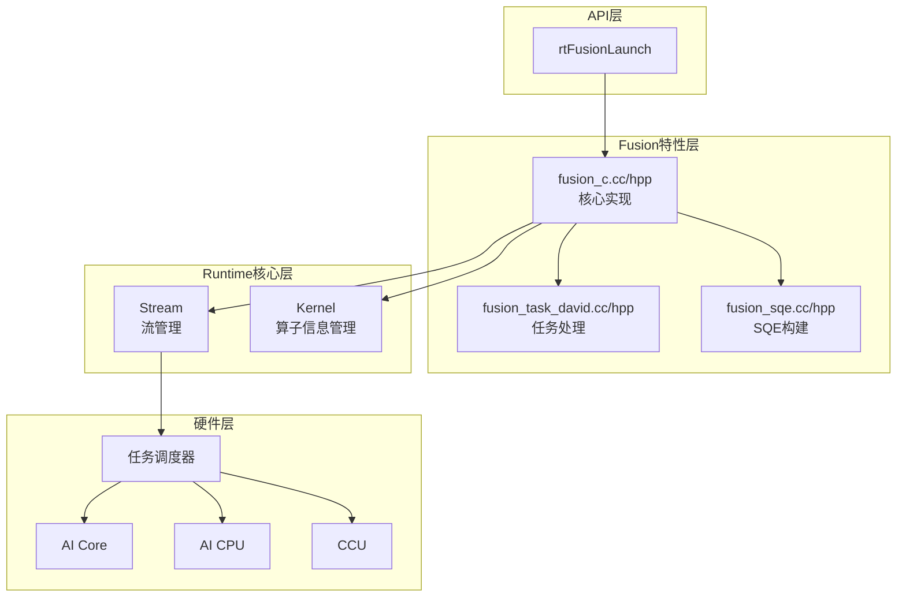
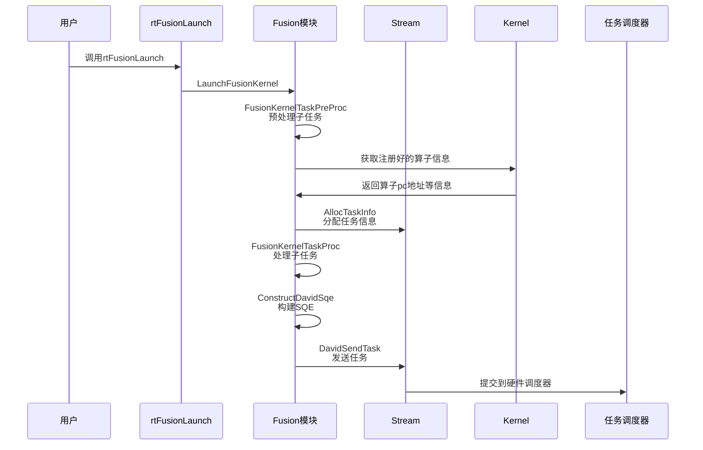
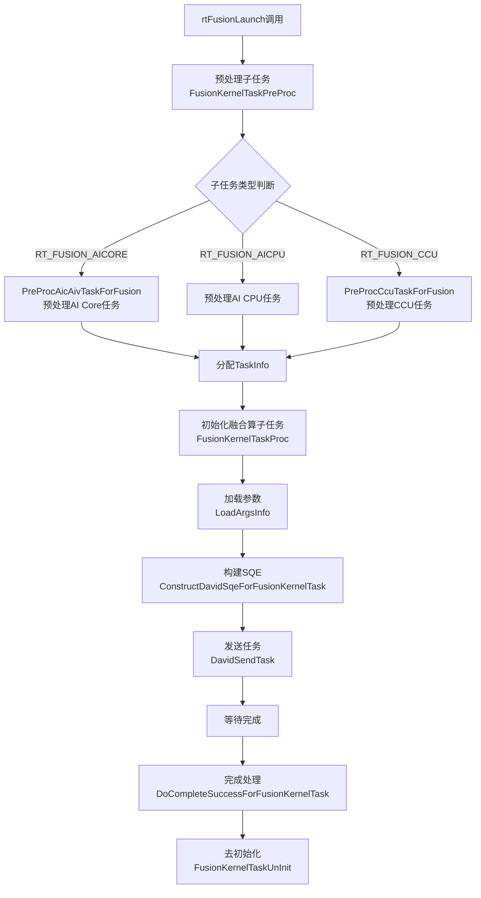

# Fusion（算子融合）特性

## 1. 特性概述

- **特性介绍**：Fusion 是Ascend950代际芯片之后可以支持的特性，支持多个不同类别算子任务（AI Core、AI CPU、HCOM CPU、CCU）的融合下发和执行，通过将多个算子任务组合为一个完整的融合算子任务提交到 Stream，减少任务调度开销，提升执行效率。
- **问题背景**：在传统执行模式下，每个算子或任务都需要单独提交到 Stream 并等待调度执行，存在较大的 Host 侧调度开销。对于一些固定的算子组合或计算模式，逐个单独提交下发会导致性能瓶颈，同时期望提供一种融合场景的算子间相互配合的能力，让算子能够在资源充沛的情况下同时调度执行。
- **设计目标**：
  - 支持多种子任务类型的融合执行
  - 减少 Host 侧任务提交开销
  - 提升整体计算性能
  - 提供灵活的融合组合模式

## 2. 使用场景与对外接口

### 2.1 使用场景

- **场景一**：计算（or通信） & 计算 算子融合
1) AI CPU + AI Core 融合
  ```cpp
  // 创建融合算子任务信息
  rtFunsionTaskInfo_t fusionInfo;
  fusionInfo.subTaskNum = 2;
  
  // 配置 AI CPU 子任务
  fusionInfo.subTask[0].type = RT_FUSION_AICPU;
  fusionInfo.subTask[0].task.aicpuInfo.kernelType = ...;
  fusionInfo.subTask[0].task.aicpuInfo.blockDim = 1;
  
  // 配置 AI Core 子任务
  fusionInfo.subTask[1].type = RT_FUSION_AICORE;
  fusionInfo.subTask[1].task.aicoreInfo.stubFunc = stubFunc;
  fusionInfo.subTask[1].task.aicoreInfo.config = launchConfig;
  
  // 提交融合算子任务
  rtFusionLaunch(&fusionInfo, stream, &argsInfo);
  ```

- **场景二**：通信 & 计算 算子融合
1) CCU + AI Core 融合
  ```cpp
  // 创建融合算子任务信息
  rtFunsionTaskInfo_t fusionInfo;
  fusionInfo.subTaskNum = 2;
  
  // 配置 CCU 子任务
  fusionInfo.subTask[0].type = RT_FUSION_CCU;
  fusionInfo.subTask[0].task.ccuInfo.taskNum = 1;
  fusionInfo.subTask[0].task.ccuInfo.ccuTaskInfo[0].dieId = 0;
  fusionInfo.subTask[0].task.ccuInfo.ccuTaskInfo[0].missionId = 0;
  
  // 配置 AI Core 子任务
  fusionInfo.subTask[1].type = RT_FUSION_AICORE;
  fusionInfo.subTask[1].task.aicoreInfo.stubFunc = stubFunc;
  fusionInfo.subTask[1].task.aicoreInfo.config = launchConfig;
  
  // 提交融合算子任务
  rtFusionLaunch(&fusionInfo, stream, &argsInfo);
  ```

### 2.2 对外接口

| 接口 | 文件位置 | 说明 |
|------|----------|------|
| `rtFusionLaunch` | `pkg_inc/runtime/runtime/kernel.h:1416` | 提交下发融合算子任务 |

**接口参数说明**：
```cpp
rtError_t rtFusionLaunch(
    void * const fusionInfo,       // 融合算子任务信息（rtFunsionTaskInfo_t*）
    rtStream_t const stm,          // 关联的 Stream
    rtFusionArgsEx_t *argsInfo     // 参数信息
);
```

## 3. 架构总览

### 整体设计思路

Fusion 特性基于 Runtime 核心层的 Stream、Task、Kernel 等模块，提供给Fusion模块进行融合算子任务的入参信息预处理、任务初始化、SQE 构建、任务提交和完成后处理等API层级完整的端到端功能。

### 架构分层图



### 核心模块交互图



## 4. 详细设计

### 4.1 核心流程



#### LaunchFusionKernel（启动融合内核）

**位置**：`feature/fusion/fusion_c.cc:418`

**职责**：
1. 预处理子任务，该函数内涉及各个子任务的处理函数逻辑，包含AI Cpu、AI Core和CCU等子任务的处理模块，具体处理逻辑根据传参中的子任务搭配类型和子任务携带信息进行必要字段的获取和预处理（调用 `FusionKernelTaskPreProc`）
2. 使用流上资源分配 TaskInfo
3. 处理融合算子任务，在各类子任务的必要字段信息处理完毕后，进行Fusion总体任务的字段初始化和赋值（调用 `FusionKernelTaskProc`）
4. 加载参数，具体为将rtFusionLaunch接口入参传入的args数据加载到device侧，便于算子执行时的访问（调用 `LoadArgsInfo`）
5. 发送任务，将taskInfo转换为硬件可识别的SQE后，通过驱动管道发送给硬件任务调度器（调用 `DavidSendTask`）

#### ConstructDavidSqeForFusionKernelTask（构建 SQE）

**位置**：`feature/fusion/fusion_sqe.cc:169`

**职责**：根据子任务类型构建对应的 SQE
- AI Core：调用 `ConstructAicAivSubSqe`，根据 mixType 判断是 AIC、AIV 还是 Mix
- AI CPU/HCOM CPU：调用 `ConstructAicpuSubSqe`
- CCU：调用 `ConstructCcuSubSqe`

### 4.2 支持的子任务类型

| 子任务类型 | 枚举值 | 说明 | SQE构建函数 |
|-----------|--------|------|------------|
| AI CPU | `RT_FUSION_HCOM_CPU = 0`or`RT_FUSION_AICPU = 1` | AI CPU (通信or计算)算子执行 | `ConstructAicpuSubSqe` |
| AI Core | `RT_FUSION_AICORE = 2` | AI Core/Vector 算子执行 | `ConstructAicAivSubSqe` |
| CCU | `RT_FUSION_CCU = 3` | 集合通信任务 | `ConstructCcuSubSqe` |

### 4.3 融合组合模式

fusion sub tasks 的组合模式如下：

1. **aicpu + aic**：AI CPU + AI Core 融合，此处的AI CPU 算子通常为计算类算子任务或者通信类算子任务
2. **ccu + aic**：CCU + AI Core 融合

### 4.4 核心数据结构

#### rtFunsionTaskInfo_t（融合算子任务的各子任务搭配信息）
◆ Fusion融合任务中各子任务信息汇总结构体。
```cpp
#define FUSION_SUB_TASK_MAX_NUM     (2U)
typedef struct tagRtFunsionTaskInfo {
    uint32_t subTaskNum;                              // 子任务数量
    rtFusionSubTaskInfo_t subTask[FUSION_SUB_TASK_MAX_NUM];  // 子任务数组（最大2个）
} rtFunsionTaskInfo_t;
```

#### FusionTaskInfo（融合算子任务内部信息）
◆ 任务初始化和下发时存储融合算子信息相关必要字段信息，例如融合算子的子任务搭配类型、任务数量、是否包含CCU任务等等。
```cpp
struct FusionTaskInfo;
```

#### FusionTaskInfoAicPart（AI Core 任务部分）
◆ 用于存储融合算子任务中AI Core子任务的必要字段信息，例如pc地址、args参数地址、分核计算所需维度、SIMT内存大小等等。
```cpp
struct FusionTaskInfoAicPart;
```

## 5. 关键设计思想

### 5.1 减少调度开销

通过将多个子任务合并为一个融合算子任务，减少任务提交次数，从而降低 Host 侧的调度开销。

### 5.2 灵活的组合模式

支持多种子任务类型的组合，可以根据不同的计算模式或者场景选择最优的融合组合。

### 5.4 任务更新支持

融合算子任务支持在 ACL Graph 场景下更新已捕获任务的参数或任务本身。

## 6. 关键文件索引

| 模块 | 文件路径 | 核心内容 |
|------|----------|----------|
| Fusion API | `pkg_inc/runtime/runtime/kernel.h` | `rtFusionLaunch` 接口定义，`rtFunsionTaskInfo_t`、`rtFusionArgsEx_t` 等数据结构 |
| Fusion 核心实现 | `src/runtime/feature/fusion/fusion_c.cc` | `LaunchFusionKernel`、`FusionKernelTaskPreProc`、`AixKernelTaskInitForFusion` |
| Fusion 任务处理 | `src/runtime/feature/fusion/fusion_task_david.cc` | `BuildFusionKernelTaskName`、`DoCompleteSuccessForFusionKernelTask`、`FusionKernelTaskUnInit` |
| Fusion SQE 构建 | `src/runtime/feature/fusion/fusion_sqe.cc` | `ConstructDavidSqeForFusionKernelTask`、`ConstructAicAivSubSqe`、`ConstructCcuSubSqe` |
| Task 数据结构 | `src/runtime/core/inc/task/task_info.hpp` | `TaskInfo` 结构定义，包含 `FusionTaskInfo` |
| Task 基础结构 | `src/runtime/core/inc/task/task_info_base.hpp` | `FusionTaskInfo`、`FusionTaskInfoAicPart` 详细定义 |
