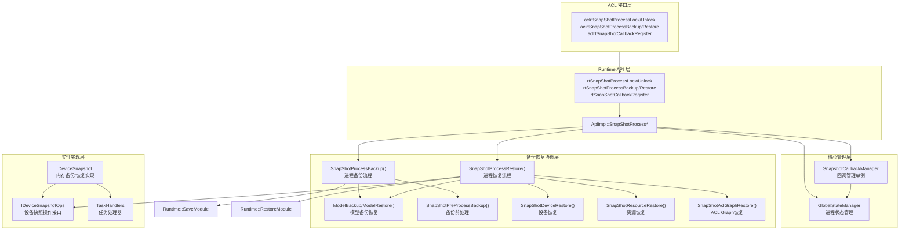
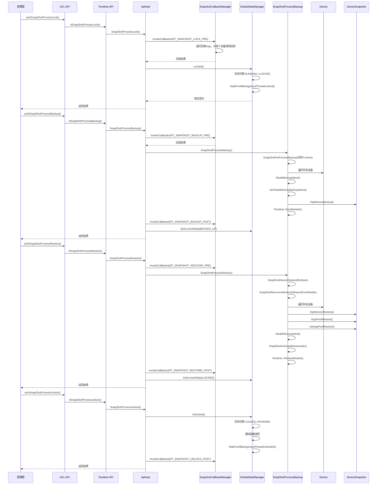
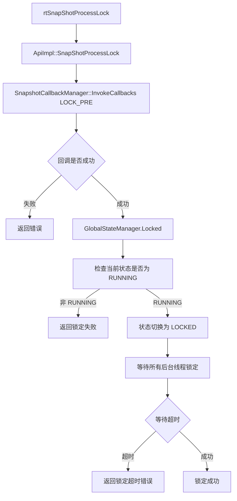
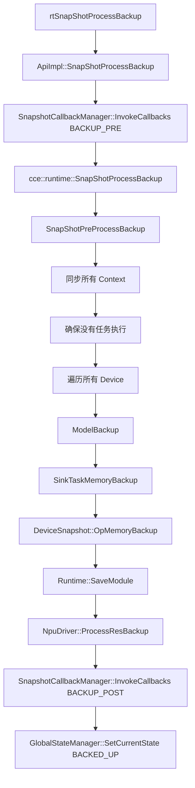
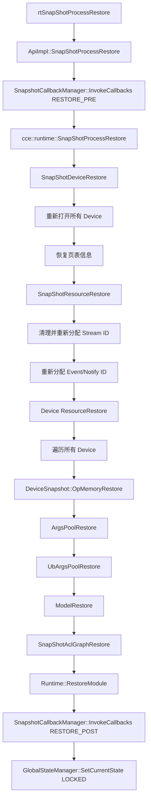
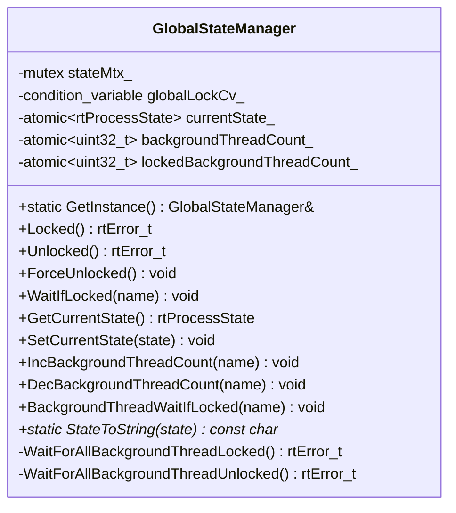
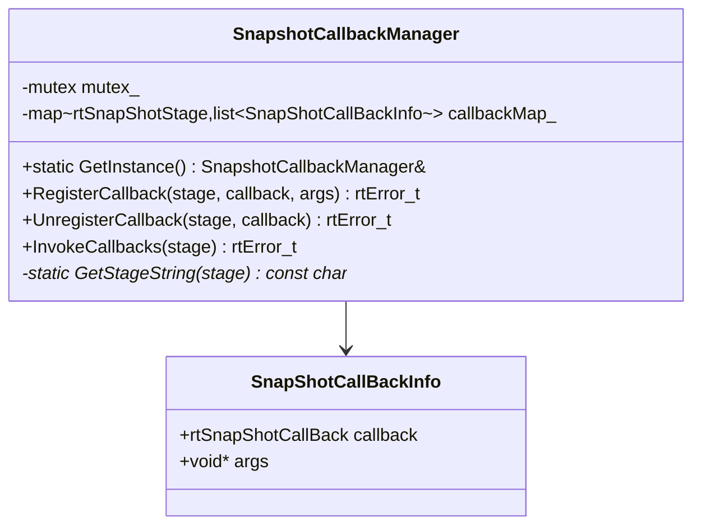
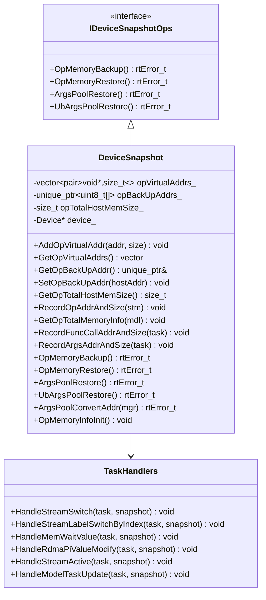
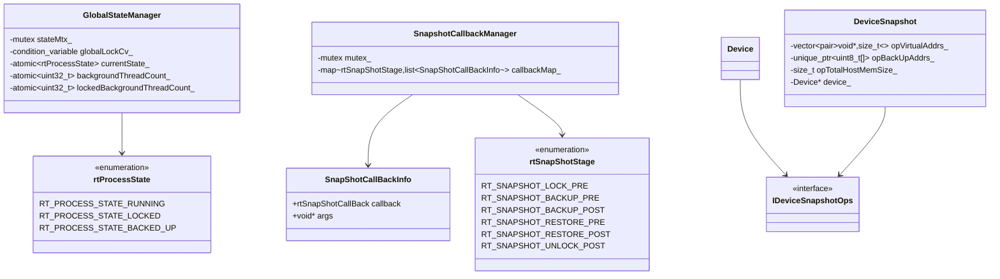
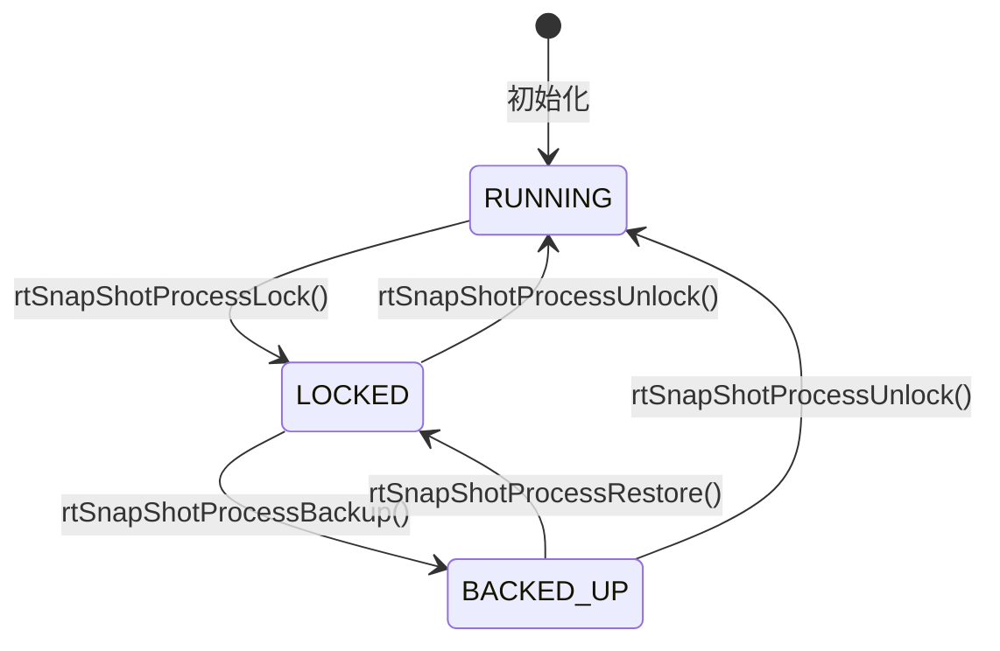

# Snapshot 特性

## 1. 特性概述

- **特性介绍**：Snapshot 特性支持 NPU 进程状态保存和恢复，用于进程级快照备份/恢复场景（故障恢复）。通过锁定进程、备份关键状态、恢复资源，实现进程状态的完整保存和恢复。
- **问题背景**：进程在运行过程中需要保存完整状态以便后续恢复。大规模AI集群的故障恢复效率直接影响训练任务的可用性与资源利用率。传统故障恢复链路涉及容器调度、进程重建、主机与设备建链、算子编译、权重加载等多个串行环节，单次恢复耗时可达十余分钟。
- **设计目标**：
  - 支持进程锁定/解锁控制
  - 支持进程状态备份
  - 支持进程状态恢复
  - 提供多阶段回调机制

## 2. 使用场景与对外接口

### 2.1 使用场景

- **场景一**：进程快照备份
  ```cpp
  // 1. 锁定进程
  aclError ret = aclrtSnapShotProcessLock(pid, nullptr);
  // 2. 备份进程状态
  aclrtSnapShotBackupArgs backupArgs;
  ret = aclrtSnapShotProcessBackup(pid, &backupArgs);
  // 3. 在目标端恢复进程状态
  aclrtSnapShotRestoreArgs restoreArgs;
  ret = aclrtSnapShotProcessRestore(pid, &restoreArgs);
  // 4. 解锁进程
  ret = aclrtSnapShotProcessUnlock(pid, nullptr);
  ```

- **场景二**：注册回调快照阶段
  ```cpp
  // 注册备份前回调
  aclrtSnapShotCallBack callback = MyBackupPreCallback;
  aclrtSnapShotCallbackRegister(ACL_RT_SNAPSHOT_BACKUP_PRE, callback, nullptr);
  // 注册恢复后回调
  aclrtSnapShotCallbackRegister(ACL_RT_SNAPSHOT_RESTORE_POST, MyRestorePostCallback, nullptr);
  ```

### 2.2 对外接口

| 接口 | 文件位置 | 说明 |
|------|----------|------|
| `aclrtSnapShotProcessLock()` | `include/external/acl/acl_rt.h` | 锁定进程 |
| `aclrtSnapShotProcessUnlock()` | `include/external/acl/acl_rt.h` | 解锁进程 |
| `aclrtSnapShotProcessBackup()` | `include/external/acl/acl_rt.h` | 备份进程状态 |
| `aclrtSnapShotProcessRestore()` | `include/external/acl/acl_rt.h` | 从备份点恢复进程 |
| `aclrtSnapShotCallbackRegister()` | `include/external/acl/acl_rt.h` | 注册快照阶段回调 |
| `aclrtSnapShotCallbackUnregister()` | `include/external/acl/acl_rt.h` | 注销快照阶段回调 |

### 2.3 快照阶段定义

```cpp
// 文件位置：include/external/acl/acl_rt.h
typedef enum {
    ACL_RT_SNAPSHOT_LOCK_PRE = 0,
    ACL_RT_SNAPSHOT_BACKUP_PRE,
    ACL_RT_SNAPSHOT_BACKUP_POST,
    ACL_RT_SNAPSHOT_RESTORE_PRE,
    ACL_RT_SNAPSHOT_RESTORE_POST,
    ACL_RT_SNAPSHOT_UNLOCK_POST,
} aclrtSnapShotStage;
```

## 3. 架构总览

### 整体设计思路

Snapshot 特性采用分层架构设计：
- **API 层**：提供 C 语言接口
- **核心协调层**：GlobalStateManager 管理进程状态，SnapshotCallbackManager 管理回调
- **备份恢复层**：命名空间级别函数实现备份恢复流程
- **设备操作层**：DeviceSnapshot 实现设备内存备份/恢复，通过 IDeviceSnapshotOps 接口抽象

### 架构分层图



### 核心模块交互图



## 4. 详细设计

### 4.1 核心流程

#### 进程锁定流程



关键文件位置：`src/runtime/core/src/api_impl/api_impl.cc`

#### 进程备份流程



关键文件位置：
- `src/runtime/core/src/api_impl/api_impl.cc`
- `src/runtime/feature/snapshot/snapshot_process_helper.cc`

#### 进程恢复流程



关键文件位置：
- `src/runtime/core/src/api_impl/api_impl.cc`
- `src/runtime/feature/snapshot/snapshot_process_helper.cc`

### 4.2 核心组件详解

#### GlobalStateManager 进程状态管理

**设计思想**：管理进程全局状态，控制 API 调用阻塞，协调后台线程锁定。位于 `cce::runtime` 命名空间。



关键文件位置：
- 头文件：`src/runtime/core/inc/common/global_state_manager.hpp`
- 实现文件：`src/runtime/core/src/common/global_state_manager.cc`

#### SnapshotCallbackManager 回调管理器

**设计思想**：独立单例管理快照回调函数，提供注册、注销、触发回调功能。位于 `cce::runtime` 命名空间。



关键文件位置：
- 头文件：`src/runtime/feature/snapshot/snapshot_callback_manager.hpp`
- 实现文件：`src/runtime/feature/snapshot/snapshot_callback_manager.cc`

#### IDeviceSnapshotOps 设备快照操作接口

**设计思想**：抽象接口定义设备快照核心操作，便于扩展和适配不同硬件版本。



关键文件位置：
- 接口定义：`src/runtime/core/inc/common/idevice_snapshot_ops.hpp`
- 实现类头文件：`src/runtime/feature/snapshot/device_snapshot.hpp`
- 实现文件：`src/runtime/feature/snapshot/device_snapshot.cc`

#### SnapShotProcessHelper 快照处理辅助

**设计思想**：提供备份前处理、设备恢复、资源恢复、模型备份恢复、ACL Graph恢复等辅助函数。位于 `cce::runtime` 命名空间。

关键文件位置：
- 头文件：`src/runtime/feature/snapshot/snapshot_process_helper.hpp`
- 实现文件：`src/runtime/feature/snapshot/snapshot_process_helper.cc`

### 4.3 模块职责划分

| 模块 | 职责 | 位置 |
|------|------|------|
| GlobalStateManager | 进程状态管理、API调用阻塞控制 | `core/inc/common/global_state_manager.hpp` |
| SnapshotCallbackManager | 回调管理单例 | `feature/snapshot/snapshot_callback_manager.hpp` |
| IDeviceSnapshotOps | 设备快照操作抽象接口 | `core/inc/common/idevice_snapshot_ops.hpp` |
| DeviceSnapshot | 设备内存备份/恢复实现 | `feature/snapshot/device_snapshot.hpp` |
| SnapShotProcessHelper | 备份恢复辅助函数 | `feature/snapshot/snapshot_process_helper.hpp` |
| ApiImpl | API 实现与流程协调 | `core/src/api_impl/api_impl.cc` |
| TaskHandlers | 任务类型处理器 | `feature/snapshot/device_snapshot.hpp` |

### 4.4 核心数据结构



## 5. 关键设计思想

### 5.1 进程状态机

进程状态转换遵循严格的状态机：



### 5.2 API 阻塞机制

进程锁定后，所有涉及设备资源修改的 API 会通过 `GLOBAL_STATE_WAIT_IF_LOCKED()` 宏阻塞等待。

关键文件位置：`src/runtime/core/inc/common/global_state_manager.hpp`

### 5.3 回调阶段设计

回调在各关键阶段触发，允许上层应用执行自定义逻辑：

| 阶段 | 触发时机 | 典型用途 |
|------|----------|----------|
| LOCK_PRE | 锁定前 | 准备工作 |
| BACKUP_PRE | 备份前 | 保存额外状态 |
| BACKUP_POST | 备份后 | 确认备份完成 |
| RESTORE_PRE | 恢复前 | 准备恢复环境 |
| RESTORE_POST | 恢复后 | 确认恢复完成 |
| UNLOCK_POST | 解锁后 | 清理工作 |

### 5.4 后台线程管理

锁定时需要等待所有后台线程进入阻塞状态：
- `IncBackgroundThreadCount(name)`：后台线程注册需要阻塞
- `BackgroundThreadWaitIfLocked(name)`：后台线程检查并阻塞
- `DecBackgroundThreadCount(name)`：后台线程退出时取消注册

### 5.5 命名空间设计

所有快照相关组件都在 `cce::runtime` 命名空间下：
- `cce::runtime::GlobalStateManager`
- `cce::runtime::SnapshotCallbackManager`
- `cce::runtime::DeviceSnapshot`
- `cce::runtime::SnapShotProcessBackup/Restore` 等辅助函数

## 6. 关键文件索引

| 模块 | 文件路径 | 核心内容 |
|------|----------|----------|
| API 头文件 | `pkg_inc/runtime/rts/rts_snapshot.h` | 对外接口定义、状态枚举 |
| ACL 实现 | `src/acl/aclrt_impl/snapshot.cpp` | ACL 层接口封装 |
| Runtime API | `src/runtime/api/api_c_snapshot.cc` | C API 实现 |
| API 实现 | `src/runtime/core/src/api_impl/api_impl.cc` | SnapShotProcess 接口实现 |
| 状态管理 | `src/runtime/core/inc/common/global_state_manager.hpp` | GlobalStateManager 类定义 |
| 状态管理实现 | `src/runtime/core/src/common/global_state_manager.cc` | 进程状态管理实现 |
| 回调管理 | `src/runtime/feature/snapshot/snapshot_callback_manager.hpp` | SnapshotCallbackManager 类定义 |
| 回调管理实现 | `src/runtime/feature/snapshot/snapshot_callback_manager.cc` | 回调注册/注销/触发实现 |
| 设备快照接口 | `src/runtime/core/inc/common/idevice_snapshot_ops.hpp` | IDeviceSnapshotOps 抽象接口 |
| 设备快照 | `src/runtime/feature/snapshot/device_snapshot.hpp` | DeviceSnapshot 类定义 |
| 设备快照实现 | `src/runtime/feature/snapshot/device_snapshot.cc` | 内存备份/恢复实现 |
| 快照辅助 | `src/runtime/feature/snapshot/snapshot_process_helper.hpp` | 处理辅助函数声明 |
| 快照辅助实现 | `src/runtime/feature/snapshot/snapshot_process_helper.cc` | 辅助函数实现 |
| 设备适配 v100 | `src/runtime/feature/snapshot/v100/device_snapshot_adapter.cc` | v100 版本适配 |
| 设备适配 v200 | `src/runtime/feature/snapshot/v200_base/device_snapshot_adapter.cc` | v200 版本适配 |

## 7. 典型问题与排查

### 7.1 关键日志点

- `locked success.`：锁定成功
- `unlocked success.`：解锁成功
- `start to restore resource`：开始恢复资源
- `the resource is restored successfully`：恢复成功
- `current state is not the running state, current state is %s`：状态错误
- `Timeout: only %u/%u background threads locked`：后台线程锁定超时

### 7.2 问题定位方法

1. **锁定失败**：检查当前进程状态是否为 RUNNING
2. **锁定超时**：检查后台线程是否正确注册和阻塞
3. **备份失败**：检查 Context 同步是否成功，检查模型是否为 AICPU 类型（不支持）
4. **恢复失败**：检查 Device ReOpen、Stream ID 重分配等步骤

### 7.3 状态检查

通过 `rtSnapShotProcessGetState()` 获取当前进程状态。

---

_本特性文档基于源码 `src/runtime/feature/snapshot/` 及 `src/runtime/core/src/common/global_state_manager.cc` 分析。_