# Context 模块架构

## 1. 模块概述

- **功能介绍**：Context 模块负责维护 Runtime 的执行上下文，是连接 Device、Stream、Task、Model 和 Module 的核心对象。上层 ACL/Runtime API 进入 Runtime 后，依赖当前线程绑定的 Context 找到对应设备、默认流、用户流、模型资源、模块缓存、系统参数和错误状态。
- **设计目标**：
  - 支持 `rtSetDevice` / `aclrtSetDevice` 隐式创建和复用 Primary Context。
  - 支持 `rtCtxCreate` / `aclrtCreateContext` 显式创建用户 Context。
  - 通过线程局部变量维护当前线程的 Context 绑定关系。
  - 统一承载 Context 下属的 Stream、Model、Module、系统参数和错误状态。
  - 通过全局有效集合和 RAII 保护降低 Context handle 误用和并发销毁风险。
  - 为 ACL Graph、FFTS Plus、XPU、Snapshot、runtime_compact 等能力提供扩展入口。

Context 在 Runtime 中主要有三类形态：

| 形态 | 创建入口 | 核心对象 | 生命周期管理 |
| ---- | -------- | -------- | ------------ |
| Primary Context | `rtSetDevice()`、`aclrtSetDevice()` | `Context(dev, true)` | `Runtime::PrimaryContextRetain()` / `Runtime::PrimaryContextRelease()` 通过 `RefObject<Context *>` 管理引用计数，维度为 Device + TS |
| 用户 Context | `rtCtxCreate()`、`rtCtxCreateEx()`、`rtsCtxCreate()`、`aclrtCreateContext()` | `Context(dev, false)` | `ContextManage` 登记，`rtCtxDestroy()`、`rtCtxDestroyEx()`、`aclrtDestroyContext()` 显式销毁 |
| XPU Context | XPU 设备设置路径 | `XpuContext : public Context` | `Runtime::PrimaryXpuContextRetain()` / `Runtime::PrimaryXpuContextRelease()` 管理 |

## 2. 使用场景与对外接口

### 2.1 使用场景

- **场景一**：设置设备并使用 Primary Context。
  ```cpp
  aclrtSetDevice(0);
  // Runtime 内部创建或复用设备 0 的 Primary Context，并绑定到当前线程。
  ```

- **场景二**：显式创建、切换和销毁用户 Context。
  ```cpp
  aclrtContext ctx = nullptr;
  aclrtCreateContext(&ctx, 0);
  aclrtSetCurrentContext(ctx);
  // ... 提交任务 ...
  aclrtDestroyContext(ctx);
  ```

- **场景三**：获取当前 Context 的默认 Stream。
  ```cpp
  aclrtStream stream = nullptr;
  aclrtCtxGetCurrentDefaultStream(&stream);
  ```

- **场景四**：设置当前 Context 级系统参数。
  ```cpp
  aclrtCtxSetSysParamOpt(ACL_OPT_DETERMINISTIC, 1);
  ```

- **场景五**：多线程复用同一个用户 Context。
  ```cpp
  // 线程 A 创建 Context 后将 handle 传给线程 B。
  // 线程 B 需要先调用 aclrtSetCurrentContext(ctx)，再提交该 Context 下的任务。
  ```

### 2.2 对外接口

ACL Context 接口定义在 `include/external/acl/acl_rt.h`，C 符号入口位于 `src/acl/aclrt_c/runtime/context.c`，主要实现位于 `src/acl/aclrt_impl/context.cpp`。

| ACL 接口 | Runtime 落点 | 说明 |
| -------- | ------------ | ---- |
| `aclrtCreateContext()` | `rtCtxCreateEx()` | 创建用户 Context，并在 Runtime 层设为当前线程 Context |
| `aclrtDestroyContext()` | `rtCtxDestroyEx()` | 销毁用户 Context，不能销毁 Primary Context |
| `aclrtSetCurrentContext()` | `rtCtxSetCurrent()` | 将指定 Context 绑定到当前线程 |
| `aclrtGetCurrentContext()` | `rtCtxGetCurrent()` | 获取当前线程绑定的 Context |
| `aclrtCtxSetSysParamOpt()` | `rtCtxSetSysParamOpt()` | 设置当前 Context 的系统参数 |
| `aclrtCtxGetSysParamOpt()` | `rtCtxGetSysParamOpt()` | 获取当前 Context 的系统参数 |
| `aclrtCtxGetCurrentDefaultStream()` | `rtsCtxGetCurrentDefaultStream()` | 获取当前 Context 的默认 Stream |
| `aclrtGetPrimaryCtxState()` | `rtsGetPrimaryCtxState()` | 查询指定 Device 的 Primary Context 是否 active |
| `aclrtCtxGetFloatOverflowAddr()` | `rtsCtxGetFloatOverflowAddr()` | 获取当前 Context 的浮点溢出标记地址 |

Runtime Context 头文件位于 `pkg_inc/runtime/runtime/context.h`，RTS Context 头文件位于 `pkg_inc/runtime/runtime/rts/rts_context.h`。

| Runtime / RTS 接口 | 实现入口 | 说明 |
| ------------------ | -------- | ---- |
| `rtCtxCreate()`、`rtCtxCreateEx()` | `src/runtime/api/api_c.cc` | 创建用户 Context，`RT_CTX_GEN_MODE` 当前返回不支持 |
| `rtCtxDestroy()`、`rtCtxDestroyEx()` | `src/runtime/api/api_c.cc` | 销毁用户 Context |
| `rtCtxSetCurrent()`、`rtCtxGetCurrent()` | `src/runtime/api/api_c.cc` | 设置或获取当前线程 Context |
| `rtGetPriCtxByDeviceId()` | `src/runtime/api/api_c.cc` | 获取指定 Device 当前 TS 的 Primary Context |
| `rtCtxGetDevice()` | `src/runtime/api/api_c.cc` | 获取当前 Context 绑定的 Device ID |
| `rtCtxSetSysParamOpt()`、`rtCtxGetSysParamOpt()` | `src/runtime/api/api_c.cc` | 读写当前 Context 级系统参数 |
| `rtCtxGetCurrentDefaultStream()` | `src/runtime/api/api_c.cc` | 获取当前 Context 默认 Stream |
| `rtsCtxCreate()` | `src/runtime/api/api_c_context.cc` | RTS 层创建 Context |
| `rtsCtxDestroy()`、`rtsCtxSetCurrent()`、`rtsCtxGetCurrent()` | `src/runtime/api/api_c_context.cc` | RTS 层转调 Runtime Context API |
| `rtsCtxSetSysParamOpt()`、`rtsCtxGetSysParamOpt()` | `src/runtime/api/api_c_context.cc` | RTS 层读写 Context 系统参数 |
| `rtsGetPrimaryCtxState()` | `src/runtime/api/api_c_context.cc` | 查询 Primary Context 状态 |

Device API 与 Primary Context 生命周期直接相关。

| 接口 | 文件位置 | Context 关系 |
| ---- | -------- | ------------ |
| `rtSetDevice()` | `src/runtime/api/api_c_device.cc` | 调用 `ApiImpl::SetDevice()`，内部 retain Primary Context |
| `rtDeviceReset()` | `src/runtime/api/api_c_device.cc` | 调用 `ApiImpl::DeviceReset()`，内部 release Primary Context |

## 3. 架构总览

### 整体设计思路

Context 模块采用“公开 API → Runtime C API → API 装饰器 → ApiImpl → Runtime / Context 核心对象”的分层设计。公开 API 不直接操作 `Context`、`Device`、`Stream` 等资源对象，而是进入 `Api::Instance()`，经过错误处理、Profiling 记录等装饰器后到达 `ApiImpl`。`ApiImpl` 负责参数校验、设备保留、Context 创建销毁和线程绑定。`Runtime` 维护 Primary Context 引用对象，`ContextManage` 维护全局有效 Context 集合，`Context` 本身承载执行资源。

当前 Context 的解析逻辑集中在 `Runtime::CurrentContext()`：

1. 当前线程显式设置过用户 Context 时，优先返回 `InnerThreadLocalContainer::GetCurCtx()`。
2. 当前线程通过 `rtSetDevice()` 绑定 Primary Context 时，返回 `InnerThreadLocalContainer::GetCurRef()` 中的 Context。
3. 两者都不存在时返回空，调用方通常返回 `RT_ERROR_CONTEXT_NULL` 或映射后的 ACL 错误码。

### 架构分层图

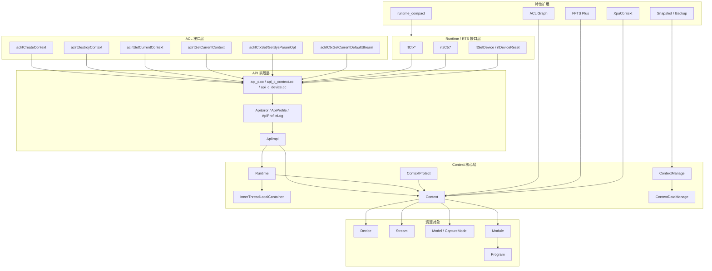

### 核心模块交互图

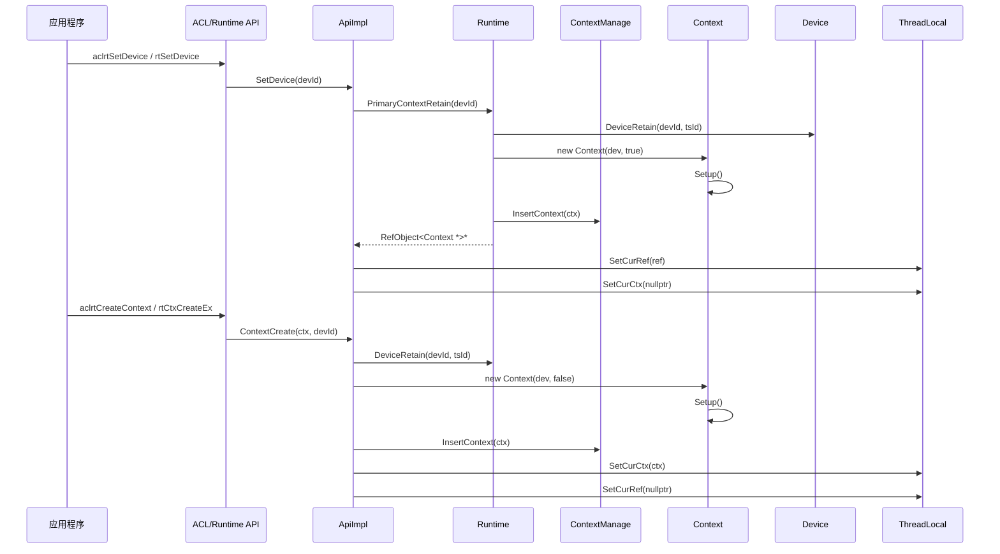

## 4. 详细设计

### 4.1 核心流程

#### Primary Context 创建流程

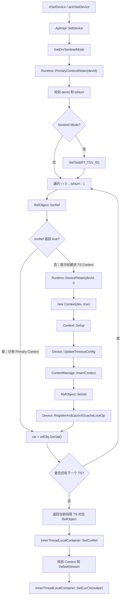

**流程说明**

Primary Context 是 Device 级默认执行环境，但源码中的保存维度是 `devId + tsId`。`Runtime::PrimaryContextRetain()` 不是只处理当前线程的 TS，而是遍历该 Device 下的 TS RefObject：每个 RefObject 先执行 `IncRef()`，如果返回 true 表示已有 Primary Context，只增加引用并读取已有对象；如果返回 false，说明该 TS 的 Primary Context 首次创建，才会执行 `DeviceRetain()`、`new Context(dev, true)`、`Setup()`、`ContextManage::InsertContext()` 和 `RefObject::SetVal()`。遍历完成后，函数按当前线程 TS 返回 `RT_TSC_ID` 或 `RT_TSV_ID` 对应的 RefObject。`ApiImpl::SetDevice()` 再把这个 RefObject 写入线程局部变量，并清空显式用户 Context。

**关键代码**：

```cpp
// 文件位置：src/runtime/core/src/api_impl/api_impl.cc
rtError_t ApiImpl::SetDevice(const int32_t devId)
{
    Runtime * const rt = Runtime::Instance();
    RefObject<Context *> *context = rt->PrimaryContextRetain(static_cast<uint32_t>(devId));
    NULL_PTR_RETURN_MSG(context, RT_ERROR_DEVICE_RETAIN);

    InnerThreadLocalContainer::SetCurRef(context);
    Context * const curCtx = context->GetVal();
    CHECK_CONTEXT_VALID_WITH_RETURN(curCtx, RT_ERROR_CONTEXT_NULL);
    InnerThreadLocalContainer::SetCurCtx(nullptr);
    return RT_ERROR_NONE;
}
```

#### 用户 Context 创建流程

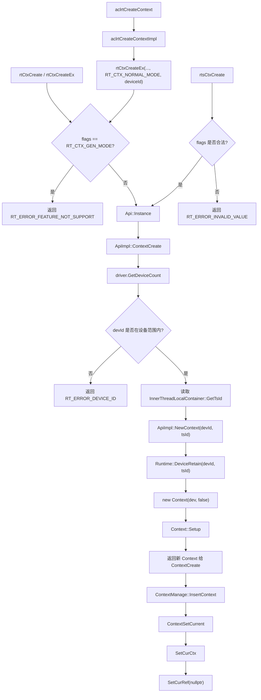

**流程说明**

用户 Context 有三类入口：ACL 的 `aclrtCreateContext()` 会先进入 `aclrtCreateContextImpl()`，再调用 `rtCtxCreateEx(..., RT_CTX_NORMAL_MODE, deviceId)`；Runtime C API 的 `rtCtxCreate()` / `rtCtxCreateEx()` 会先拒绝当前不支持的 `RT_CTX_GEN_MODE`；RTS 的 `rtsCtxCreate()` 会检查 flags 范围。三类入口最终都会进入 `ApiImpl::ContextCreate()`。`ContextCreate()` 通过 driver 查询设备数量并校验 `devId`，读取当前线程 `tsId` 后调用 `NewContext()`。`NewContext()` retain 对应 Device，构造 `Context(dev, false)` 并执行 `Setup()`。创建成功后，`ContextCreate()` 将 Context 插入 `ContextManage`，再调用 `ContextSetCurrent()`，因此新创建的用户 Context 会成为当前线程的活跃 Context，同时清空 Primary Context 引用。

**关键代码**：

```cpp
// 文件位置：src/runtime/core/src/api_impl/api_impl.cc
rtError_t ApiImpl::ContextCreate(Context ** const inCtx, const int32_t devId)
{
    rtError_t error = NewContext(static_cast<uint32_t>(devId), tsId, inCtx);
    ERROR_RETURN_MSG_INNER(error, "new context failed, drv devId=%d", devId);

    ContextManage::InsertContext(*inCtx);
    error = ContextSetCurrent(*inCtx);
    ERROR_RETURN_MSG_INNER(error, "Failed to set current context");
    return RT_ERROR_NONE;
}
```

#### Context 销毁流程

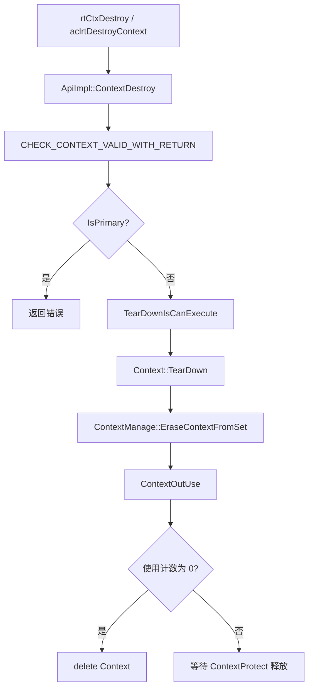

**流程说明**

用户 Context 销毁前会先确认 handle 仍在 `ContextManage` 有效集合中，然后拒绝销毁 `IsPrimary()` 为 true 的 Context。Primary Context 只能通过 `rtDeviceReset()` 对应路径释放。`Context::TearDown()` 清理 Context 下的 Model、Stream 和在线 Profiling Stream；用户 Context 的默认 Stream 也在该阶段释放。Context 从有效集合移除后，如果仍被其他线程保护使用，则等最后一个 `ContextProtect` 析构时释放。

Primary Context 的释放路径在 `Runtime::PrimaryContextRelease()`，该路径按引用计数递减，计数归零后执行回调、`Context::TearDown()`、`ContextManage::EraseContextFromSet()` 和 `RefObject::ResetVal()`。

#### 当前 Context 获取流程

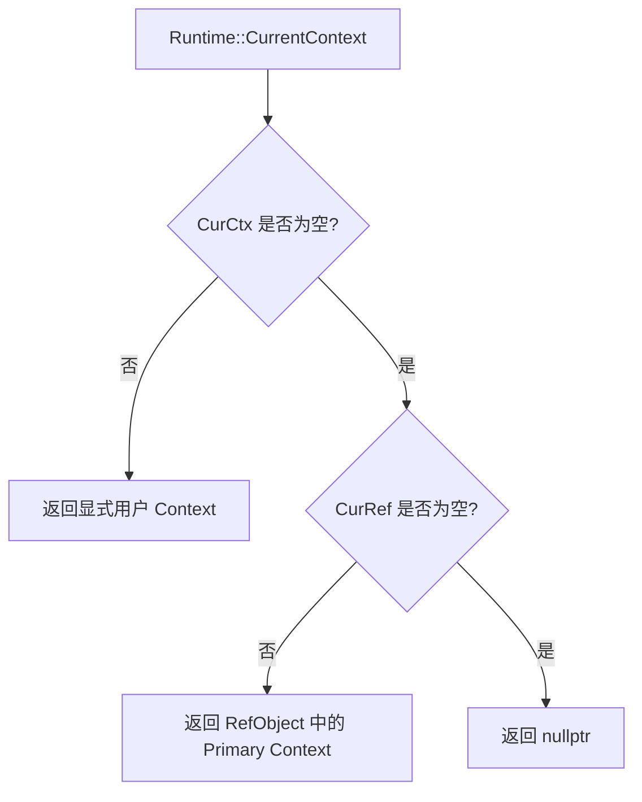

**关键代码**：

```cpp
// 文件位置：src/runtime/core/src/runtime.cc
Context *Runtime::CurrentContext() const
{
    Context * const curCtx = InnerThreadLocalContainer::GetCurCtx();
    if (curCtx != nullptr) {
        return curCtx;
    }

    RefObject<Context *> * const curRef = InnerThreadLocalContainer::GetCurRef();
    if (curRef != nullptr) {
        return curRef->GetPrimaryCtxCallBackFlag() ? curRef->GetVal(false) : curRef->GetVal();
    }
    return nullptr;
}
```

#### Context 初始化流程

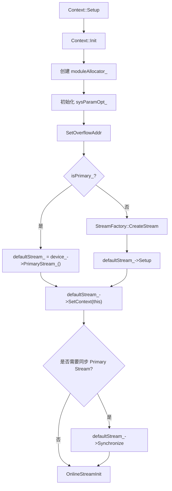

**流程说明**

`Context::Setup()` 建立 Context 的基础执行环境。`Context::Init()` 创建 `moduleAllocator_` 并初始化 Context 级系统参数数组。`SetOverflowAddr()` 为浮点溢出检测分配设备侧地址，大小由 `OVERFLOW_ADDR_MAX_SIZE` 定义。Primary Context 的默认 Stream 来自 Device 的 Primary Stream；用户 Context 则通过 `StreamFactory::CreateStream()` 创建自己的默认 Stream。

#### Context 同步流程

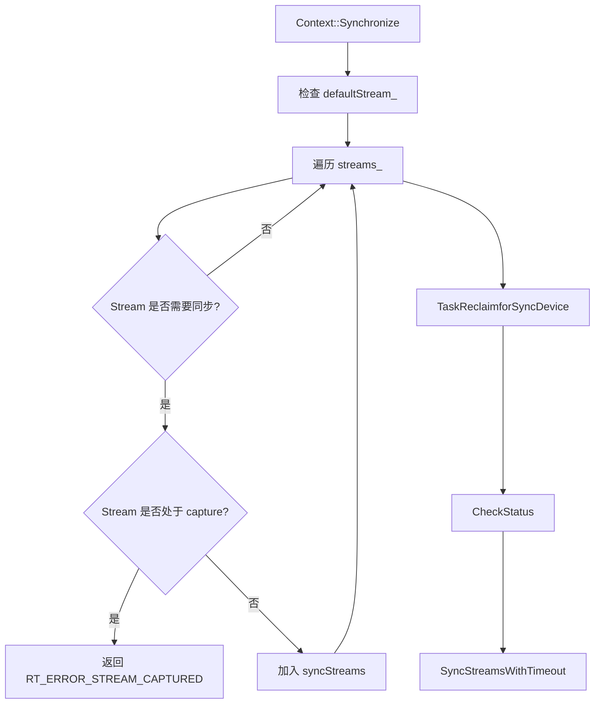

**流程说明**

`Context::Synchronize()` 首先确认 `defaultStream_` 存在，然后遍历 `streams_` 收集需要同步的用户 Stream。`IsStreamNotSync()` 会跳过特定类型的 Stream；处于 capture 状态的 Stream 不能在该路径同步。收集完成后，Context 先执行任务回收，再通过 `CheckStatus()` 检查设备状态和 Context 失败状态，最后调用 `SyncStreamsWithTimeout()` 同步收集到的 Stream。

#### Stream、Model 和 Module 管理

| 资源 | 创建入口 | Context 内部状态 | 销毁或释放 |
| ---- | -------- | ---------------- | ---------- |
| 默认 Stream | `Context::Setup()` | `defaultStream_` | 用户 Context 在 `TearDown()` 中销毁；Primary Context 不销毁 Device 的 Primary Stream |
| 用户 Stream | `Context::StreamCreate()` | `streams_` | `Context::StreamDestroy()` 从 `streams_` 移除后调用 `TearDownStream()` |
| 在线 Profiling Stream | `OnlineStreamInit()` | `onlineStream_` | `Context::TearDown()` 中销毁 |
| Model / CaptureModel | `Context::ModelCreate()` | `models_` | `Context::ModelDestroy()` 或 `Context::TearDown()` 中清理 |
| Module | `Context::GetModule()` | `moduleAllocator_` | `Context::ReleaseModule()` 或析构时释放 |

### 4.2 核心机制详解

#### 线程绑定机制

**设计思想**：当前线程只能有一个生效的 Context 来源。显式用户 Context 和 Primary Context 引用分别保存在不同 TLS 字段中，设置其中一个时会清空另一个。

| TLS 字段 | 设置入口 | 含义 |
| -------- | -------- | ---- |
| `InnerThreadLocalContainer::SetCurCtx()` | `ApiImpl::ContextSetCurrent()` | 保存用户显式设置的 `Context *` |
| `InnerThreadLocalContainer::SetCurRef()` | `ApiImpl::SetDevice()` | 保存 Primary Context 的 `RefObject<Context *>` |

```cpp
// 文件位置：src/runtime/core/src/api_impl/api_impl.cc
rtError_t ApiImpl::ContextSetCurrent(Context * const inCtx)
{
    InnerThreadLocalContainer::SetCurCtx(inCtx);
    InnerThreadLocalContainer::SetCurRef(nullptr);
    (void)ThreadLocalContainer::GetOrCreateWatchDogHandle();
    return RT_ERROR_NONE;
}
```

#### Context handle 有效性与并发销毁保护

**设计思想**：Context handle 是 opaque pointer，Runtime 需要防止无效指针进入核心逻辑，也要避免一个线程销毁 Context 时另一个线程仍在使用。`ContextManage` 保存有效 Context 集合，`ContextProtect` 负责作用域内使用计数回落和延迟释放。

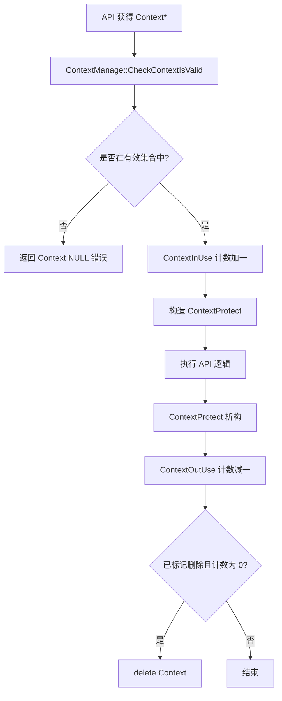

`CHECK_CONTEXT_VALID_WITH_RETURN` 宏封装了有效性检查和 `ContextProtect` 构造。`ContextManage::EraseContextFromSet()` 删除 Context 时，会先从集合中移除，再标记删除状态；如果使用计数不为 0，释放动作由最后一个 `ContextProtect` 完成。

#### Primary Context 引用计数

**设计思想**：Primary Context 与 Device/TS 绑定，多次设置同一 Device 时复用已有 Context。Runtime 使用 `priCtxs_[devId][tsId]` 保存 `RefObject<Context *>`，通过引用计数控制创建和销毁。

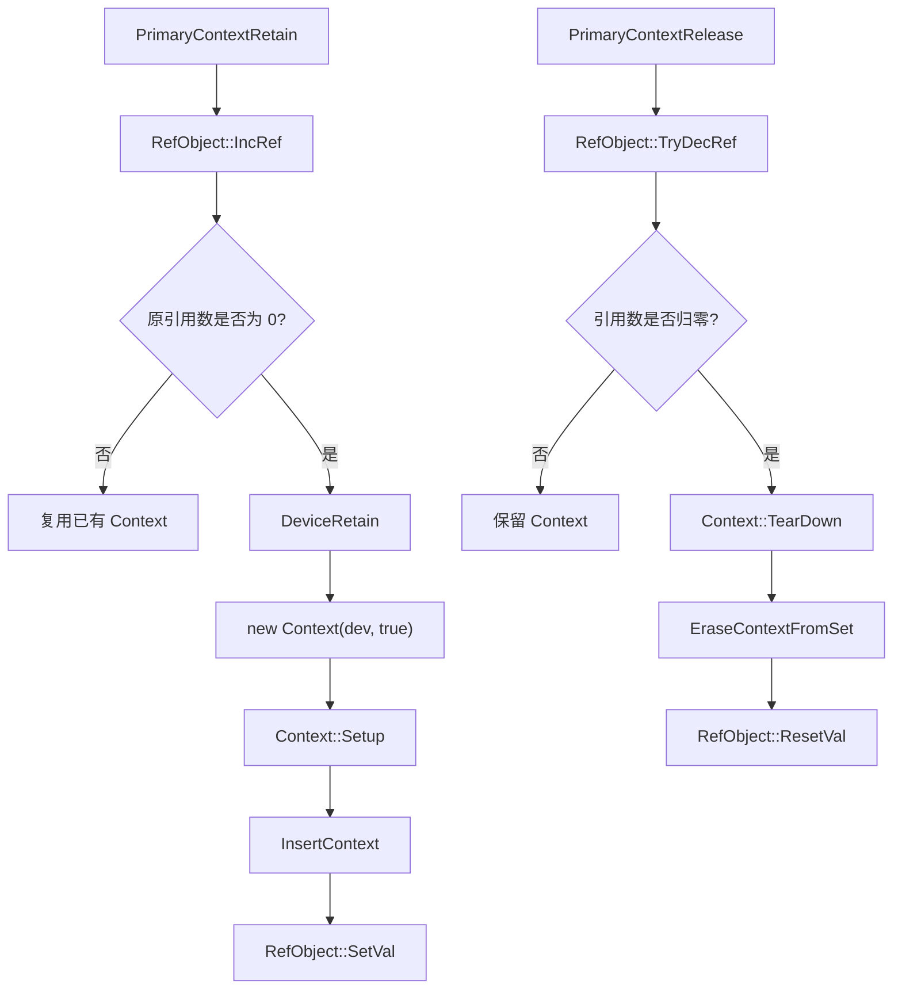

`rtsGetPrimaryCtxState()` / `aclrtGetPrimaryCtxState()` 最终进入 `Runtime::GetPrimaryCtxState()`，该函数遍历指定 Device 下的 TS 引用对象，只要存在引用计数大于 0 的 Primary Context，就返回 active。

#### 系统参数作用域

`rtCtxSetSysParamOpt()` 和 `rtsCtxSetSysParamOpt()` 设置的是当前 Context 的系统参数，最终写入 `Context::sysParamOpt_`。`sysParamOpt_` 使用 `pair<bool, int64_t>` 保存是否已设置和值。读取未设置参数时，`Context::CtxGetSysParamOpt()` 返回 `RT_ERROR_NOT_SET_SYSPARAMOPT`，API 层映射为对外错误码。

```cpp
// 文件位置：src/runtime/core/src/context/context.cc
rtError_t Context::CtxSetSysParamOpt(const rtSysParamOpt configOpt, const int64_t configVal)
{
    const std::unique_lock<std::mutex> mutexLock(sysParamOptLock_);
    sysParamOpt_[configOpt].first = true;
    sysParamOpt_[configOpt].second = configVal;
    return RT_ERROR_NONE;
}
```

#### 错误状态传播

Context 维护两类错误状态：`lastErr_` 记录最近一次错误，`GetContextLastErr()` 读取后会清零；`failureError_` 记录失败模式下需要传播的错误。`ContextManage::SetGlobalFailureErr()` 会按 Device ID 遍历有效 Context，设置 Context failure error、Stream 状态和 Device 状态。`Context::CheckStatus()` 会检查设备运行状态、驱动状态、设备业务状态和 Context failure error；只有 `ctxMode_ == STOP_ON_FAILURE` 时，Context failure error 会作为返回错误继续向上传播。

#### Module 懒分配

`Context::Init()` 初始化的是 `moduleAllocator_`，真正的 `Module` 对象在 `Context::GetModule()` 首次访问对应 `Program` 时通过 `device_->ModuleAlloc(prog)` 创建，并记录到 `Program` 与 Context 的映射关系。释放时通过 `Context::ReleaseModule()` 清空 allocator 条目，并调用 `device_->ModuleRelease()`。

### 4.3 特性扩展

Context 的特性扩展主要采用两种方式。

| 扩展模式 | 使用方 | 说明 |
| -------- | ------ | ---- |
| 编译单元分离 | ACL Graph、FFTS Plus | 方法声明在 `context.hpp`，实现放在 `src/runtime/feature/` 目录，链接为 `Context` 成员方法 |
| 继承子类 | XPU | `XpuContext` 继承 `Context` 并重写虚方法 |

#### ACL Graph 扩展

ACL Graph 相关 Context 实现位于 `src/runtime/feature/aclgraph/context_aclgraph.cc`、`src/runtime/feature/aclgraph/context_standard_soc_aclgraph.cc` 和 `src/runtime/feature/aclgraph/tiny/context_tiny_stub_aclgraph.cc`，主要为 Stream Capture 和 CaptureModel 提供入口。

| 能力 | 入口 |
| ---- | ---- |
| 开始捕获 | `Context::StreamBeginCapture()` |
| 结束捕获 | `Context::StreamEndCapture()` |
| 查询捕获状态 | `Context::StreamGetCaptureInfo()` |
| TaskGroup 采样 | `Context::StreamBeginTaskGrp()`、`Context::StreamEndTaskGrp()` |
| 模型调试输出 | `Context::ModelDebugDotPrint()`、`Context::ModelDebugJsonPrint()` |

#### FFTS Plus 扩展

FFTS Plus Context 实现位于 `src/runtime/feature/ffts/context_ffts_standard_soc.cc`，tiny 平台 stub 位于 `src/runtime/feature/ffts/context_ffts_tiny_stub.cc`。标准实现中，`Context::FftsPlusTaskLaunch()` 从 Stream 分配 `TS_TASK_TYPE_FFTS_PLUS` 任务，初始化 FFTS Plus task，等待参数拷贝完成后通过 Device 提交任务。Stream 处于 capture 状态时，还会补充 RDMA PI value modify 任务。

#### XPU Context 扩展

XPU Context 定义在 `src/runtime/core/inc/context/xpu_context.hpp`，实现位于 `src/runtime/feature/xpu/xpu_context.cc` 和 `src/runtime/feature/xpu/runtime_xpu_adapt.cc`。`XpuContext` 继承 `Context`，重写 `Setup()`、`TearDown()`、`StreamCreate()`、`TearDownStream()` 和 `CheckStatus()`。

| 重写方法 | 差异行为 |
| -------- | -------- |
| `Setup()` | 设置 `STOP_ON_FAILURE` 模式 |
| `StreamCreate()` | 校验 priority 和 flag，创建 `XpuStream` |
| `TearDown()` | 遍历 XPU Context 下的 Stream 并逐一清理 |
| `CheckStatus()` | 直接返回 Context 的 failure error |

#### Snapshot 和恢复

Context 模块通过 `ContextManage` 为 Snapshot 提供设备、Stream 和 Model 维度的信息入口。`ContextManage::DeviceGetStreamlist()`、`DeviceGetModelList()` 遍历有效 Context 集合并筛选指定 Device；`SnapShotProcessBackup()`、`SnapShotProcessRestore()` 调用 Model 备份恢复、ACL Graph 恢复以及驱动资源备份恢复。

#### runtime_compact Context

`runtime_compact` 使用 C 结构体实现轻量 Context，代码位于 `src/runtime_compact/feature/inc/context.h`、`src/runtime_compact/feature/src/context_common.c`、`src/runtime_compact/feature/src/context_linux.c` 和 `src/runtime_compact/feature/src/context_liteos.c`。

| 平台 | 当前 Context 记录方式 |
| ---- | -------------------- |
| Linux | `__thread Context *g_curCtx` 和 `g_curCtxSeq` |
| LiteOS | `g_contextRecord` 按 task id 保存 `ContextKeyObj` |

compact Context 保存 `Device *`、Stream vector 和 stream lock，创建时从 `g_contextMemPool` 分配，销毁和查询时通过内存池序列号判断 handle 是否仍有效。

### 4.4 模块职责划分

| 模块 | 职责 | 位置 |
| ---- | ---- | ---- |
| ACL Context API | ACL 对外 Context 接口、参数校验、错误码转换、Profiling 统计 | `src/acl/aclrt_impl/context.cpp`、`src/acl/aclrt_c/runtime/context.c` |
| Runtime C API | Runtime C 接口入口，转调 `Api::Instance()` | `src/runtime/api/api_c.cc`、`src/runtime/api/api_c_context.cc`、`src/runtime/api/api_c_device.cc` |
| API 抽象 | Context API 虚接口和装饰器链 | `src/runtime/api/api.hpp`、`src/runtime/core/src/api_impl/api_decorator.cc`、`src/runtime/core/src/profiler/api_profile_decorator.cc` |
| ApiImpl | Context 创建、销毁、设置当前、获取当前、系统参数操作 | `src/runtime/core/src/api_impl/api_impl.cc` |
| Runtime | Primary Context 数组、引用计数、当前 Context 解析、Device 生命周期联动 | `src/runtime/core/inc/runtime.hpp`、`src/runtime/core/src/runtime.cc` |
| Context | 资源容器，管理 Device、Stream、Model、Module、系统参数和错误状态 | `src/runtime/core/inc/context/context.hpp`、`src/runtime/core/src/context/context.cc` |
| ContextManage | 全局 Context 集合、有效性校验、设备异常处理、Snapshot 入口 | `src/runtime/core/inc/context/context_manage.hpp`、`src/runtime/core/src/context/context_manage.cc` |
| ContextDataManage | 线程安全 set 封装，保存有效 Context 指针 | `src/runtime/core/src/common/context_data_manage.h`、`src/runtime/core/src/common/context_data_manage.cc` |
| ContextProtect | Context 使用计数保护，配合延迟释放 | `src/runtime/core/inc/context/context_protect.hpp`、`src/runtime/core/src/context/context_protect.cc` |
| ACL Graph Context | 流捕获、CaptureModel、TaskGroup、模型调试输出 | `src/runtime/feature/aclgraph/context_aclgraph.cc` |
| FFTS Context | FFTS Plus task launch | `src/runtime/feature/ffts/context_ffts_standard_soc.cc` |
| XPU Context | XPU Context 生命周期和 Stream 管理 | `src/runtime/core/inc/context/xpu_context.hpp`、`src/runtime/feature/xpu/xpu_context.cc` |
| compact Context | runtime_compact 轻量 Context | `src/runtime_compact/feature/inc/context.h`、`src/runtime_compact/feature/src/context_common.c` |

### 4.5 核心数据结构

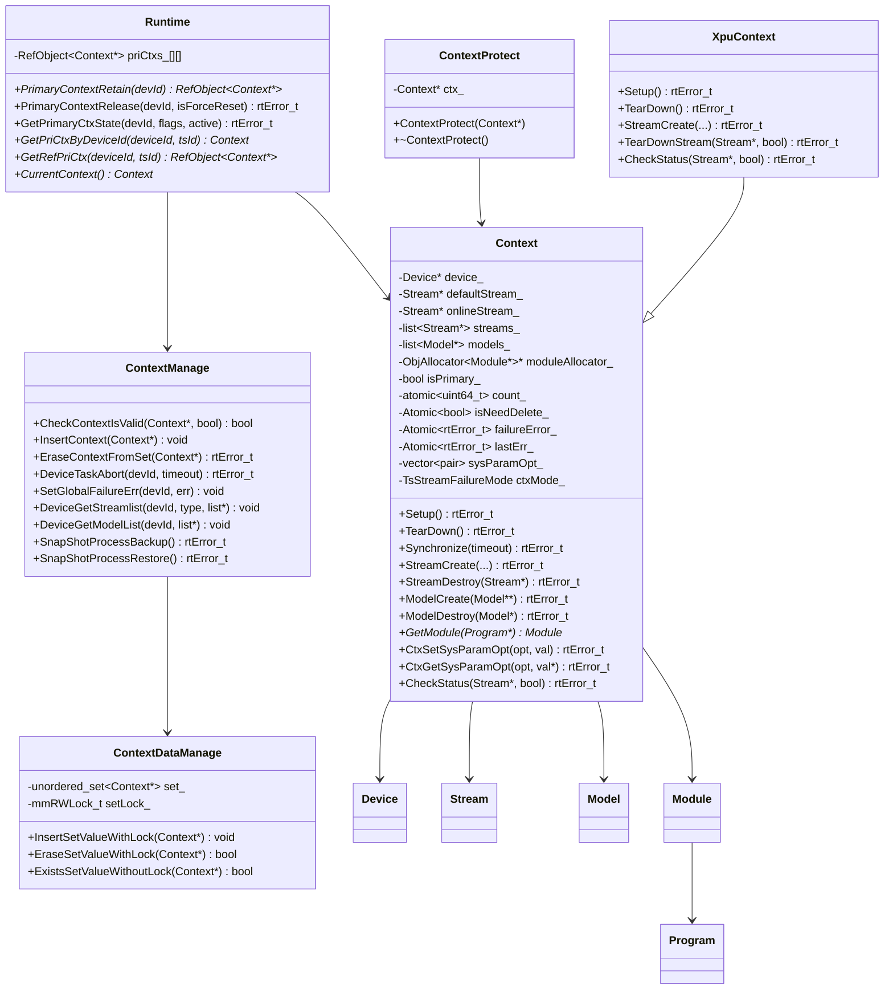

## 5. 关键文件索引

| 模块 | 文件路径 | 核心内容 |
| ---- | -------- | -------- |
| ACL 公开头文件 | `include/external/acl/acl_rt.h` | ACL Context API 声明和接口约束 |
| ACL C 入口 | `src/acl/aclrt_c/runtime/context.c` | ACL Context C 符号入口，转调 wrapper |
| ACL 实现 | `src/acl/aclrt_impl/context.cpp` | ACL Context 实现、参数校验、错误码转换 |
| ACL wrapper | `src/acl/aclrt_impl/acl_rt_wrapper.h` | ACL runtime wrapper 宏注册 |
| Runtime Context 头文件 | `pkg_inc/runtime/runtime/context.h` | `rtContext_t`、`rtCtx*` 接口声明 |
| RTS Context 头文件 | `pkg_inc/runtime/runtime/rts/rts_context.h` | `rtsCtx*` 接口声明 |
| Runtime C API | `src/runtime/api/api_c.cc` | `rtCtx*`、sysparam、default stream 等接口入口 |
| RTS C API | `src/runtime/api/api_c_context.cc` | `rtsCtx*`、primary ctx state 接口入口 |
| Device C API | `src/runtime/api/api_c_device.cc` | `rtSetDevice()`、`rtDeviceReset()` 与 Primary Context 生命周期联动 |
| API 抽象 | `src/runtime/api/api.hpp` | Context 相关虚接口定义 |
| ApiImpl | `src/runtime/core/src/api_impl/api_impl.cc` | Context 创建、销毁、线程绑定、系统参数实现 |
| Runtime | `src/runtime/core/inc/runtime.hpp`、`src/runtime/core/src/runtime.cc` | Primary Context 引用计数、当前 Context 解析 |
| Context 头文件 | `src/runtime/core/inc/context/context.hpp` | Context 类、校验宏、核心方法声明 |
| Context 实现 | `src/runtime/core/src/context/context.cc` | Context 生命周期、Stream、Model、Module、sysparam、同步和错误状态 |
| Context 平台实现 | `src/runtime/core/src/context/context_standard_soc.cc`、`src/runtime/core/src/context/context_tiny_stub.cc` | 标准平台和 tiny stub 的 Context 差异实现 |
| ContextManage | `src/runtime/core/inc/context/context_manage.hpp`、`src/runtime/core/src/context/context_manage.cc` | 全局 Context 集合、有效性校验、设备异常、Snapshot 入口 |
| ContextDataManage | `src/runtime/core/src/common/context_data_manage.h`、`src/runtime/core/src/common/context_data_manage.cc` | 有效 Context set 和读写锁 |
| ContextProtect | `src/runtime/core/inc/context/context_protect.hpp`、`src/runtime/core/src/context/context_protect.cc` | RAII 使用计数和延迟释放 |
| ACL Graph 扩展 | `src/runtime/feature/aclgraph/context_aclgraph.cc`、`src/runtime/feature/aclgraph/context_standard_soc_aclgraph.cc`、`src/runtime/feature/aclgraph/tiny/context_tiny_stub_aclgraph.cc` | 流捕获和 CaptureModel 相关 Context 实现 |
| FFTS 扩展 | `src/runtime/feature/ffts/context_ffts_standard_soc.cc`、`src/runtime/feature/ffts/context_ffts_tiny_stub.cc` | FFTS Plus task launch 标准实现和 stub |
| XPU 扩展 | `src/runtime/core/inc/context/xpu_context.hpp`、`src/runtime/feature/xpu/xpu_context.cc`、`src/runtime/feature/xpu/runtime_xpu_adapt.cc` | XPU Context 生命周期、Stream 和 Primary XPU Context |
| compact Context | `src/runtime_compact/feature/inc/context.h`、`src/runtime_compact/feature/src/context_common.c`、`src/runtime_compact/feature/src/context_linux.c`、`src/runtime_compact/feature/src/context_liteos.c` | runtime_compact 轻量 Context 实现 |
| Context 示例 | `example/1_basic_features/context/README.md` | Context 使用入口说明 |

## 6. 测试覆盖

| 测试文件 | 覆盖重点 |
| -------- | -------- |
| `tests/ut/runtime/runtime/test/rt_utest_api_context.cc` | RTS Context 创建销毁、设置获取当前 Context、Primary Context 状态、sysparam、默认 Stream |
| `tests/ut/runtime/runtime/test/rt_utest_context.cc` | Context Setup、TearDown、Synchronize、任务回收、并发 Context、Module、Model、FFTS、ContextProtect 等 |
| `tests/ut/runtime/runtime/test/platform/910B/rt_utest_api_context.cc` | 910B 平台 Context API 差异用例 |
| `tests/ut/runtime/runtime/test/platform/910B/rt_utest_context.cc` | 910B 平台 Context 行为用例 |
| `tests/ut/runtime/runtime/test/platform/910_95/xpu/rt_utest_xpu_context.cc` | XPU Context 生命周期和 Stream 行为 |
| `tests/ut/runtime/runtime_c/testcase/feature/rt_api_test.cc` | runtime_compact Context API 行为 |
| `tests/ut/acl/testcase/acl_runtime_unittest.cpp` | ACL Context API 参数校验和 Runtime 转调 |
| `tests/ut/runtime/runtime/fuzz/testcase/rt_event_ctx_fuzzer.cc` | Event 与 Context 组合路径 fuzz |

## 7. 设计约束与维护建议

- Primary Context 只能通过 Device 生命周期释放，用户显式销毁接口不能销毁 `IsPrimary()` 为 true 的 Context。
- 新增以 `Context *` 为入参的 API 时，应使用 `CHECK_CONTEXT_VALID_WITH_RETURN` 或等价逻辑，保证 handle 已登记且 `ContextProtect` 覆盖 API 执行区间。
- 调用 `ContextManage::CheckContextIsValid(ctx, true)` 后必须配套 `ContextProtect`，否则 Context 使用计数不会在作用域结束时回落。
- 切换当前 Context 时需要明确处理 `curCtx` 和 `curRef`。显式 Context 使用 `SetCurCtx(ctx)` 并清空 `curRef`；设置 Device 使用 `SetCurRef(ref)` 并清空 `curCtx`。
- 新增 Context 下属资源时，需要补齐 `Context::TearDown()`、异常回收、Snapshot 备份恢复和必要的测试用例。
- 新增平台差异实现时，优先放入 `src/runtime/feature/` 或现有平台 stub 文件，避免把平台条件散落到核心 Context 主流程。
- 新增 ACL/RTS API 时，需要同步检查 `include/external/acl/acl_rt.h`、`pkg_inc/runtime/runtime/context.h`、`pkg_inc/runtime/runtime/rts/rts_context.h`、`src/runtime/api/api.hpp`、`src/runtime/core/src/api_impl/api_impl.cc` 和 profiler 装饰器。

## 8. 性能与可靠性关注点

- Primary Context 通过引用计数复用，避免同一 Device/TS 组合重复创建默认执行环境。
- 用户 Context 销毁先从 `ContextManage` 有效集合移除，再结合使用计数延迟释放，降低并发使用时的 UAF 风险。
- `Context::Setup()` 区分 Primary Context 和用户 Context 的默认 Stream 来源，避免用户 Context 销毁时误删 Device 的 Primary Stream。
- `Context::Synchronize()` 跳过无需同步的 Stream，并拒绝同步 capture 状态的 Stream，避免捕获期间破坏 Stream Capture 状态。
- Module 采用按 Program ID 懒分配模式，`moduleAllocator_` 在 Context 初始化时创建，具体 Module 在首次 `GetModule()` 时创建。
- Context 级 sysparam 保存在 `sysParamOpt_` 中，同一进程内不同 Context 可以保存不同配置。

---

_本模块文档基于 `src/runtime/core/src/context/`、`src/runtime/core/src/runtime.cc`、`src/runtime/core/src/api_impl/api_impl.cc` 及 Context 相关 API、feature、runtime_compact 源码整理。_
