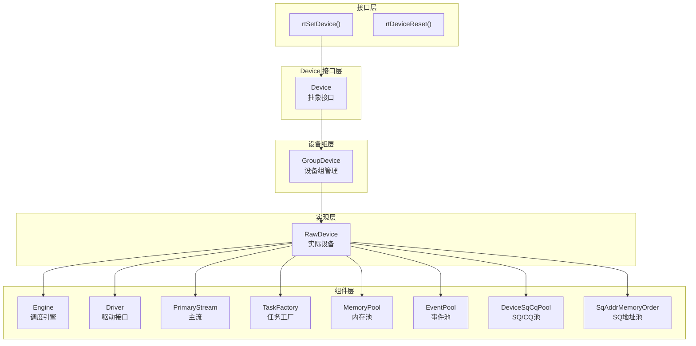
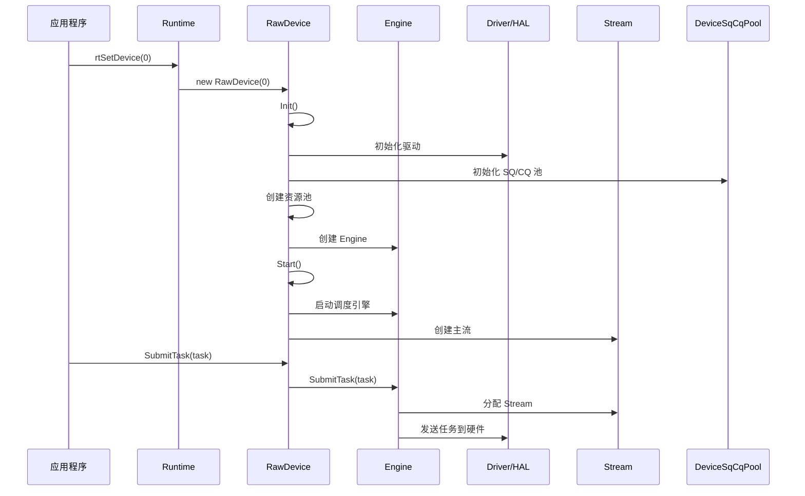
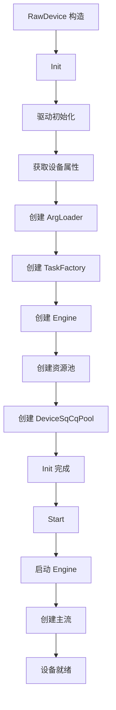
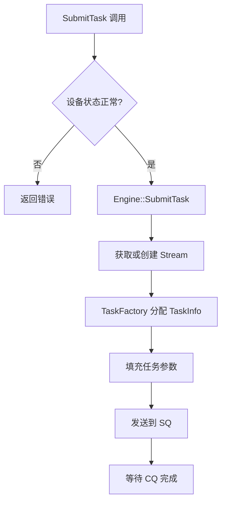
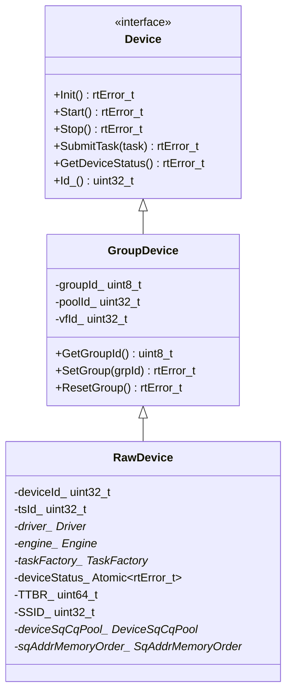
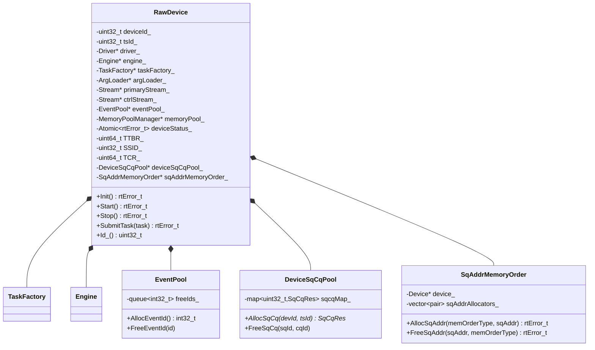
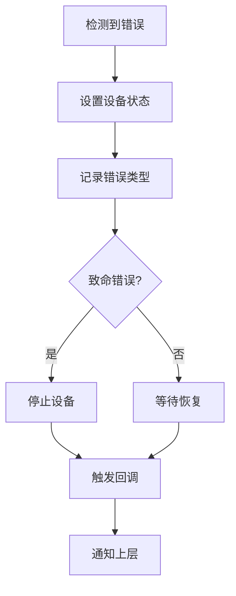

# Device 模块架构

## 1. 模块概述

- **功能介绍**：Device 模块负责管理昇腾 AI 处理器的设备资源，包括设备初始化、启动、停止、状态管理、任务提交、资源池管理等功能。采用三层继承结构：Device（接口）→ GroupDevice（设备组）→ RawDevice（实际设备）。
- **设计目标**：
  - 提供统一的设备管理接口
  - 支持多设备组和虚拟化场景
  - 管理设备生命周期（初始化、运行、停止）
  - 提供任务提交和回收机制
  - 管理设备资源池（Event、Notify、Memory、SQ/CQ 等）
  - 支持设备错误处理和状态回调

## 2. 使用场景与对外接口

### 2.1 使用场景

- **场景一**：设置当前计算设备
  ```cpp
  rtError_t err = rtSetDevice(0);
  // Runtime::DeviceRetain(0) → Device::Init() → Device::Start()
  ```

- **场景二**：提交计算任务到设备
  ```cpp
  TaskInfo task;
  device->SubmitTask(&task);
  // 通过 Engine 提交任务到硬件
  ```

- **场景三**：设备错误处理
  ```cpp
  rtError_t status = device->GetDeviceStatus();
  if (status != RT_ERROR_NONE) {
      // 处理设备错误
  }
  ```

### 2.2 对外接口

| 接口 | 文件位置 | 说明 |
|------|----------|------|
| `rtSetDevice()` | `src/runtime/api/api_c_device.cc` | 设置当前设备 |
| `rtDeviceReset()` | `src/runtime/api/api_c_device.cc` | 重置设备 |
| `rtGetDevice()` | `src/runtime/api/api_c_device.cc` | 获取当前设备 ID |
| `rtGetDeviceCapability()` | `src/runtime/api/api_c_device.cc` | 获取设备能力 |
| `rtGetDeviceInfo()` | `src/runtime/api/api_c_device.cc` | 获取设备信息 |
| `rtDeviceSynchronize()` | `src/runtime/api/api_c_device.cc` | 设备同步 |
| `rtSetDeviceSatMode()` | `src/runtime/api/api_c.cc` | 设置饱和模式 |
| `rtGetDeviceSatMode()` | `src/runtime/api/api_c_device.cc` | 获取饱和模式 |

## 3. 架构总览

### 整体设计思路

Device 采用三层继承结构实现设备管理：抽象接口层（Device）定义所有核心方法，中间层（GroupDevice）处理设备组管理，底层（RawDevice）实现具体设备操作。每个 Device 包含 Engine（调度引擎）、Driver（驱动）、Stream（主流）、DeviceSqCqPool（SQ/CQ池）、SqAddrMemoryOrder（SQ地址内存池）等核心组件。

### 架构分层图



### 核心模块交互图



## 4. 详细设计

### 4.1 核心流程

#### 设备初始化流程



**关键代码**：

```cpp
// 文件位置：src/runtime/core/src/device/raw_device.cc
rtError_t RawDevice::Init() {
    // 驱动初始化
    driver_ = new Driver(deviceId_);
    driver_->Init();
    
    // 获取设备属性
    driver_->GetDevProperties(devProperties_);
    
    // 创建参数加载器
    argLoader_ = new ArgLoader();
    ubArgLoader_ = new UbArgLoader();
    
    // 创建任务工厂
    taskFactory_ = new TaskFactory(this);
    
    // 创建调度引擎
    engine_ = new Engine(this);
    
    // 创建资源池
    eventPool_ = new EventPool();
    notifyPool_ = new NotifyPool();
    memoryPool_ = new MemoryPoolManager();
    deviceSqCqPool_ = new DeviceSqCqPool();
    sqAddrMemoryOrder_ = new SqAddrMemoryOrder();
    return RT_ERROR_NONE;
}

rtError_t RawDevice::Start() {
    // 启动调度引擎
    engine_->Start();
    
    // 创建主流
    primaryStream_ = streamFactory_->CreateStream(this);
    ctrlStream_ = streamFactory_->CreateCtrlStream(this);
    
    return RT_ERROR_NONE;
}
```

#### 任务提交流程



**关键代码**：

```cpp
// 文件位置：src/runtime/core/src/device/raw_device.hpp
rtError_t RawDevice::SubmitTask(TaskInfo *taskObj, ...) {
    // 检查设备状态
    rtError_t error = GetDeviceStatus();
    if (error != RT_ERROR_NONE) {
        return error;
    }
    
    // 通过 Engine 提交任务
    return engine_->SubmitTask(taskObj, flipTaskId, timeout);
}
```

### 4.2 核心机制详解

#### 三层继承结构

**设计思想**：分离接口定义、设备组管理和实际实现，支持多场景适配。



#### 设备状态管理

**设计思想**：使用原子变量管理设备状态和故障类型，支持多线程并发访问。

```cpp
// 文件位置：src/runtime/core/src/device/device.hpp
class Device {
public:
    void SetDeviceStatus(rtError_t status) {
        deviceStatus_.Set(status);
    }
    
    rtError_t GetDeviceStatus() const {
        return deviceStatus_.Value();
    }
    
    void SetDeviceFaultType(DeviceFaultType type) {
        deviceFaultType_.Set(type);
    }
    
private:
    Atomic<rtError_t> deviceStatus_;
    Atomic<DeviceFaultType> deviceFaultType_;
};
```

#### 资源池管理

**设计思想**：设备维护多个资源池（Event、Notify、Memory、SQ/CQ），支持快速分配和回收。

```cpp
// 文件位置：src/runtime/core/src/device/raw_device.hpp
class RawDevice {
    // Event 池管理
    void PushEvent(Event *evt);
    void RemoveEvent(Event *evt);
    rtError_t AllocPoolEvent(int32_t *eventId);
    rtError_t FreePoolEvent(int32_t eventId);
    
    // Notify 池管理
    void PushNotify(Notify *nty);
    void RemoveNotify(Notify *nty);
    
    // Memory 池管理
    rtError_t AllocSPM(void **dptr, uint64_t size);
    rtError_t FreeSPM(const void *dptr);

     // SQ/CQ 池管理
     DeviceSqCqPool *GetDeviceSqCqManage() const;
     SqAddrMemoryOrder *GetSqAddrMemoryManage() const;
     uint64_t AllocSqIdMemAddr();
     void FreeSqIdMemAddr(const uint64_t sqIdAddr);
};
```

### 4.3 模块职责划分

| 模块 | 职责 | 位置 |
|------|------|------|
| Device | 抽象接口定义 | `device/device.hpp` |
| GroupDevice | 设备组管理 | `device/group_device.hpp` |
| RawDevice | 实际设备实现 | `device/raw_device.hpp` |
| Engine | 任务调度引擎 | `engine/engine.hpp` |
| TaskFactory | 任务对象工厂 | `task/task_factory.hpp` |
| Driver | 驱动接口封装 | `driver/driver.hpp` |
| DeviceSqCqPool | SQ/CQ 资源池 | `device/device_sq_cq_pool.hpp` |
| SqAddrMemoryOrder | SQ 地址内存池 | `device/sq_addr_memory_pool.hpp` |

### 4.4 核心数据结构



## 5. 关键文件索引

| 模块 | 文件路径 | 核心内容 |
|------|----------|----------|
| Device 接口 | `src/runtime/core/src/device/device.hpp` | Device 抽象类定义 |
| GroupDevice | `src/runtime/core/src/device/group_device.hpp` | 设备组管理类 |
| RawDevice | `src/runtime/core/src/device/raw_device.hpp` | 实际设备实现 |
| RawDevice 实现 | `src/runtime/core/src/device/raw_device.cc` | Init, Start, SubmitTask 实现 |
| SQ/CQ 池 | `src/runtime/core/src/device/device_sq_cq_pool.hpp` | SQ/CQ 资源池管理 |
| SQ 地址池 | `src/runtime/core/src/device/sq_addr_memory_pool.hpp` | SQ 地址内存池管理 |
| 错误处理 | `src/runtime/core/src/device/device_error_proc.cc` | 设备错误处理 |
| C 接口层 | `src/runtime/c/rt_device.cc` | rtSetDevice 等外部接口 |

## 6. 设备错误处理机制

### 错误类型

```cpp
enum class DeviceFaultType : uint8_t {
    NO_ERROR = 0,
    AICORE_ERROR,
    AICPU_ERROR,
    HWTS_ERROR,
    DEVICE_TIMEOUT,
    ...
};
```

### 错误处理流程



## 7. 性能优化策略

- **任务预分配**：TaskFactory 预分配任务对象，减少分配开销
- **资源池复用**：Event、Notify 池复用，避免频繁创建销毁
- **SQ/CQ 池化**：多 Stream 共享 SQ/CQ 资源
- **SQ 地址池化**：SqAddrMemoryOrder 按大小分级管理，支持 32K-2M 不同规格
- **原子状态检查**：设备状态使用原子操作，减少锁开销
- **异步任务提交**：任务异步提交，不阻塞调用线程

---

_本模块文档基于源码 `src/runtime/core/src/device/` 分析。_