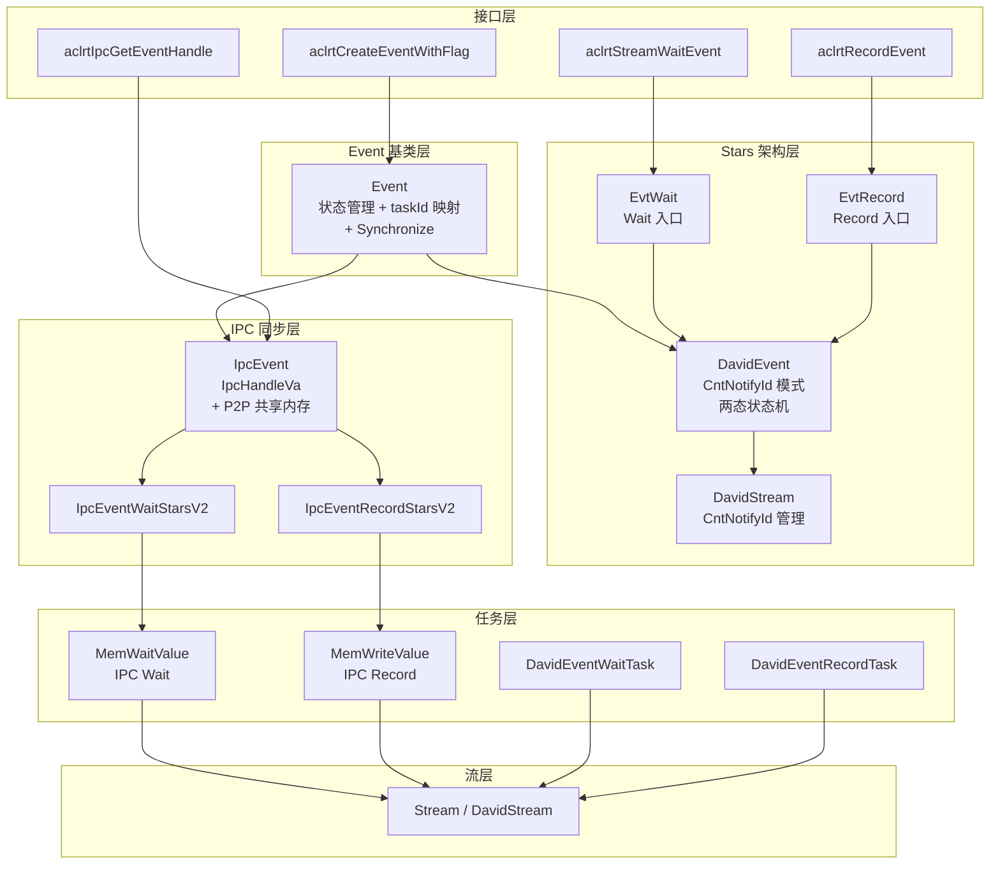
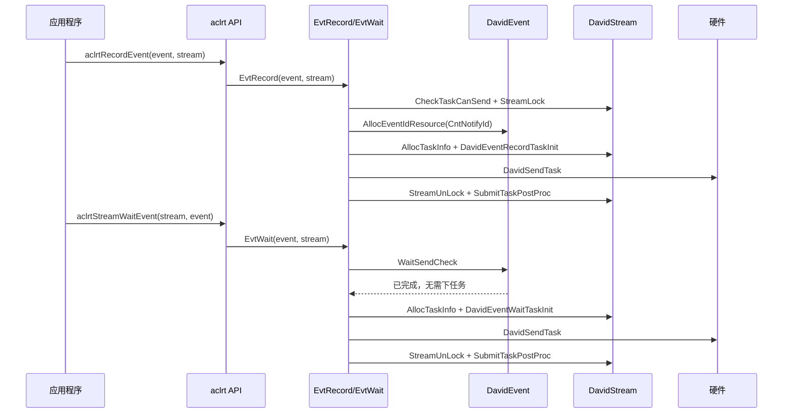
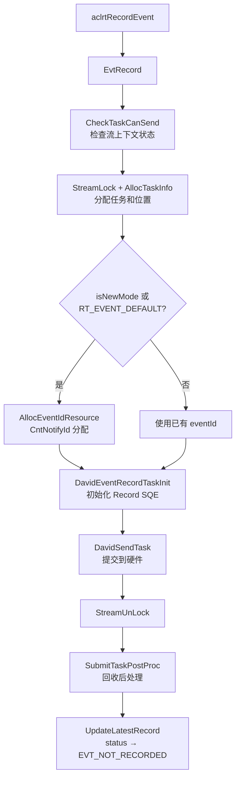
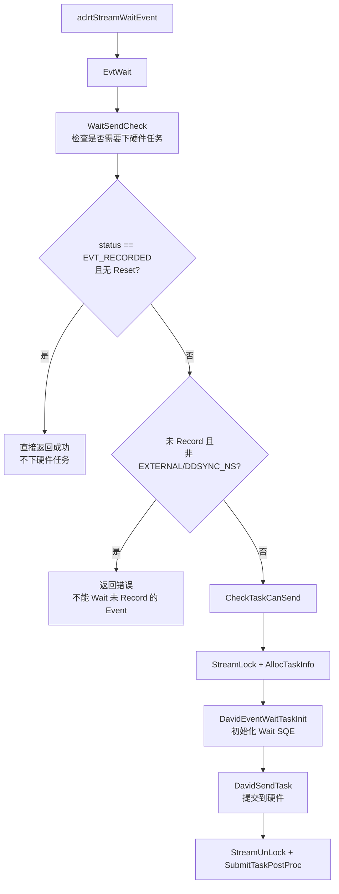
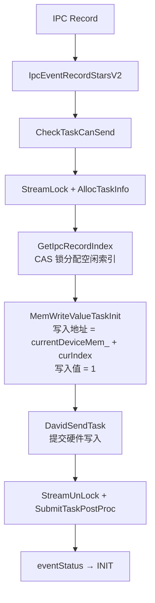
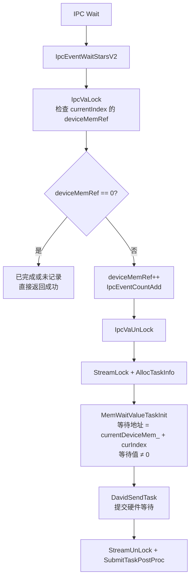
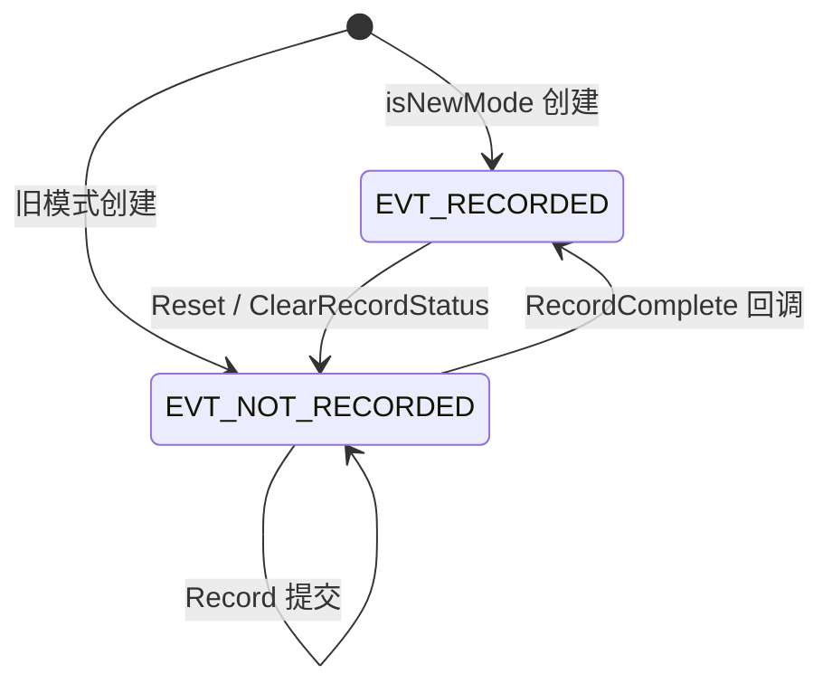
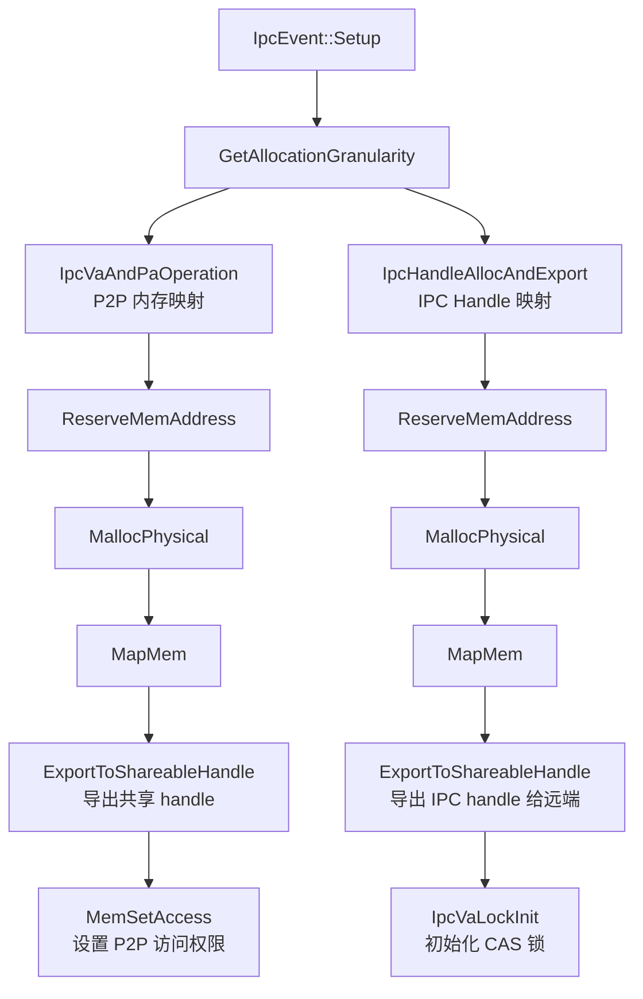
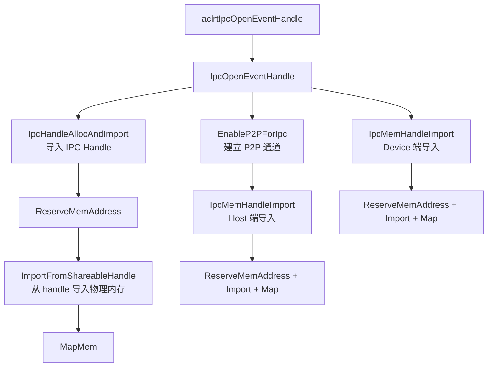
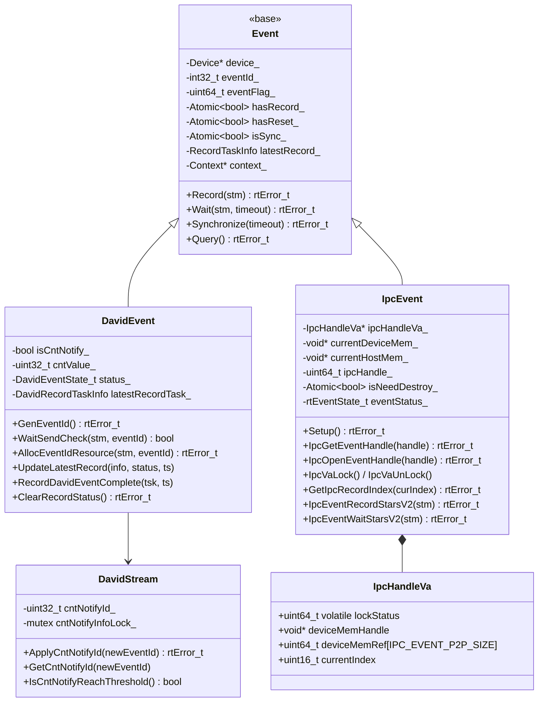

# Event 模块架构

## 1. 模块概述

- **功能介绍**：Event 模块提供同步机制，支持事件记录、等待和状态查询。Event 可以在流中记录执行位置，其他流可以等待该事件完成，实现跨流同步。支持 IPC Event 用于进程间同步。
- **设计目标**：
  - 提供高效的跨流同步机制
  - IPC 场景通过共享内存实现进程间事件同步
  - 支持事件状态查询和超时等待
  

## 2. 使用场景与对外接口

### 2.1 使用场景

- **场景一**：跨流同步
  ```cpp
  aclrtRecordEvent(event, stream1);  // 在 stream1 记录事件
  aclrtStreamWaitEvent(stream2, event);  // stream2 等待事件
  ```

- **场景二**：查询事件状态
  ```cpp
  aclrtEventRecordedStatus status;
  aclrtQueryEventStatus(event, &status);  // 查询事件是否完成
  if (status == ACL_EVENT_RECORDED_STATUS_COMPLETE) {
      // 事件已完成
  }
  ```

- **场景三**：阻塞等待事件
  ```cpp
  aclrtSynchronizeEvent(event);  // 阻塞等待事件完成
  ```

- **场景四**：IPC 进程间同步
  ```cpp
  // 进程 A：创建 IPC Event 并导出 handle
  aclrtCreateEventWithFlag(&event, ACL_EVENT_IPC);
  aclrtIpcGetEventHandle(event, &ipcHandle);
  // 将 ipcHandle 传递给进程 B（如通过共享内存或 socket）

  // 进程 B：打开 IPC Event
  aclrtIpcOpenEventHandle(ipcHandle, &remoteEvent);
  aclrtStreamWaitEvent(stream, remoteEvent);
  ```

- **场景五**：计算事件间隔时间
  ```cpp
  aclrtCreateEventWithFlag(&startEvent, ACL_EVENT_TIME_LINE);  // 创建起始事件
  aclrtCreateEventWithFlag(&endEvent, ACL_EVENT_TIME_LINE);    // 创建结束事件
  aclrtRecordEvent(startEvent, stream);        // 在 stream 记录起始事件
  // ... 执行需要计时的任务 ...
  aclrtRecordEvent(endEvent, stream);          // 在 stream 记录结束事件
  aclrtSynchronizeEvent(endEvent);             // 等待结束事件完成
  float elapsedTime = 0.0f;
  aclrtEventElapsedTime(&elapsedTime, startEvent, endEvent);  // 计算两个事件之间的耗时（毫秒）
  printf("Task elapsed time: %.3f ms\n", elapsedTime);
  aclrtDestroyEvent(startEvent);
  aclrtDestroyEvent(endEvent);
  ```

### 2.2 对外接口

| 接口 | 说明 |
|------|------|
| `aclrtCreateEvent()` | 创建事件（默认 flag） |
| `aclrtCreateEventWithFlag()` | 带 flag 创建事件 |
| `aclrtCreateEventExWithFlag()` | 带 flag 创建可复用事件 |
| `aclrtDestroyEvent()` | 销毁事件 |
| `aclrtRecordEvent()` | 在流中记录事件 |
| `aclrtResetEvent()` | 重置事件 |
| `aclrtQueryEventStatus()` | 查询事件完成状态 |
| `aclrtQueryEventWaitStatus()` | 查询事件等待状态 |
| `aclrtSynchronizeEvent()` | 阻塞等待事件完成 |
| `aclrtSynchronizeEventWithTimeout()` | 带超时阻塞等待 |
| `aclrtStreamWaitEvent()` | 流等待事件 |
| `aclrtStreamWaitEventWithTimeout()` | 带超时流等待事件 |
| `aclrtEventElapsedTime()` | 计算两个事件间隔时间 |
| `aclrtEventGetTimestamp()` | 获取事件记录时间戳 |
| `aclrtGetEventId()` | 获取事件 ID |
| `aclrtIpcGetEventHandle()` | 获取 IPC Event 跨进程 handle |
| `aclrtIpcOpenEventHandle()` | 在当前进程打开 IPC Event handle |

### 2.3 Event Flag 类型

Event Flag 通过 `aclrtCreateEventWithFlag` 传入，决定 Event 的创建分支和同步行为：

| Flag | 值 | 说明 |
|------|-----|------|
| `ACL_EVENT_SYNC` | 0x01 | 同步事件 |
| `ACL_EVENT_CAPTURE_STREAM_PROGRESS` | 0x02 | 流捕获进度标记 |
| `ACL_EVENT_TIME_LINE` | 0x08 | 时间线事件（用于计时） |
| `ACL_EVENT_DEVICE_USE_ONLY` | 0x10 | 仅设备内部使用 |
| `ACL_EVENT_EXTERNAL` | 0x20 | 外部事件（跨进程可见） |
| `ACL_EVENT_IPC` | 0x40 | IPC 事件（进程间同步，创建 IpcEvent 子类） |

Flag 值为 0 时（默认）创建普通 Event；`ACL_EVENT_IPC` 创建 IpcEvent 子类；`ACL_EVENT_TIME_LINE` 使用固定 TIMELINE_EVENT_ID；其他 Flag 影响 eventId 分配策略和 Wait 任务类型。

### 2.4 Event 状态枚举

| 枚举类型 | 值 | 说明 |
|----------|-----|------|
| `aclrtEventRecordedStatus` | `NOT_READY(0)` / `COMPLETE(1)` | 事件记录状态 |
| `aclrtEventWaitStatus` | `COMPLETE(0)` / `NOT_READY(1)` / `RESERVED(0xFFFF)` | 事件等待状态 |

## 3. 架构总览

### 3.1 整体设计思路

Event 模块采用继承分支设计：Event 基类提供状态管理和同步框架，Stars 架构下由 DavidEvent 子类承载（CntNotifyId 模式 + 两态状态机），IPC 场景下由 IpcEvent 子类承载（P2P 共享内存 + MemWriteValue/MemWaitValue SQE）。DavidEvent 的 Record/Wait 入口由 `event_c.cc` 中 `EvtRecord`/`EvtWait` 函数承接，IpcEvent 的 Record/Wait 由 `IpcEventRecordStarsV2`/`IpcEventWaitStarsV2` 承接。

### 3.2 架构分层图



### 3.3 核心模块交互图



## 4. 详细设计

### 4.1 DavidEvent Record 流程



**流程步骤说明**：

- **CheckTaskCanSend**：检查流上下文状态，确保 Context 未 abort，否则返回错误
- **AllocEventIdResource**：DavidEvent 使用 CntNotifyId 替代传统 eventId。CntNotifyId 由 DavidStream 管理（`cntNotifyId_`），首次 Record 时通过 `ApplyCntNotifyId` 从驱动申请。当 `IsCntNotifyReachThreshold` 达到阈值时，需先等待之前 Wait 任务完成再申请新 id
- **StreamLock / StreamUnLock**：整个任务分配和提交过程在 Stream 锁保护下完成，防止并发修改 Stream 任务队列
- **SubmitTaskPostProc**：任务提交后的回收处理，包括更新 Stream 队列位置和触发 Profiling

### 4.2 DavidEvent Wait 流程



**流程步骤说明**：

- **WaitSendCheck** 是关键决策点：若 Event 状态为 EVT_RECORDED 且未 Reset，直接返回成功不下硬件任务。这是 DavidEvent 的优化：当 Record 已完成，Wait 只需检查状态，无需插入额外 SQE
- 若 Event 未 Record 且 Flag 不是 EXTERNAL/DDSYNC_NS，返回 `ACL_ERROR_RT_INVALID_VALUE`，因为不能 Wait 一个未 Record 的 Event
- 否则下发 Wait 任务到硬件，通过 SQE 等待 CntNotifyId 完成

### 4.3 IPC Event Record 流程（StarsV2）



**流程步骤说明**：

- IPC Record 不使用 CntNotifyId/eventId，而是通过**共享内存索引**实现同步：`GetIpcRecordIndex` 在 `IpcHandleVa.deviceMemRef[]` 中通过 CAS 自旋锁（`IpcVaLock/IpcVaUnLock`）分配一个空闲 `curIndex`
- 硬件执行 `MemWriteValue` SQE，将值 1 写入 `currentDeviceMem_ + curIndex` 地址，跨进程通过 P2P 共享内存可见
- 写入完成后，远端进程的 MemWaitValue 即可感知该地址值变化

### 4.4 IPC Event Wait 流程（StarsV2）



**流程步骤说明**：

- IPC Wait 使用 `MemWaitValue` SQE 等待共享内存地址变为非零值。当硬件执行完 Record 的 MemWriteValue 后，该地址从 0 变为 1，Wait 任务即完成
- `IpcVaLock`（CAS 自旋锁）保护 `deviceMemRef[]` 的并发计数，支持同一 IPC Event 多次 Wait 的引用计数管理
- `deviceMemRef == 0` 意味着 Record 已完成（Ref 已被消耗）或尚未 Record，两种情况均无需下硬件任务，直接返回

### 4.5 核心机制详解

#### DavidEvent 状态机与 CntNotify 机制

**设计思想**：DavidEvent 将基类的三态状态机（INIT/RECORDING/RECORDED）简化为两态（`EVT_NOT_RECORDED`/`EVT_RECORDED`），并用 DavidStream 维护的 CntNotifyId 替代传统 eventId 池分配，减少跨组件资源管理开销。



CntNotifyId 由 DavidStream 管理：
- `cntNotifyId_` 成员维护当前 Stream 的 NotifyId
- 首次通过 `ApplyCntNotifyId` 从驱动申请
- `IsCntNotifyReachThreshold` 达到阈值时需等待之前 Wait 任务完成
- `isCntNotify_` 标志区分预分配（newMode/RT_EVENT_DEFAULT）和驱动分配两种 id 来源

#### IPC Event 共享内存同步机制

**设计思想**：IPC Event 不依赖 CntNotifyId 硬件同步，而是通过 P2P 共享内存 + MemWriteValue/MemWaitValue SQE 实现跨进程事件同步，避免进程间 NotifyId 不可共享的限制。

核心数据结构 `IpcHandleVa`：

| 字段 | 类型 | 说明 |
|------|------|------|
| `lockStatus` | `uint64_t volatile` | CAS 自旋锁（LOCK_RELEASED/LOCK_OCCUPIED） |
| `deviceMemHandle` | `void*` | P2P 共享内存 handle（由 Export 导出） |
| `deviceMemRef[8192]` | `uint64_t[IPC_EVENT_P2P_SIZE]` | 环形索引数组，每个 slot 记录 Record/Wait 计数 |
| `currentIndex` | `uint16_t` | 当前 Record 位置 |

**Setup 流程（创建端）**：



**Open 流程（远端进程）**：



- **创建端**：分配 P2P 共享内存 + IPC Handle，导出两个 shareable handle（deviceMemHandle + ipcHandle）
- **远端进程**：Import IPC Handle → 获取 IpcHandleVa 指针 → Enable P2P → Host/Device 双端 Import 共享内存
- 跨进程同步：创建端通过 MemWriteValue 写入 `currentDeviceMem_ + curIndex`，远端通过 MemWaitValue 等待同一地址值变化

### 4.6 模块职责划分

| 模块 | 职责 | 位置 |
|------|------|------|
| Event | 事件基类，状态管理、taskId 映射、Synchronize | `core/inc/event/event.hpp` |
| DavidEvent | Stars 架构 Event 子类，CntNotifyId 模式、两态状态机 | `core/inc/event/event_david.hpp` |
| IpcEvent | IPC Event 子类，P2P 共享内存同步 | `core/inc/event/ipc_event.hpp` |
| event_c.cc | Stars 架构 Record/Wait/Reset 入口 | `core/src/event/event_c.cc` |
| event_david.cc | DavidEvent 实现 | `core/src/event/event_david.cc` |
| ipc_event.cc | IpcEvent 基础实现（Setup/Open） | `core/src/event/ipc_event.cc` |
| ipc_event_starsV2.cc | IPC StarsV2 Record/Wait | `core/src/event/ipc_event_starsV2.cc` |
| DavidStream | Stream CntNotifyId 管理 | `core/src/stream/stream_david.hpp` |

### 4.7 核心数据结构



## 5. 关键文件索引

| 模块 | 文件路径 | 核心内容 |
|------|----------|----------|
| Event 基类 | `src/runtime/core/inc/event/event.hpp` | Event 类定义 |
| Event 基类实现 | `src/runtime/core/src/event/event.cc` | Event 基类核心实现 |
| DavidEvent 定义 | `src/runtime/core/inc/event/event_david.hpp` | DavidEvent 类定义、两态状态机 |
| DavidEvent 实现 | `src/runtime/core/src/event/event_david.cc` | CntNotifyId、状态管理、Query |
| Stars 入口 | `src/runtime/core/src/event/event_c.cc` | EvtRecord/EvtWait/EvtReset |
| IpcEvent 定义 | `src/runtime/core/inc/event/ipc_event.hpp` | IpcEvent 类、IpcHandleVa |
| IpcEvent 实现 | `src/runtime/core/src/event/ipc_event.cc` | Setup/Open 流程 |
| IPC StarsV2 | `src/runtime/core/src/event/ipc_event_starsV2.cc` | IPC Record/Wait StarsV2 |
| C 接口层 | `src/runtime/api/api_c_event.cc` | aclrt/rt Event 外部接口 |
| 任务定义 | `src/runtime/core/src/task/task_info/event/` | Event/Notify 任务类型 |

## 6. 性能优化策略

- **CntNotifyId 模式**：DavidEvent 使用 Stream 维护的 CntNotifyId 替代全局池分配，减少跨组件 id 管理开销
- **两态状态机**：DavidEvent 简化为 EVT_NOT_RECORDED/EVT_RECORDED 两态，减少状态判断复杂度
- **Wait 快捷路径**：WaitSendCheck 检测到已完成 Event 时直接返回，不下硬件任务
- **IPC 共享内存**：IpcEvent 通过 P2P 共享内存实现跨进程同步，避免进程间 NotifyId 不可共享的限制
- **CAS 自旋锁**：IpcHandleVa 的 lockStatus 使用 CAS 原子操作，避免进程间互斥锁不可用的问题
- **环形索引复用**：deviceMemRef[8192] 环形索引数组，支持 IPC Event 多次 Record/Wait 复用同一共享内存区域

---

_本模块文档基于源码 `src/runtime/core/src/event/` 和 `src/runtime/core/inc/event/` 分析。_