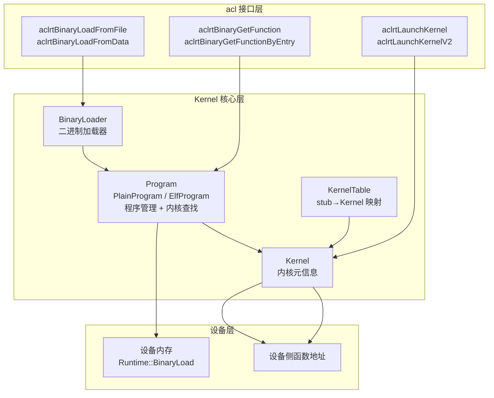
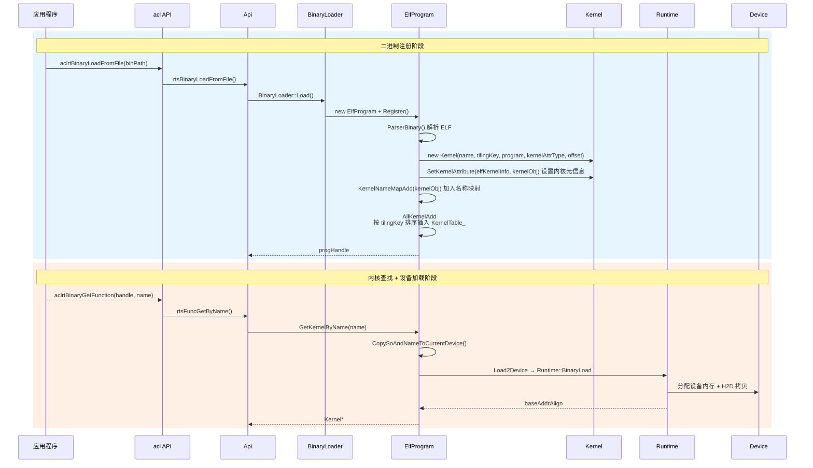
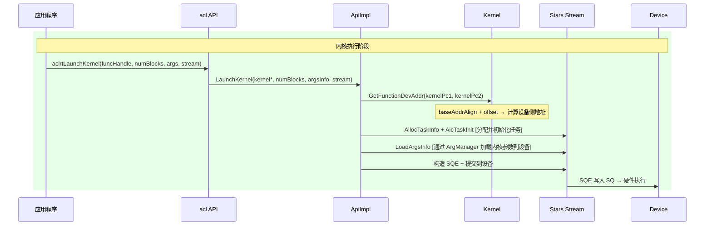
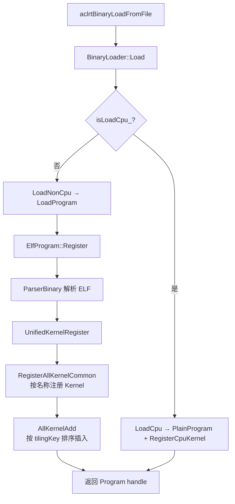
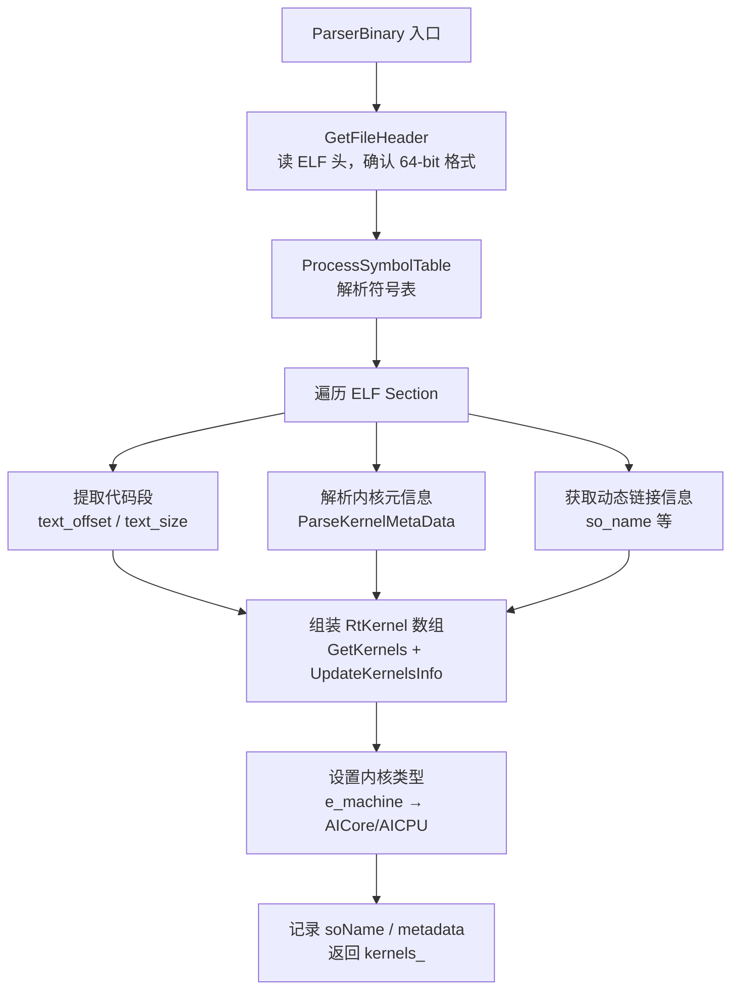
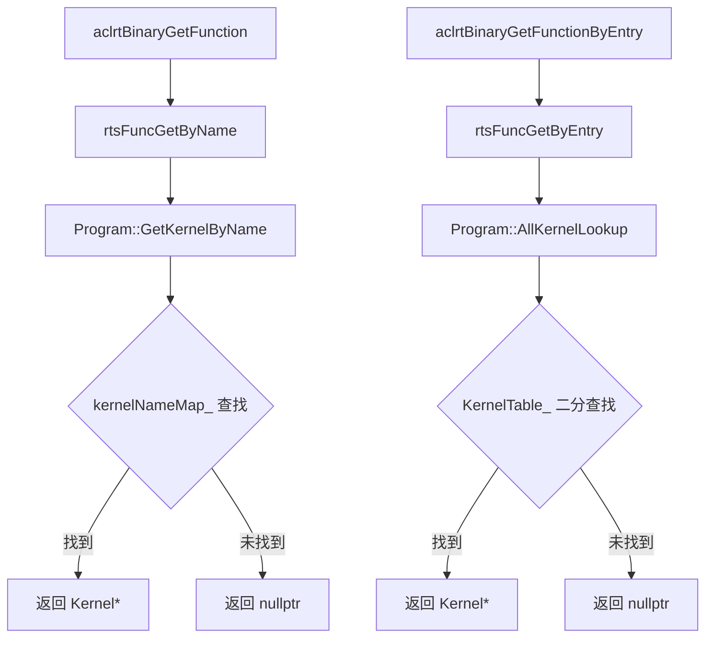
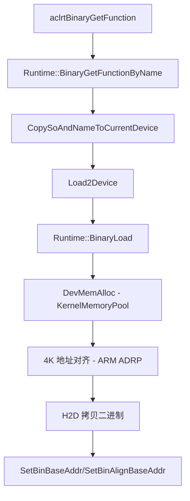
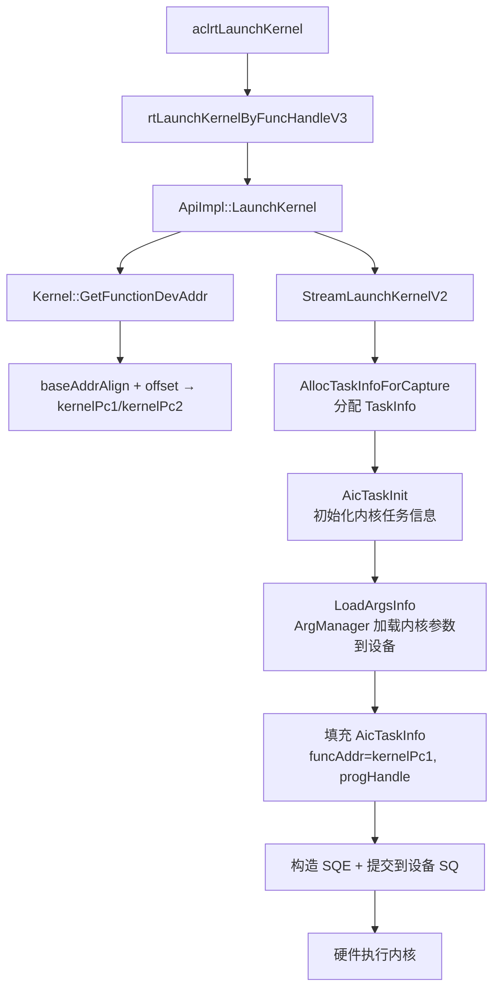
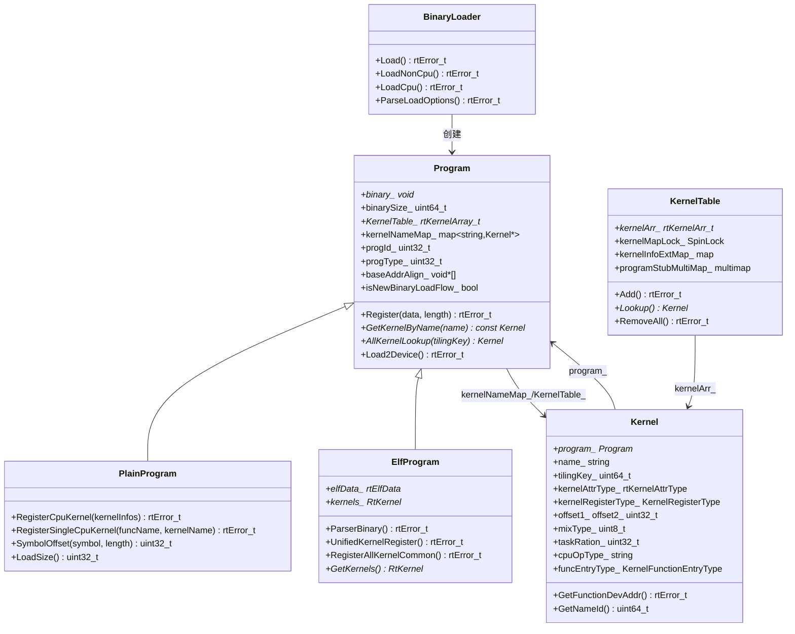

# Kernel 模块架构

## 1. 模块概述

- **功能介绍**：Kernel 模块负责管理内核二进制的注册、查找和执行，Kernel 维护内核元信息（名称、偏移、参数等）。
- **设计目标**：
  - 提供内核注册和查找机制
  - 管理内核元信息
  - 支持内核二进制加载到设备
  - 支持 AI Core（AI Cube、AI Vector）、MIX（AI Cube 和 AI Vector 混合）、AICPU 多种算子注册
  - 支持按核函数名称（Function Name）/核函数标识（Function Entry）两种查找方式

## 2. 使用场景与对外接口

### 2.1 使用场景

- **场景一**：二进制注册（从文件）
  ```cpp
  aclrtBinHandle binHandle = nullptr;
  aclrtBinaryLoadFromFile(binPath, nullptr, &binHandle);
  // 内部路径: rtsBinaryLoadFromFile → BinaryLoader::Load → ElfProgram::Register → UnifiedKernelRegister
  ```

- **场景二**：二进制注册（从内存）
  ```cpp
  aclrtBinHandle binHandle = nullptr;
  aclrtBinaryLoadFromData(data, length, nullptr, &binHandle);
  // 内部路径: rtsBinaryLoadFromData → BinaryLoader::Load → ElfProgram::Register
  ```

- **场景三**：内核查找与执行
  ```cpp
  aclrtFuncHandle funcHandle = nullptr;
  aclrtBinaryGetFunction(binHandle, kernelName, &funcHandle);
  aclrtLaunchKernel(funcHandle, numBlocks, argsData, argsSize, stream);
  ```

- **场景四**：内核查找（按核函数标识）
  ```cpp
  aclrtFuncHandle funcHandle = nullptr;
  aclrtBinaryGetFunctionByEntry(binHandle, funcEntry, &funcHandle);
  ```

### 2.2 对外接口

| 接口 | 对应 rt 调用 | 说明 |
|------|-------------|------|
| `aclrtCreateBinary()` | 本地 new rtDevBinary_t | 创建二进制描述对象 |
| `aclrtDestroyBinary()` | 本地 delete | 销毁二进制描述对象 |
| `aclrtBinaryLoad()` | `rtBinaryLoadWithoutTilingKey()` | 注册二进制（旧接口，无 tiling key） |
| `aclrtBinaryUnLoad()` | `rtBinaryUnLoad()` | 卸载二进制 |
| `aclrtBinaryLoadFromFile()` | `rtsBinaryLoadFromFile()` | 从文件注册二进制 |
| `aclrtBinaryLoadFromData()` | `rtsBinaryLoadFromData()` | 从内存注册二进制 |
| `aclrtBinaryGetFunction()` | `rtsFuncGetByName()` | 按名称获取内核函数 |
| `aclrtBinaryGetFunctionByEntry()` | `rtsFuncGetByEntry()` | 按核函数标识获取内核函数 |
| `aclrtBinaryGetDevAddress()` | `rtsBinaryGetDevAddress()` | 获取二进制设备侧地址 |
| `aclrtBinaryGetGlobal()` | `rtBinaryGetGlobal()` | 获取全局符号地址 |
| `aclrtBinarySetExceptionCallback()` | `rtBinarySetExceptionCallback()` | 设置异常回调 |
| `aclrtLaunchKernel()` | `rtLaunchKernelByFuncHandleV3()` | 执行内核 |
| `aclrtLaunchKernelV2()` | `rtsLaunchKernelWithDevArgs()` | 执行内核（V2） |
| `aclrtLaunchKernelWithConfig()` | `rtsLaunchKernelWithConfig()` | 执行内核（带配置） |
| `aclrtLaunchKernelWithHostArgs()` | `rtsLaunchKernelWithHostArgs()` | 执行内核（Host 参数） |
| `aclrtLaunchKernelWithArgsArray()` | `rtLaunchKernelWithArgsArray()` | 执行内核（参数数组） |

## 3. 架构总览

### 3.1 整体设计思路

- **BinaryLoader**：内核注册入口，从文件或内存加载二进制并创建 Program。
- **Program**：管理内核二进制和查找，维护名称映射和 tilingKey 有序表两个查找机制。ElfProgram 解析 ELF 并注册内核，PlainProgram 注册 CPU 内核。
- **Kernel**：维护内核元信息，通过所属 Program 的基地址直接计算设备侧函数地址。
- **KernelTable**：全局 stub→Kernel 有序映射表，二分查找，支持按 Program 批量卸载。
- 设备侧加载通过 Program::Load2Device → Runtime::BinaryLoad 完成，在 aclrtBinaryGetFunction 内部触发。

### 3.2 架构分层图



### 3.3 核心模块交互图





## 4. 详细设计

### 4.1 核心流程

#### 二进制注册流程



**流程步骤说明**：

1. BinaryLoader 判断 CPU/非 CPU 路径（通过 `isLoadCpu_` 标志区分）
2. 非 CPU 路径：LoadProgram 创建 ElfProgram → Register 保存二进制 → ParserBinary 解析 ELF 符号和属性 → UnifiedKernelRegister 执行两步注册
3. UnifiedKernelRegister 先调用 RegisterAllKernelCommon 按名称注册到 `kernelNameMap_`，再遍历所有 Kernel 按 tilingKey 排序插入 `KernelTable_`
4. CPU 路径：创建 PlainProgram，根据模式加载 CPU 算子信息并注册

**关键代码**：

```cpp
// 文件位置：src/runtime/core/src/kernel/program.cc
rtError_t ElfProgram::UnifiedKernelRegister() {
    rtError_t error = RegisterAllKernelCommon();
    ERROR_RETURN(error, "register all kernel failed, retCode=%#x.", static_cast<uint32_t>(error));

    const std::map<std::string, Kernel *>& kernelNameMap = GetKernelNameMap();
    for (auto iter = kernelNameMap.begin(); iter != kernelNameMap.end(); ++iter) {
        Kernel* kernelObj = iter->second;
        if (kernelObj->GetFunctionEntryType() == KernelFunctionEntryType::KERNEL_TYPE_NOT_SUPPORT_FUNCTION_ENTRY) {
            continue;
        }
        bool isRepeated = false;
        error = AllKernelAdd(kernelObj, isRepeated);
        ERROR_RETURN(error, "add kernel to tilingKey table failed, kernel_name=%s, tilingKey=%llu.",
            kernelObj->Name_().c_str(), kernelObj->TilingKey());
    }
    return RT_ERROR_NONE;
}
```

#### ELF 解析流程



**流程步骤说明**：

1. 读 ELF 文件头，确认是合法 64-bit 格式
2. 遍历 ELF 各 Section：提取代码段位置和大小、解析每个内核的元信息（名称、偏移、长度、funcType、funcEntryType 等）、获取 so_name
3. 将解析结果组装为 RtKernel 数组（每个 RtKernel 包含一个内核的全部描述信息）
4. 根据 ELF 头的 e_machine 设置默认内核类型（AICore/AICPU），记录 soName 和 metadata

**关键代码**：

```cpp
// 文件位置：src/runtime/core/src/kernel/program.cc
rtError_t ElfProgram::ParserBinary() {
    elfData_->obj_size = binarySize_;
    kernels_ = ProcessObject(RtPtrToPtr<char_t *>(binary_), elfData_);
    if (elfData_->elf_header.e_machine == 183U) {
        SetDefaultKernelAttrType(RT_KERNEL_ATTR_TYPE_AICPU);
    } else {
        SetDefaultKernelAttrType(RT_KERNEL_ATTR_TYPE_AICORE);
    }
    SetMachine(elfData_->elf_header.e_machine);
    SetStackSize(elfData_->stackSize);
    soName_ = elfData_->so_name;
}
```

```cpp
// 文件位置：src/runtime/core/src/kernel/program.cc
void ElfProgram::SetKernelAttribute(const RtKernel *kernel, Kernel *kernelObj) {
    const RtKernelMetaInfo *metaInfo = &(kernel->metaInfo);
    kernelObj->SetKernelLength1(kernel->length);
    kernelObj->SetKernelVfType_(metaInfo->kernelVfType);
    kernelObj->SetFuncType(metaInfo->funcType);
    kernelObj->SetTaskRation(metaInfo->taskRation);
    kernelObj->SetFunctionEntryType(metaInfo->funcEntryType);
    kernelObj->SetParamTotalSize(metaInfo->paramTotalSize);
}
```

#### 内核查找流程



**流程步骤说明**：

- 按名称查找（`aclrtBinaryGetFunction`）：通过 `rtsFuncGetByName` → `Program::GetKernelByName` 在 `kernelNameMap_` 中直接查找
- 按核函数标识查找（`aclrtBinaryGetFunctionByEntry`）：通过 `rtsFuncGetByEntry` → `Program::AllKernelLookup` 在 `KernelTable_` 有序数组中二分查找 tilingKey

#### 内核加载到设备流程



**流程步骤说明**：设备侧加载在 aclrtBinaryGetFunction 内部通过 CopySoAndNameToCurrentDevice 触发。Program::Load2Device 调用 Runtime::BinaryLoad 完成实际拷贝：分配设备内存（优先使用 KernelMemoryPool 内存池）、4K 地址对齐（ARM ADRP 指令要求）、H2D 拷贝、记录 baseAddr/baseAddrAlign。

#### 内核执行流程



**流程步骤说明**：

1. aclrtLaunchKernel 将 funcHandle（Kernel*）和参数传递给 rtLaunchKernelByFuncHandleV3
2. ApiImpl::LaunchKernel 获取设备侧函数地址：Kernel::GetFunctionDevAddr 通过 baseAddrAlign + offset 直接计算 kernelPc1/kernelPc2
3. StreamLaunchKernelV2 从 Stream 任务池分配 TaskInfo，AicTaskInit 初始化内核类型、blockDim、qos 等信息
4. 通过 ArgManager 将内核参数加载到设备（ArgPool 或 H2D 拷贝）
5. 填充 AicTaskInfo 字段（kernel、progHandle、funcAddr），构造 SQE 提交到设备 SQ，硬件执行内核

**关键代码**：

```cpp
// 文件位置：src/runtime/core/src/launch/aix_starsv2.cc
rtError_t StreamLaunchKernelV2(Kernel *kernel, const uint32_t coreDim, Stream *stm,
    const rtStreamLaunchKernelV2ExtendArgs_t *extendAgrs, const bool isLaunchVec) {
    Program * const prog = kernel->Program_();
    // 获取设备侧函数地址
    error = kernel->GetFunctionDevAddr(kernelPc1, kernelPc2);
    // 分配 TaskInfo
    error = AllocTaskInfoForCapture(&kernelTask, stm, pos, dstStm, 1U, true);
    // 初始化内核任务
    AicTaskInit(kernelTask, kernelAttrType, static_cast<uint16_t>(coreDim), extendAgrs->taskCfg, false);
    // 加载参数
    error = static_cast<DavidStream *>(dstStm)->LoadArgsInfo(argsInfo, useArgPool, &result);
    // 填充任务信息
    aicTask->kernel = const_cast<Kernel *>(kernel);
    aicTask->progHandle = prog;
    aicTask->funcAddr = kernelPc1;
    aicTask->funcAddr1 = kernelPc2;
    // 提交到设备
    error = DavidSendTask(kernelTask, dstStm);
}
```

### 4.2 核心机制详解

#### Kernel 内核元信息

**设计思想**：Kernel 维护内核全部元信息，支持 CPU 和非 CPU 两种注册类型，每种类型的构造器不同。非 CPU Kernel 由 ElfProgram 在解析 ELF 时创建，CPU Kernel 由 PlainProgram 在注册 CPU 算子时创建。

重点字段（按功能分组）：

| 功能分组 | 字段 | 类型 | 含义 |
|---------|------|------|------|
| 基础标识 | `program_` | Program* | 所属程序 |
| | `name_` | string | 内核名称 |
| | `tilingKey_` | uint64_t | Tiling Key |
| | `kernelAttrType_` | rtKernelAttrType | 内核类型（AIC/AIV/MIX（AI Cube 和 AI Vector 混合）/AICPU） |
| | `kernelRegisterType_` | KernelRegisterType | 注册类型（CPU/非 CPU） |
| 设备地址 | `offset1_`/`offset2_` | uint32_t | 函数偏移 1/偏移 2 |
| | `stubFun_` | const void* | stub 函数地址 |
| | `funcEntryType_` | KernelFunctionEntryType | 核函数标识类型（TilingKey/FunctionEntry） |
| 执行参数 | `mixType_` | uint8_t | 混合类型（AIC+AIV 模式） |
| | `taskRation_` | uint32_t | AIC:AIV 任务配额 |
| | `schedMode_` | uint32_t | 调度模式 |
| | `length1_`/`length2_` | uint32_t | 内核代码长度 |
| CPU 算子 | `cpuOpType_` | string | CPU 算子类型 |
| | `cpuKernelSo_` | string | CPU SO 名称 |
| | `cpuFunctionName_` | string | CPU 函数名称 |
| DFX/Profiling | `dfxAddr_`/`dfxSize_` | void*/uint16_t | DFX 调试信息 |
| | `nameId_` | uint64_t | 名称哈希 ID（用于 Profiling） |
| | `isSupportOverFlow_` | bool | 是否支持溢出检测 |

核心方法：

| 方法 | 功能 |
|------|------|
| `GetFunctionDevAddr()` | 获取设备侧函数地址（baseAddrAlign + offset） |
| `GetNameId()` | 获取内核名称哈希 ID（首次调用时计算并缓存） |
| `SetKernelAttribute()` | 在 ElfProgram 注册时批量设置内核属性 |

#### KernelTable 内核映射表

**设计思想**：采用有序数组 + 二分查找实现高效 stub→Kernel 映射，同时维护多个辅助映射表支持不同查找场景。

重点字段：

| 字段 | 类型 | 含义 |
|------|------|------|
| `kernelArr_` | rtKernelArr_t* | 有序数组（按 stub 地址排序），支持二分查找 |
| `kernelMapLock_` | SpinLock | 并发保护锁 |
| `kernelInfoExtMap_` | map&lt;string, Kernel*&gt; | kernelInfoExt→Kernel 映射（扩展信息查找） |
| `invKernelMap_` | map&lt;string, const void*&gt; | name→stub 反向查找 |
| `programStubMultiMap_` | multimap&lt;Program*, const void*&gt; | Program→stubs 映射（卸载时按 Program 批量删除） |

重点方法：

| 方法 | 功能 |
|------|------|
| `Add()` | 注册内核：二分查找定位 → ArrayInsert 插入有序数组 → 更新辅助映射 |
| `Lookup()` | stub 查找：二分查找 → 返回 Kernel*（同时检查 Program 是否已卸载） |
| `RemoveAll()` | 按 Program 批量卸载：遍历 programStubMultiMap → 二分查找定位 → memmove 删除 → 更新辅助映射 |

#### Program 继承体系

**设计思想**：Program 基类定义公共接口和二进制管理逻辑，PlainProgram 和 ElfProgram 分别实现 CPU 算子简单二进制和 ELF 格式内核的管理。

Program 基类重点字段：

| 字段 | 类型 | 含义 |
|------|------|------|
| `binary_`/`binarySize_` | void*/uint64_t | 二进制数据及大小 |
| `KernelTable_` | rtKernelArray_t* | Program 内 tilingKey→Kernel 有序表 |
| `kernelNameMap_` | map&lt;string, Kernel*&gt; | name→Kernel 映射 |
| `progId_` | uint32_t | 程序 ID |
| `progType_` | uint32_t | 程序类型（PLAIN/ELF） |
| `baseAddr_[]`/`baseAddrAlign_[]` | void*[] | 各设备上的二进制基地址 |
| `isNewBinaryLoadFlow_` | bool | 新注册流程标志 |

Program 基类核心方法：

| 方法 | 功能 |
|------|------|
| `Register()` | 保存二进制数据 → ParserBinary → AddProgramToPool |
| `GetKernelByName()` | 按名称从 kernelNameMap_ 查找 |
| `AllKernelLookup()` | 按 tilingKey 从 KernelTable_ 二分查找 |
| `Load2Device()` | 通过 Runtime::BinaryLoad 将二进制加载到设备（在 aclrtBinaryGetFunction 内部触发） |
| `BuildTilingTbl()`/`BuildTilingTblForDavid()` | 构建 Tiling 表供任务下发 |

**PlainProgram**（CPU 算子）：

- `RegisterCpuKernel()`：从 JSON 解析的 CpuKernelInfo 批量注册 CPU 内核
- `RegisterSingleCpuKernel()`：单独注册单个 CPU 内核，含设备侧名称存储

**ElfProgram**（ELF 内核）：

- `ParserBinary()`：解析 ELF 格式，提取内核符号和属性
- `UnifiedKernelRegister()`：统一注册流程（先 nameMap 再 KernelTable）
- `RegisterAllKernelCommon()`：遍历 ELF kernels，按名称创建 Kernel 并注册到 kernelNameMap_

#### BinaryLoader 二进制加载器

**功能描述**：BinaryLoader 是内核注册的入口组件，负责从文件或内存加载二进制数据并创建对应的 Program 对象。它区分 CPU 算子和非 CPU 算子两种加载路径，支持多种加载选项。

核心方法功能：

| 方法 | 功能 |
|------|------|
| `Load()` | 主入口，解析加载选项后分发到 LoadCpu 或 LoadNonCpu |
| `LoadNonCpu()` | 非 CPU 路径：LoadProgram → UnifiedKernelRegister |
| `LoadCpu()` | CPU 路径：根据 isLoadFromFile 分发到 LoadCpuKernelFromFile 或 LoadCpuKernelFromData |
| `LoadFromFile()`/`LoadFromData()` | 创建 ElfProgram，调用 Register + ParseKernelJsonFile |
| `ParseLoadOptions()` | 解析加载选项（Magic、CPU Kernel Mode） |

CPU 注册三种模式：

- Mode 0：仅加载 JSON 文件（自研算子，只需要 JSON 描述）
- Mode 1：加载 SO + JSON 文件（自定义算子，需要 SO 和 JSON）
- Mode 2：从内存数据加载（Data 模式，通过 hash 生成 SO 名称）

#### Module 模块管理

> **注意**：Module 仅用于旧 rtBinaryLoad 流程，aclrt 新流程（aclrtBinaryLoadFromFile/Data）不使用 Module。aclrt 流程的设备侧加载由 Runtime::BinaryLoad 完成，内核地址由 Kernel::GetFunctionDevAddr 直接计算。

**功能介绍**：Module 将 Program 的二进制数据加载到设备侧内存，提供内核函数地址查询。核心职责包括：设备侧内存分配（支持 KernelMemoryPool 内存池）、4K 地址对齐（ARM ADRP 指令要求）、H2D 数据拷贝、CPU 算子的 kernelNames/soNames 设备侧存储。

核心方法功能：

| 方法 | 功能 |
|------|------|
| `Load(prog)` | 加载 Program 到设备：分配内存 → 4K 对齐 → H2D 拷贝 → 记录地址 |
| `GetFunction(kernel)` | 计算内核函数地址：baseAddrAlign + offset |
| `GetPrefetchCnt(kernel)` | 计算 ICache 预取计数 |

#### 其他子模块职责

- **arg_loader/**：参数从 Host 侧加载到 Device 侧的机制。UbArgLoader 使用 UB 缓存池，UmaArgLoader 支持 PCIE BAR 和多种分配策略，StarsArgManager 是流级参数管理基类（派生出 UbArgManage/PcieArgManage）
- **args/**：参数格式转换与分配。ArgsHandleAllocator 管理 RtArgsHandle 内存，ParaConvertor 实现 aclrt 新老参数格式适配
- **elf.hpp / elf.cc**：ELF 格式解析。ProcessObject 解析 ELF 文件提取内核符号，RtKernel/RtKernelMetaInfo 描述内核元信息，GetKernelTlvInfo 解析 TLV 格式属性
- **kernel_utils.hpp / cc**：内核任务参数计算工具。ComputeRatio 计算混合执行配额，ConvertTaskType/GetKernelTaskParams 提取任务参数
- **program_common.hpp / cc**：CPU 算子属性设置辅助。SetCpuKernelAttr 统一设置 CPU Kernel 的 SO/FuncName/OpType 属性

### 4.3 模块职责划分

| 模块 | 职责 | 位置 |
|------|------|------|
| Kernel | 内核元信息管理，支持 CPU/非 CPU 类型 | `inc/kernel/kernel.hpp` |
| KernelTable | stub→Kernel 有序映射表，二分查找 | `inc/kernel/kernel.hpp` |
| Program | 程序管理基类，二进制数据 + 内核查找 | `inc/kernel/program.hpp` |
| PlainProgram | CPU 算子程序管理 | `inc/kernel/program.hpp` |
| ElfProgram | ELF 内核程序管理 + 解析 | `inc/kernel/program.hpp` |
| BinaryLoader | 二进制加载入口，CPU/非 CPU 注册 | `src/kernel/binary_loader.hpp` |
| Module | 设备侧加载（仅旧 rtBinaryLoad 流程） | `inc/kernel/module.hpp` |
| Elf | ELF 格式解析 | `inc/kernel/elf.hpp` |
| KernelUtils | 内核任务参数计算 | `src/kernel/kernel_utils.hpp` |
| ProgramCommon | CPU 算子属性辅助 | `src/kernel/program_common.hpp` |
| ArgLoader | 参数 H2D 加载机制 | `src/kernel/arg_loader/` |
| Args | 参数格式转换与分配 | `src/kernel/args/` |

### 4.4 核心数据结构



## 5. 关键文件索引

| 模块 | 文件路径 | 核心内容 |
|------|----------|----------|
| Kernel 核心类 | `src/runtime/core/inc/kernel/kernel.hpp` | Kernel 类定义 + KernelTable 类定义 |
| Kernel 实现 | `src/runtime/core/src/kernel/kernel.cc` | Kernel + KernelTable 实现 |
| Program | `src/runtime/core/inc/kernel/program.hpp` | Program/PlainProgram/ElfProgram 定义 |
| Program 实现 | `src/runtime/core/src/kernel/program.cc` | Program 三类实现 |
| Module | `src/runtime/core/inc/kernel/module.hpp` | Module 类定义（仅旧 rtBinaryLoad 流程） |
| Module 实现 | `src/runtime/core/src/kernel/module.cc` | Module::Load 等实现（仅旧 rtBinaryLoad 流程） |
| BinaryLoader | `src/runtime/core/src/kernel/binary_loader.hpp` | BinaryLoader 类定义 |
| BinaryLoader 实现 | `src/runtime/core/src/kernel/binary_loader.cc` | CPU/非 CPU 加载路径 |
| ELF 解析 | `src/runtime/core/inc/kernel/elf.hpp` | ELF 数据结构定义 |
| ELF 实现 | `src/runtime/core/src/kernel/elf.cc` | ProcessObject 等解析函数 |
| KernelUtils | `src/runtime/core/src/kernel/kernel_utils.hpp` | 工具函数声明 |
| KernelUtils 实现 | `src/runtime/core/src/kernel/kernel_utils.cc` | 工具函数实现 |
| ProgramCommon | `src/runtime/core/src/kernel/program_common.hpp` | CPU 辅助函数声明 |
| ProgramCommon 实现 | `src/runtime/core/src/kernel/program_common.cc` | SetCpuKernelAttr 实现 |
| ArgLoader | `src/runtime/core/src/kernel/arg_loader/` | 参数加载机制 |
| Args | `src/runtime/core/src/kernel/args/` | 参数转换与分配 |
| C 接口层 | `src/runtime/api/api_c_kernel.cc` | rt 内核外部接口 |
| aclrt 实现 | `src/acl/aclrt_impl/kernel.cpp` | aclrt 内核接口实现 |

---

_本模块文档基于源码 `src/runtime/core/src/kernel/` 分析。_