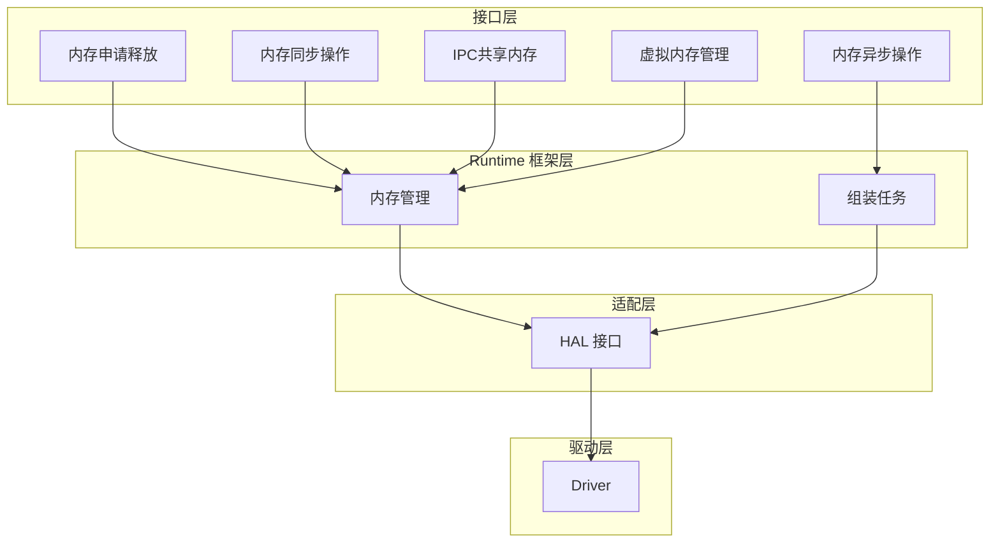
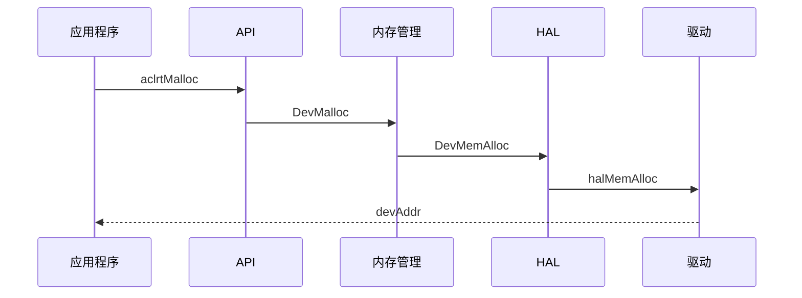
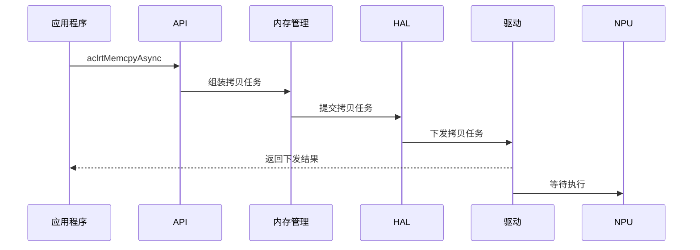
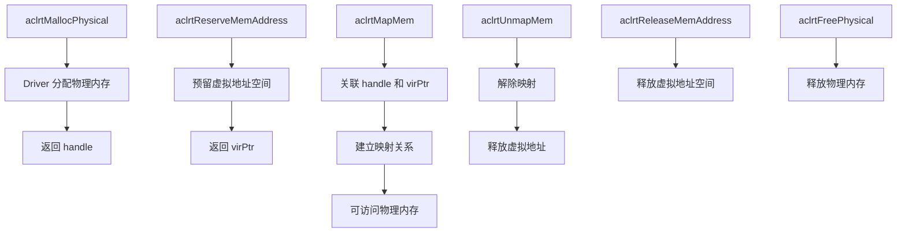
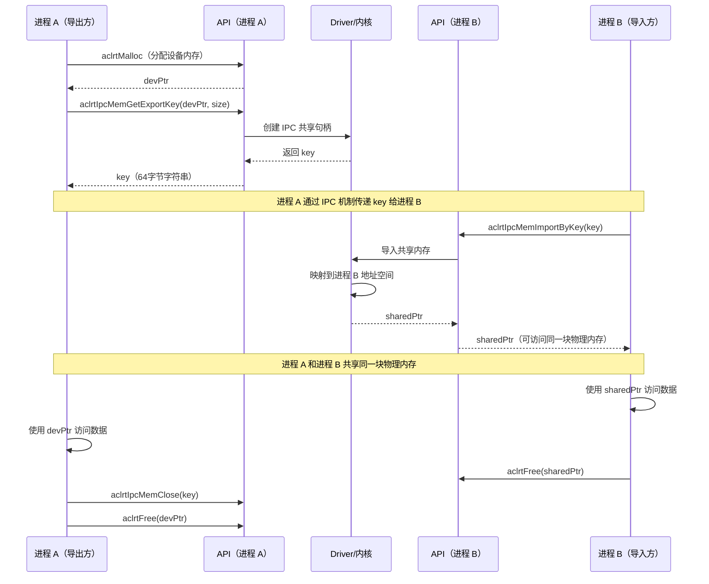

# Memory 模块架构

## 1. 模块概述

- **功能介绍**：Memory 模块负责管理设备内存的分配、操作和释放。提供了一套内存管理API，使开发者能够高效便捷的管理应用程序中的内存使用。
- **设计目标**：
  - 提供统一的内存管理接口
  - 支持多种内存类型
  - 支持高效的内存拷贝
  - 支持进程间内存共享

## 2. 使用场景与对外接口

### 2.1 基本使用场景

- **场景一**：分配Device内存
  ```cpp
  void *devPtr;
  aclrtMalloc(&devPtr, size, ACL_MEM_MALLOC_HUGE_FIRST);
  ```

- **场景二**：分配Host内存
  ```cpp
  void *hostPtr;
  aclrtMallocHost(&hostPtr, size);
  ```

- **场景三**：同步内存拷贝
  ```cpp
  aclrtMemcpy(dstPtr, dstSize, srcPtr, srcSize, ACL_MEMCPY_HOST_TO_DEVICE);
  ```

- **场景四**：异步内存拷贝
  ```cpp
  aclrtStream stream;
  aclrtCreateStream(&stream);
  // 异步拷贝，不阻塞主机
  aclrtMemcpyAsync(dstPtr, dstSize, srcPtr, srcSize, ACL_MEMCPY_HOST_TO_DEVICE, stream);
  ```

- **场景五**：IPC 内存共享
  ```cpp
  // 进程 A：导出共享句柄
  void *ptr;
  aclrtMalloc(&ptr, size, ACL_MEM_MALLOC_HUGE_FIRST);  // 提前申请设备内存
  char key[65];
  aclrtIpcMemGetExportKey(ptr, size, key, 65, ACL_RT_IPC_MEM_EXPORT_FLAG_DEFAULT);
  
  // 进程 B：导入共享内存
  void *sharedPtr;
  aclrtIpcMemImportByKey(&sharedPtr, key, ACL_RT_IPC_MEM_IMPORT_FLAG_DEFAULT);
  
  // 使用完成后关闭 IPC 内存
  aclrtIpcMemClose(key);
  aclrtFree(ptr);  // 进程 A 释放原内存
  ```

- **场景六**：物理内存管理
  ```cpp
  aclrtDrvMemHandle handle;
  aclrtPhysicalMemProp prop = {...};
  aclrtMallocPhysical(&handle, size, &prop, 0);  // 分配物理内存
  void *virPtr;
  aclrtReserveMemAddress(&virPtr, size, 0, nullptr, 0);  // 预留虚拟地址空间
  aclrtMapMem(virPtr, size, 0, handle, 0);  // 映射物理内存到虚拟地址
  
  // 使用完成后解除映射并释放内存
  aclrtUnmapMem(virPtr);  // 解除映射
  aclrtReleaseMemAddress(virPtr);  // 释放虚拟地址空间
  aclrtFreePhysical(handle);  // 释放物理内存
  ```

### 2.2 对外接口

| 接口 | 说明 |
|------|------|
| **内存分配/释放** |
| `aclrtMalloc`/`aclrtMallocWithCfg` | 分配设备内存 |
| `aclrtMallocHost`/`aclrtMallocHostWithCfg` | 分配主机内存 |
| `aclrtFree` | 释放设备内存 |
| `aclrtFreeHost` | 释放主机内存 |
| **内存拷贝** |
| `aclrtMemcpy`/`aclrtMemcpyAsync` | 内存同步/异步拷贝 |
| `aclrtMemcpy2d`/`aclrtMemcpy2dAsync` | 2D 内存同步/异步拷贝 |
| `aclrtMemcpyBatch`/`aclrtMemcpyBatchAsync` | 批量内存同步/异步拷贝 |
| **内存设置** |
| `aclrtMemset` | 内存设置 |
| `aclrtMemsetAsync` | 异步内存设置 |
| **物理内存管理** |
| `aclrtMallocPhysical` | 分配物理内存 |
| `aclrtReserveMemAddress` | 预留虚拟地址空间 |
| `aclrtMapMem` | 映射物理内存到虚拟地址 |
| `aclrtUnmapMem` | 解除内存映射 |
| `aclrtReleaseMemAddress` | 释放虚拟地址空间 |
| `aclrtFreePhysical` | 释放物理内存 |
| **内存注册** |
| `aclrtHostRegister` | 注册主机内存 |
| `aclrtHostUnregister` | 取消主机内存注册 |

### 2.3 内存拷贝类型

| 拷贝类型 | 说明 |
|----------|------|
| `ACL_MEMCPY_HOST_TO_HOST` | 主机到主机 |
| `ACL_MEMCPY_HOST_TO_DEVICE` | 主机到设备 |
| `ACL_MEMCPY_DEVICE_TO_HOST` | 设备到主机 |
| `ACL_MEMCPY_DEVICE_TO_DEVICE` | 设备到设备 |
| `ACL_MEMCPY_DEFAULT` | 默认拷贝类型（系统自动推断方向） |
| `ACL_MEMCPY_HOST_TO_BUF_TO_DEVICE` | 主机到设备（Runtime中会缓存，应用调用完接口就可以释放Host内存） |
| `ACL_MEMCPY_INNER_DEVICE_TO_DEVICE` | 同设备内部拷贝 |
| `ACL_MEMCPY_INTER_DEVICE_TO_DEVICE` | 跨设备拷贝 |

## 3. 架构总览

### 架构分层图




## 4. 详细设计

### 4.1 核心流程

#### 内存申请流程
Device申请内存的接口如下：

```cpp
aclError aclrtMalloc(void **devPtr, size_t size, aclrtMemMallocPolicy policy);
```
- `devPtr`：指向分配内存地址的二级指针，函数成功后 `*devPtr` 为分配的设备内存地址；
- `size`：申请内存大小，单位为字节；
- `policy`：内存分配策略，根据应用实际场景与诉求，开发者可以指定申请策略，选择普通的小页(4KB)更加节省资源，在处理海量数据时使用大页(2MB)性能更好。支持的策略说明如下：

| 策略 | 说明 |
|------|------|
| `ACL_MEM_MALLOC_HUGE_FIRST` | 优先使用大页内存，大页内存不足时使用普通页内存 |
| `ACL_MEM_MALLOC_HUGE_ONLY` | 仅使用大页内存，大页内存不足时返回错误 |
| `ACL_MEM_MALLOC_NORMAL_ONLY` | 仅使用普通页内存 |
| `ACL_MEM_MALLOC_HUGE_FIRST_P2P` | 优先使用大页内存（P2P场景） |
| `ACL_MEM_MALLOC_HUGE_ONLY_P2P` | 仅使用大页内存（P2P场景） |
| `ACL_MEM_MALLOC_NORMAL_ONLY_P2P` | 仅使用普通页内存（P2P场景） |
| `ACL_MEM_MALLOC_HUGE1G_ONLY` | 仅使用1G大页内存 |
| `ACL_MEM_MALLOC_HUGE1G_ONLY_P2P` | 仅使用1G大页内存（P2P场景） |
| `ACL_MEM_TYPE_LOW_BAND_WIDTH` | 低带宽内存类型 |
| `ACL_MEM_TYPE_HIGH_BAND_WIDTH` | 高带宽内存类型 |
| `ACL_MEM_ACCESS_USER_SPACE_READONLY` | 用户空间只读访问权限 |

详细申请流程如下所示：


#### 内存拷贝流程
常用的内存拷贝分为同步拷贝和异步拷贝：

**同步拷贝（aclrtMemcpy）：**
- 调用后阻塞主机线程，直到拷贝完成才返回
- 适用场景：需要立即使用拷贝结果、数据量较小、简单的数据传输场景
- 优点：使用简单，不需要考虑流同步问题
- 缺点：阻塞主机，影响并发性能

**异步拷贝（aclrtMemcpyAsync）：**
- 调用后立即返回，不阻塞主机线程，拷贝任务在指定Stream上异步执行
- 适用场景：数据量大、需要与其他计算任务并行、多流并发场景
- 优点：提高主机与设备并行度，充分利用硬件性能
- 缺点：需要通过Event或Stream同步确保拷贝完成后再使用数据

以下是异步拷贝的主要流程：


#### 批量内存拷贝流程

批量内存拷贝允许一次性提交多个内存拷贝任务，减少任务提交开销，提高整体拷贝效率。支持同步批量拷贝（`aclrtMemcpyBatch`）和异步批量拷贝（`aclrtMemcpyBatchAsync`），适用于需要同时传输多个数据块的场景。

**接口参数：**
```cpp
aclError aclrtMemcpyBatch(void **dsts, size_t *destMaxs, void **srcs, 
                          size_t *sizes, size_t numBatches,
                          aclrtMemcpyBatchAttr *attrs, size_t *failIdx);

aclError aclrtMemcpyBatchAsync(void **dsts, size_t *destMaxs, void **srcs,
                               size_t *sizes, size_t numBatches,
                               aclrtMemcpyBatchAttr *attrs, size_t *failIdx,
                               aclrtStream stream);
```

**参数说明：**
| 参数 | 类型 | 说明 |
|------|------|------|
| `dsts` | IN `void**` | 目标地址数组 |
| `destMaxs` | IN `size_t*` | 目标地址最大容量数组 |
| `srcs` | IN `void**` | 源地址数组 |
| `sizes` | IN `size_t*` | 拷贝大小数组 |
| `numBatches` | IN `size_t` | 批量拷贝任务数量 |
| `attrs` | IN `aclrtMemcpyBatchAttr*` | 拷贝属性数组（可指定每个任务的拷贝方向） |
| `failIdx` | OUT `size_t*` | 失败任务索引（同步拷贝时返回） |
| `stream` | IN `aclrtStream` | 异步拷贝使用的流 |


#### 物理内存管理流程

物理内存管理允许用户直接控制物理内存的分配和映射，提供更精细的内存管理能力。主要用于需要跨进程共享内存、大内存池管理或需要特定内存属性的进阶场景。通过物理内存管理接口，用户可以：
- 独立分配物理内存并获取 handle（`aclrtMallocPhysical`）
- 预留虚拟地址空间（`aclrtReserveMemAddress`）
- 将物理内存映射到虚拟地址空间（`aclrtMapMem`）
- 使用完成后解除映射并释放资源（`aclrtUnmapMem`、`aclrtReleaseMemAddress`、`aclrtFreePhysical`）



#### IPC 内存共享

IPC（Inter-Process Communication）内存共享允许不同进程之间共享同一块设备内存，实现高效的跨进程数据传递。通过 IPC 机制，进程 A 可以将已分配的设备内存导出为共享 key，进程 B 通过该 key 导入并访问同一块物理内存，避免了数据拷贝开销。


| 核心接口 | 说明 |
|------|------|
| `aclrtIpcMemGetExportKey` | 导出设备内存为 IPC key，供其他进程导入 |
| `aclrtIpcMemImportByKey` | 通过 key 导入共享内存到当前进程 |
| `aclrtIpcMemClose` | 关闭 IPC 共享内存（导出方调用） |
| `aclrtIpcMemSetImportPid` | 设置允许导入的进程 PID 白名单 |



### 4.2 关键文件索引

| 功能模块 | 文件路径 | 核心内容 |
|------|----------|----------|
| ACL 内存接口 | `include/external/acl/acl_rt.h` | aclrtMalloc、aclrtMemcpy、aclrtIpcMem 等对外接口 |
| Runtime 接口层实现 | `src/runtime/api/api_c_memory.cc` | rtMem* 内部接口实现 |
| 内存任务 | `src/runtime/core/src/task/task_info/memory/memory_task.cc` | MemcpyAsyncTask、MemcpyBatchTask 任务实现 |
| 内存任务头文件 | `src/runtime/core/src/task/inc/memory_task.h` | 内存任务接口定义 |
