# Model 模块架构

## 1. 模块概述

- **功能介绍**：Model 模块负责管理计算图的执行模型，包括模型创建、Stream 绑定、任务加载、模型执行和销毁等全生命周期管理。支持普通模型（Normal Model）和捕获模型（Capture Model）两种类型，通过 SQ/CQ 机制实现任务调度和执行。
- **设计目标**：
  - 提供统一的模型管理接口
  - 支持多 Stream 绑定和调度
  - 实现 Task 的批量提交和执行
  - 支持 Label 分配和跳转控制
  - 提供模型执行同步/异步模式

## 2. 使用场景与对外接口

### 2.1 使用场景

- **场景一**：创建并执行计算模型（使用 ACL 接口）
  ```cpp
  aclmdlRI modelRI;
  aclmdlRIBuildBegin(&modelRI, 0);  // 开始构建模型
  aclmdlRIBindStream(modelRI, stream, ACL_MODEL_STREAM_FLAG_HEAD);  // 绑定 Stream
  // 添加任务到 stream
  aclmdlRIEndTask(modelRI, stream);  // 标记任务结束
  aclmdlRIBuildEnd(modelRI, nullptr);  // 结束构建
  aclmdlRIExecute(modelRI, -1);  // 同步执行
  aclmdlRIDestroy(modelRI);  // 销毁模型
  ```

- **场景二**：异步模型执行（使用 ACL 接口）
  ```cpp
  aclmdlRIExecuteAsync(modelRI, execStream);
  // 通过 Stream 同步等待执行完成
  aclrtSynchronizeStream(execStream);
  ```

### 2.2 对外接口

| ACL 接口 | 文件位置 | 说明 |
|----------|----------|------|
| `aclmdlRIBuildBegin()` | `include/external/acl/acl_rt.h`<br>`src/acl/aclrt_impl/model_ri.cpp` | 创建模型（开始构建） |
| `aclmdlRIDestroy()` | `include/external/acl/acl_rt.h`<br>`src/acl/aclrt_impl/model_ri.cpp` | 销毁模型 |
| `aclmdlRIBindStream()` | `include/external/acl/acl_rt.h`<br>`src/acl/aclrt_impl/model_ri.cpp` | 绑定 Stream 到模型 |
| `aclmdlRIUnbindStream()` | `include/external/acl/acl_rt.h`<br>`src/acl/aclrt_impl/model_ri.cpp` | 解绑 Stream |
| `aclmdlRIExecute()` | `include/external/acl/acl_rt.h`<br>`src/acl/aclrt_impl/model_ri.cpp` | 同步执行模型 |
| `aclmdlRIExecuteAsync()` |`include/external/acl/acl_rt.h`<br>`src/acl/aclrt_impl/model_ri.cpp` | 异步执行模型 |
| `aclmdlRIBuildEnd()` | `include/external/acl/acl_rt.h`<br>`src/acl/aclrt_impl/model_ri.cpp` | 完成模型构建（LoadComplete） |
| `aclmdlRIEndTask()` | `include/external/acl/acl_rt.h`<br>`src/acl/aclrt_impl/model_ri.cpp` | 标记任务结束 |
| `aclmdlRISetName()` | `include/external/acl/acl_rt.h`<br>`src/acl/aclrt_impl/model_ri.cpp` | 设置模型名称 |
| `aclmdlRIAbort()` |`include/external/acl/acl_rt.h`<br>`src/acl/aclrt_impl/model_ri.cpp` | 终止模型执行 |

## 3. 架构总览

### 3.1 整体设计思路

Model 采用两层继承结构：基类 Model 提供普通模型的完整功能。每个 Model 绑定多个 Stream，通过 ModelExecuteTask 提交执行任务，使用 Notify 实现执行完成通知。

| 设计点 | 说明 |
|--------|------|
| **Model 作为任务容器** | 绑定多个 Stream，统一管理 SQE 下发和执行 |
| **Stream 作为任务队列** | 每个 Stream 维护 SQ 任务序列，支持任务回收 |
| **Label 实现控制流** | Model 分配 Label ID，Stream 记录跳转点 |
| **headStreams 机制** | 标记入口 Stream，Execute 时从这里激活执行 |

### 3.2 架构分层图

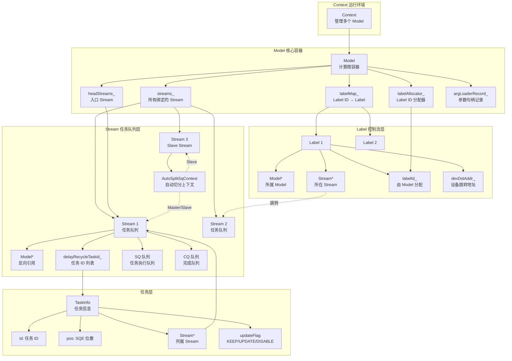

### 3.3 Model-Stream-Label 三层架构关系

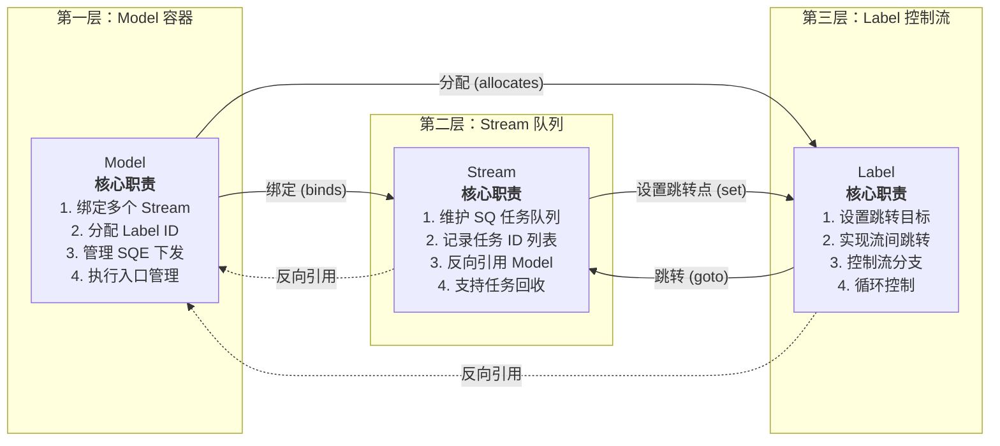

### 3.4 核心模块交互图（含硬件交互）

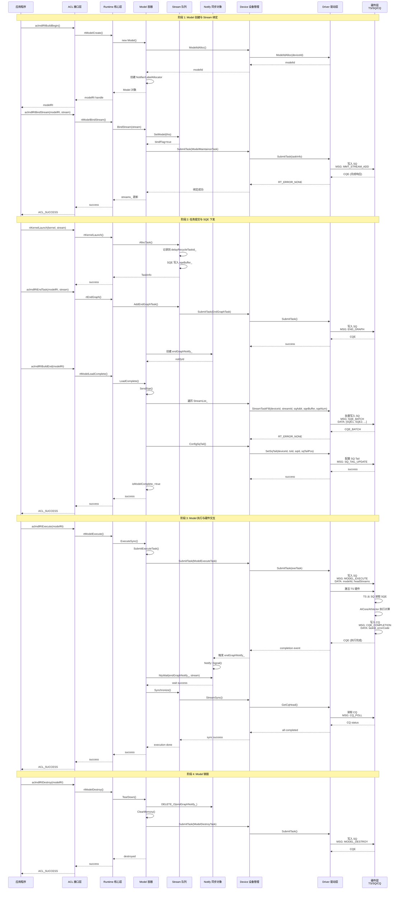

## 4. 详细设计

### 4.1 核心流程

#### 模型创建与初始化流程

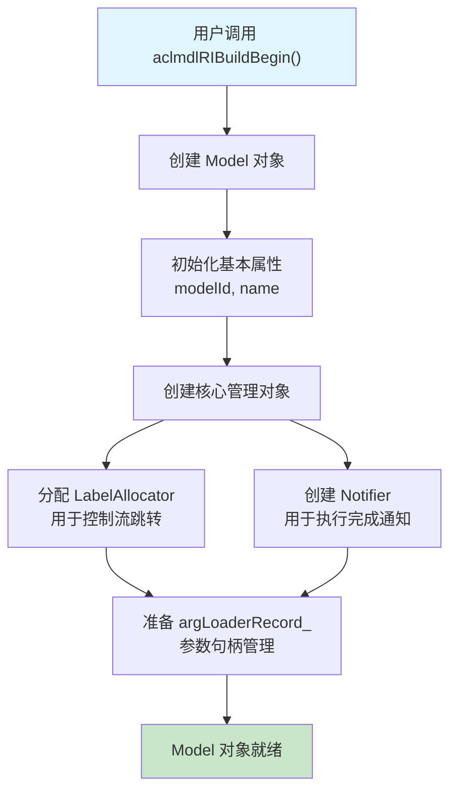

**流程说明**：
1. 用户通过 ACL 接口发起模型创建请求
2. Runtime 创建 Model 对象，分配唯一的 modelId
3. 初始化 Label 分配器，支持后续的分支跳转控制
4. 创建 Notifier 对象，用于模型执行完成后的通知机制
5. 申请设备侧内存，用于存储模型元数据
6. 准备参数句柄记录表，管理任务的参数内存

#### Stream 绑定流程

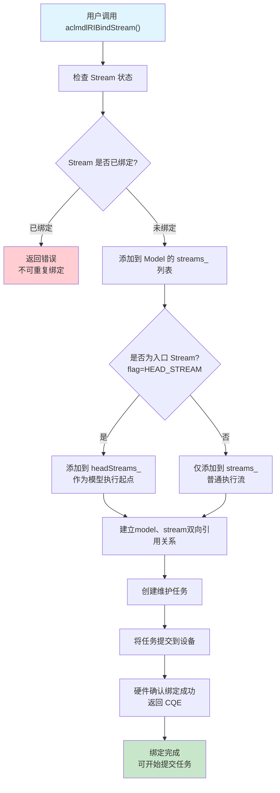

**流程说明**：
1. 用户请求将 Stream 绑定到 Model
2. 检查 Stream 状态，防止重复绑定
3. 将 Stream 添加到 Model 的 Stream 列表
4. 判断是否为入口 Stream（HEAD_STREAM），入口 Stream 是模型执行的起点
5. 建立双向引用：Stream 反向指向 Model，Model 持有 Stream 列表
6. 创建维护任务，通知硬件建立 Stream 与 Model 的关系
7. 提交任务到设备，硬件返回确认（CQE）
8. 设置 Stream 的绑定标志，准备接收任务

#### EndGraph 标记流程

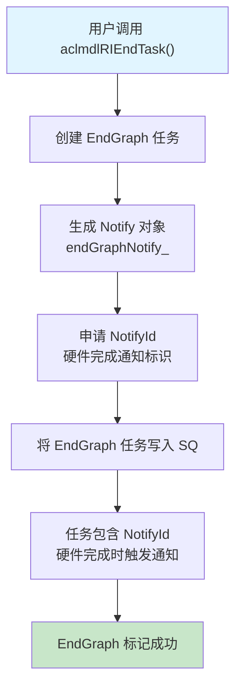

**流程说明**：
1. 用户标记任务下发结束
2. 创建 EndGraph 任务，作为模型的结束标记
3. 创建 Notify 对象，申请唯一的 NotifyId
4. EndGraph 任务写入 SQ，包含 NotifyId
5. 硬件执行到 EndGraph 任务时，触发 Notify Signal
6. 标记成功，模型进入可执行状态

#### Model LoadComplete 流程

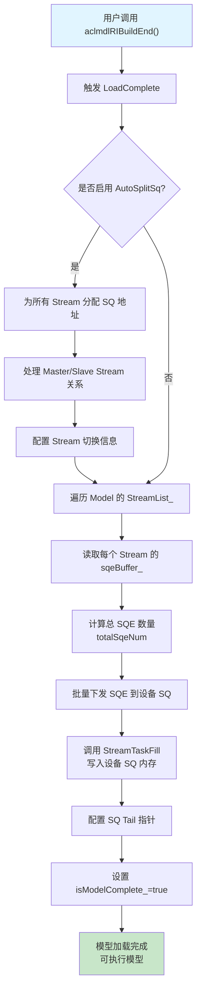

**流程说明**：
1. 用户调用 LoadComplete，触发批量下发
2. 判断是否启用 AutoSplitSq（自动 SQ 切分）：
   - 启用：为所有 Stream 分配 SQ 地址，处理 Master/Slave 关系
   - 不启用：直接遍历 StreamList_
3. 读取每个 Stream 的 sqeBuffer_，计算总 SQE 数量
4. 批量下发 SQE 到设备 SQ 内存（StreamTaskFill）
5. 硬件 SQ 准备就绪，任务驻留在设备侧
6. 配置 SQ Tail 指针，激活 TS（Task Scheduler）读取任务
7. 设置模型完成标志，进入可执行状态

#### 模型执行流程

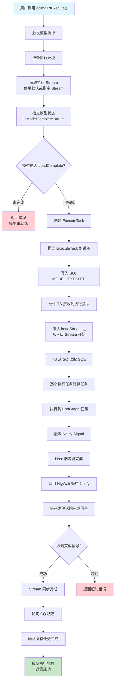

**流程说明**：
1. 用户调用 Execute，触发模型执行
2. 准备执行环境，获取执行 Stream
3. 检查模型状态，确保 LoadComplete 已完成
4. 创建 ExecuteTask，设置执行参数（modelId、入口 Stream）
5. 提交 ExecuteTask 到设备，写入 SQ
6. 硬件 TS 接收执行指令，激活 headStreams_
7. TS 从 SQ 读取 SQE，逐个执行任务
8. AICore/AIVector 执行计算任务
9. 执行到 EndGraph 任务，触发 Notify Signal
10. Host 端等待完成（NtyWait）
11. 收到完成信号后，轮询 CQ 状态
12. 确认所有任务完成，返回成功

#### Label 控制流设置流程

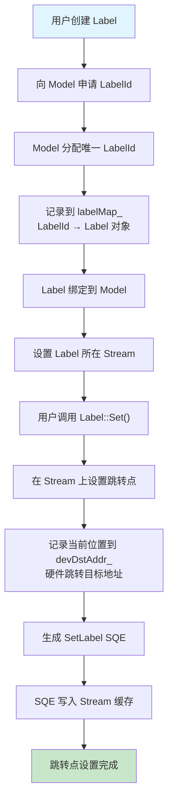

**流程说明**：
1. 用户创建 Label，向 Model 申请唯一的 LabelId
2. Model 通过 LabelAllocator 分配 ID，记录映射关系
3. Label 绑定到 Model 和 Stream
4. 用户调用 Label::Set，在 Stream 上设置跳转目标点
5. 记录当前位置到设备侧地址（devDstAddr_）
6. 生成 SetLabel SQE，写入 Stream 缓存
7. 跳转点设置完成，等待后续跳转

#### Label 控制流跳转流程

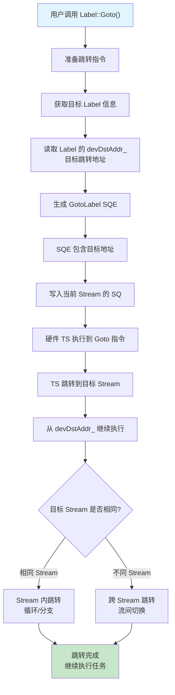

**流程说明**：
1. 用户调用 Label::Goto，发起跳转指令
2. 获取目标 Label 的设备侧地址（devDstAddr_）
3. 生成 GotoLabel SQE，包含目标跳转地址
4. 写入当前 Stream 的 SQ
5. 硬件 TS 执行到 Goto 指令，跳转到目标位置
6. 从目标地址继续执行任务
7. 判断跳转类型：
   - 相同 Stream：实现循环或分支控制
   - 不同 Stream：实现跨 Stream 任务切换

#### 模型销毁流程

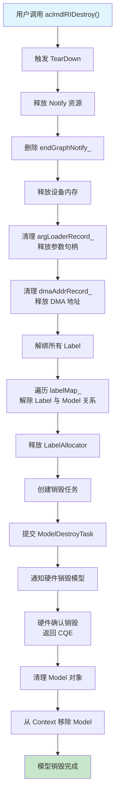

**流程说明**：
1. 用户调用 Destroy，触发模型销毁
2. 释放 Notify 资源，删除 endGraphNotify_
3. 释放设备内存，清理参数句柄记录
4. 释放 DMA 地址记录
5. 解绑所有 Label，解除与 Model 的关系
6. 释放 LabelAllocator 资源
7. 创建销毁任务，通知硬件销毁模型
8. 硬件确认销毁，返回 CQE
9. 清理 Model 对象，从 Context 移除
10. 模型销毁完成，释放所有资源

### 4.2 核心机制详解

#### Model 容器管理机制

**设计思想**：Model 作为计算图的容器，统一管理所有绑定的 Stream 和 Label，实现任务批量下发和执行入口控制。

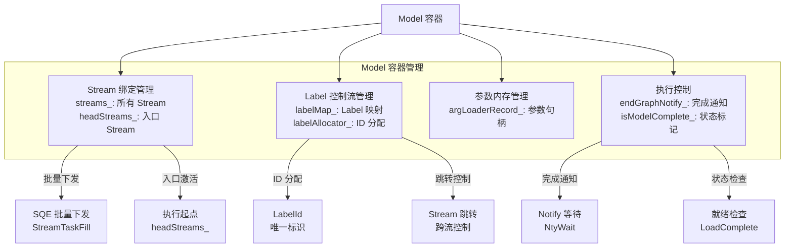

**机制说明**：
- **Stream 绑定管理**：维护所有 Stream 列表，headStreams_ 作为执行起点
- **Label 控制流管理**：分配 Label ID，管理跳转关系
- **参数内存管理**：记录任务参数句柄，避免重复分配
- **执行控制**：Notify 机制实现异步等待，状态标记确保执行顺序

#### Stream 任务队列机制

**设计思想**：Stream 作为任务队列，缓存 SQE，支持任务回收和自动 SQ 切分。

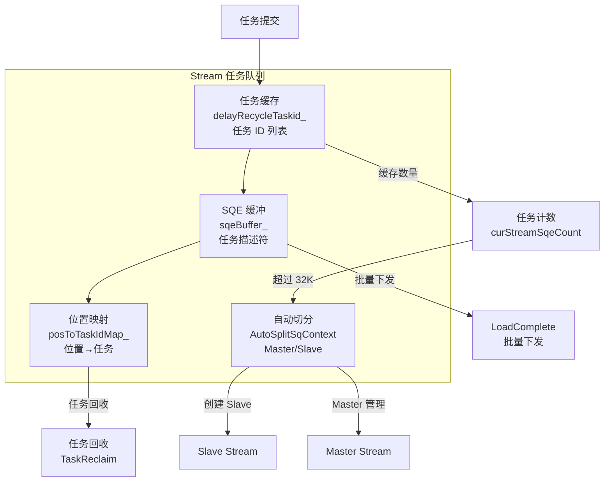

**机制说明**：
- **任务缓存**：delayRecycleTaskid_ 记录任务 ID，等待批量下发
- **SQE 缓冲**：sqeBuffer_ 存储任务描述符，准备写入硬件 SQ
- **位置映射**：posToTaskIdMap_ 记录 SQE 位置与任务的对应关系
- **自动切分**：超过 32K 任务时自动创建 Slave Stream 扩展容量

#### Label 控制流跳转机制

**设计思想**：Label 实现跨 Stream 跳转和循环控制，通过设备侧地址实现硬件级跳转。

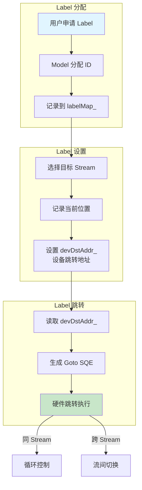

**机制说明**：
- **Label 分配**：Model 通过 LabelAllocator 分配唯一 ID
- **Label 设置**：在目标 Stream 上记录跳转位置，设置设备侧地址
- **Label 跳转**：读取设备地址，生成跳转 SQE，硬件执行跳转
- **控制流实现**：支持循环（同 Stream）和跨 Stream 任务切换

#### Notify 完成通知机制

**设计思想**：Notify 实现硬件完成通知，Host 通过等待 Notify 获取执行结果。

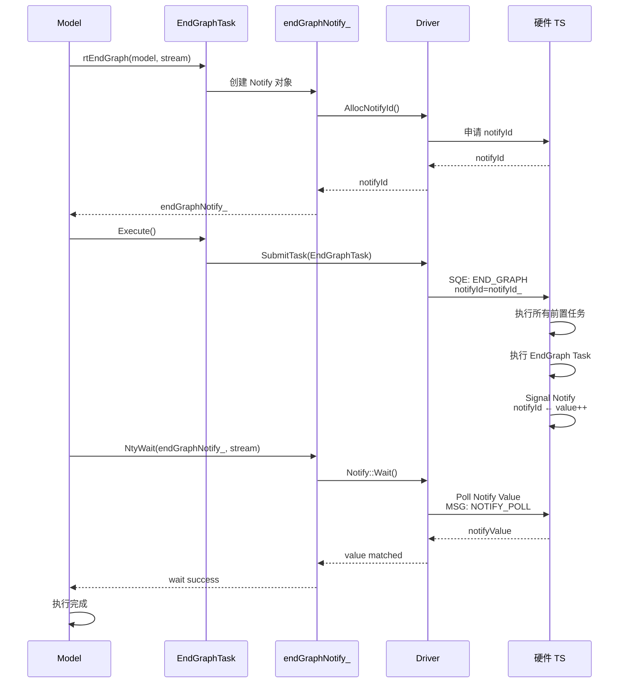

**机制说明**：
- **Notify 创建**：EndGraph 任务申请 NotifyId，绑定到 Model
- **Notify 等待**：Host 通过 NtyWait 轮询 Notify Value
- **Notify 触发**：硬件执行到 EndGraph，Signal Notify，更新 Value
- **完成确认**：Host 检测到 Value 匹配，确认执行完成

### 4.3 模块职责划分

Model 模块按照功能划分为核心容器、任务管理、接口层、辅助工具等子模块，各模块职责清晰，协同完成模型全生命周期管理。

#### 核心容器模块

| 模块名称 | 核心职责 | 代码位置 | 主要功能 |
|----------|----------|----------|----------|
| **Model 核心类** | 计算图容器，统一管理 Stream/Label/Notify | `src/runtime/core/inc/model/model.hpp`<br/>`src/runtime/feature/model/model.cc` | • 绑定/解绑 Stream<br/>• 分配/释放 Label<br/>• 执行同步/异步模型<br/>• 批量下发 SQE<br/>• 管理 argLoaderRecord |
| **Model C 接口** | 对外 C 风格 API 封装 | `src/runtime/feature/model/model_c.cc` | • rtModelCreate/Destroy<br/>• rtModelBindStream<br/>• rtModelExecute<br/>• rtEndGraph<br/>• rtModelLoadComplete |
| **Model Rebuild** | 模型重建与恢复 | `src/runtime/feature/model/model_rebuild.cc` | • ReBuild 重建模型<br/>• ReSetup 恢复状态<br/>• ReBindStreams 重新绑定<br/>• ReAllocStreamId 重分配 ID |

#### 任务管理模块

| 任务类型 | 任务职责 | 代码位置 | 触发时机 |
|----------|----------|----------|----------|
| **ModelExecuteTask** | 触发模型执行，激活 headStreams | `src/runtime/core/src/task/task_info/model/model_execute_task.cc`<br/>`src/runtime/core/src/task/task_info/model/model_execute_task_v100.cc`<br/>`src/runtime/core/src/task/task_info/model/model_execute_task_v200_base.cc` | Execute/ExecuteAsync 调用时 |
| **ModelMaintainceTask** | 维护 Stream 与 Model 关系 | `src/runtime/core/src/task/task_info/model/model_maintaince_task.cc`<br/>`src/runtime/core/src/task/task_info/model/model_maintaince_task_v100.cc`<br/>`src/runtime/core/src/task/task_info/model/model_maintaince_task_v200_base.cc` | BindStream/UnbindStream<br/>LoadComplete 时 |
| **ModelGraphTask** | EndGraph 标记，创建 Notify | `src/runtime/core/src/task/task_info/model/model_graph_task.cc`<br/>`src/runtime/core/src/task/task_info/model/model_graph_task_v100.cc`<br/>`src/runtime/core/src/task/task_info/model/model_graph_task_v200_base.cc` | rtEndGraph 调用时 |
| **ModelUpdateTask** | CaptureModel 参数更新 | `src/runtime/core/src/task/task_info/model/model_update_task.cc`<br/>`src/runtime/core/src/task/task_info/model/model_update_task_v100.cc`<br/>`src/runtime/core/src/task/task_info/model/model_update_task_v200_base.cc` | StreamBeginTaskUpdate<br/>StreamEndTaskUpdate |
| **KernelFusionTask** | Kernel 融合优化 | `src/runtime/core/src/task/task_info/model/kernel_fusion_task.cc` | 融合算子执行时 |

#### 辅助工具模块

| 工具模块 | 辅助职责 | 代码位置 | 服务对象 |
|----------|----------|----------|----------|
| **LabelAllocator** | Label ID 分配器 | `src/runtime/core/inc/launch/label.hpp` | Model Label 管理 |
| **Notify** | 硬件完成通知对象 | `src/runtime/core/inc/notify/notify.hpp`<br/>`src/runtime/core/src/notify/notify.cc` | EndGraph Notify |
| **Notifier** | 多 Notify 管理 | `src/runtime/core/inc/utils/osal.hpp` | Model 执行完成通知 |

#### 接口适配层

| 适配层 | 适配职责 | 代码位置 | 服务对象 |
|----------|----------|----------|----------|
| **ACL 接口封装** | ACL → RT 接口映射 | `src/acl/aclrt_impl/model_ri.cpp` | 用户调用 aclmdlRI 接口 |
| **API 装饰器** | API 错误处理装饰 | `src/runtime/core/src/api_impl/api_decorator.cc`<br/>`src/runtime/feature/aclgraph/api_decorator_aclgraph.cc` | ApiImpl 调用链 |
| **API 错误处理** | API 错误码封装 | `src/runtime/core/src/api_impl/api_error.cc`<br/>`src/runtime/feature/aclgraph/api_error_aclgraph.cc` | 错误码处理 |


### 5 关键文件路径索引

| 模块类别 | 文件路径 | 核心内容 |
|----------|----------|----------|
| **Model 头文件** | `src/runtime/core/inc/model/model.hpp` | Model 类定义、数据结构 |
| **Model 实现** | `src/runtime/feature/model/model.cc` | Model 核心实现 |
| **Model C 接口** | `src/runtime/feature/model/model_c.cc` | C 风格接口实现 |
| **Model Rebuild** | `src/runtime/feature/model/model_rebuild.cc` | 模型重建逻辑 |
| **Model Execute Task** | `src/runtime/core/src/task/task_info/model/model_execute_task.cc` | 执行任务实现 |
| **Model Execute Task V100** | `src/runtime/core/src/task/task_info/model/model_execute_task_v100.cc` | V100 版本适配 |
| **Model Execute Task V200** | `src/runtime/core/src/task/task_info/model/model_execute_task_v200_base.cc` | V200 版本适配 |
| **Model Maintaince Task** | `src/runtime/core/src/task/task_info/model/model_maintaince_task.cc` | 维护任务实现 |
| **Model Graph Task** | `src/runtime/core/src/task/task_info/model/model_graph_task.cc` | 图任务实现 |
| **Model To Aicpu Task** | `src/runtime/core/src/task/task_info/model/model_to_aicpu_task.cc` | AICPU 任务实现 |
| **Model Update Task** | `src/runtime/core/src/task/task_info/model/model_update_task.cc` | 更新任务实现 |
| **ACL 接口头文件** | `include/external/acl/acl_rt.h` | ACL 外部接口定义 |
| **ACL 接口实现** | `src/acl/aclrt_impl/model_ri.cpp` | ACL 接口实现（aclmdlRI 系列） |
