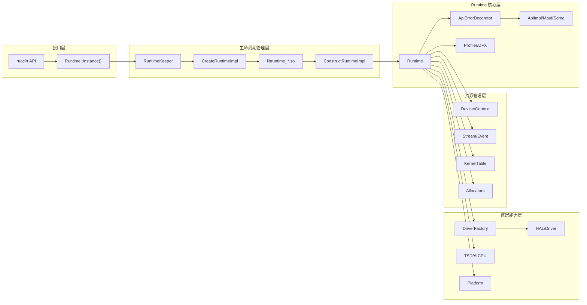
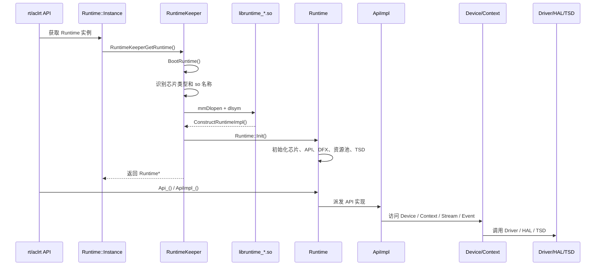
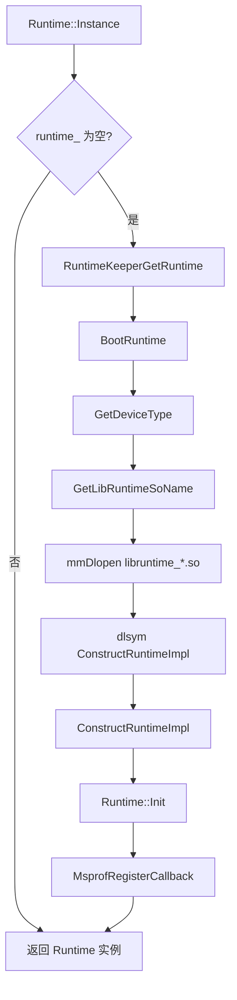
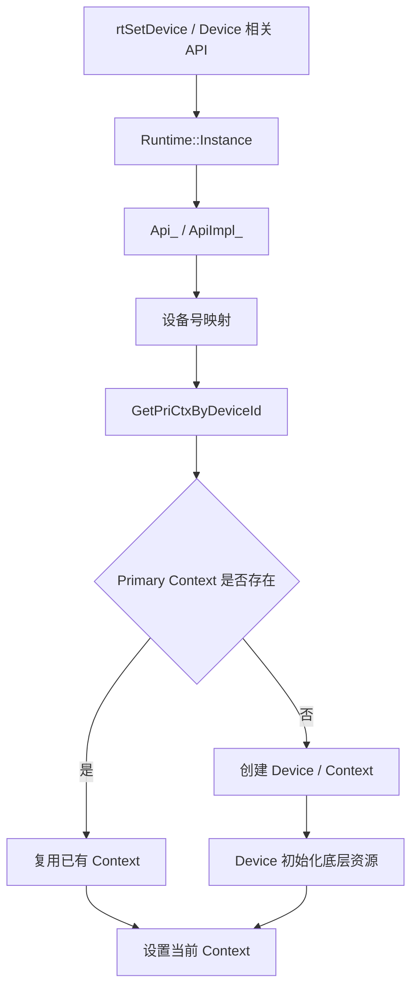
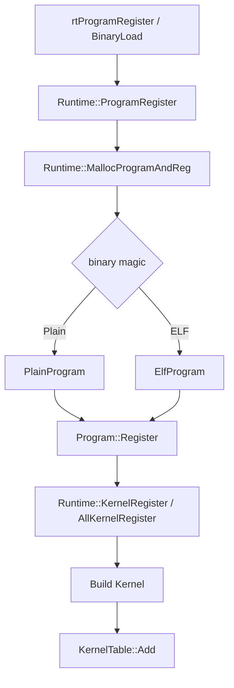

# Runtime 全局管理模块架构

## 1. 模块概述

- **功能介绍**：Runtime 是 CANN Runtime 组件内部的进程级全局运行时实例，负责承接上层 Runtime API 调用，维护设备（Device）、上下文（Context）、流（Stream）、事件（Event）、程序（Program）、内核（Kernel）、Profiling、错误处理等全局运行状态，并通过 Driver、TSD、HAL 和平台能力完成 Ascend NPU 的资源管理与任务执行。
- **设计目标**：
  - 提供进程级唯一的 Runtime 访问入口。
  - 聚合 Runtime API 所需的全局状态、资源表和底层能力入口。
  - 屏蔽不同芯片、不同 SoC、不同运行模式下的底层能力差异。
  - 管理 Device、Context、Program、Kernel 等核心资源的生命周期。
  - 维护 Runtime API 到内部实现模块的统一派发链路。
  - 支持 Profiling、错误回调、Task Abort 回调、RAS 上报等 DFX 能力。

Runtime 不对应单个 Device 或单个 Context，而是 Runtime 组件内部的统一调度中心。Runtime 内部各模块通过 `Runtime::Instance()` 获取当前进程内的全局 Runtime 实例，并基于该实例访问 API 实现、设备资源、上下文、Kernel 注册表、Profiling 状态和全局特性配置。

本文档重点描述 `Runtime` 类本身的功能和设计。`RuntimeKeeper`、插件 so、Driver、TSD 等对象只作为 Runtime 构造、初始化和运行依赖进行说明；Runtime 类本体才是全局状态承载者、API 派发中心和资源协同入口。

## 2. 使用场景与对外接口

### 2.1 使用场景

- **场景一：首次访问 Runtime 实例**

  ```cpp
  Runtime *rt = Runtime::Instance();
  // RuntimeKeeper 在首次访问时创建 Runtime 实例并调用 Runtime::Init()
  ```

- **场景二：Runtime API 访问内部实现**

  ```cpp
  Api *api = Runtime::Instance()->Api_();
  // 外部 rt/aclrt API 通过 ApiErrorDecorator 和 ApiImpl 进入具体实现
  ```

- **场景三：获取当前 Context 或 primary Context**

  ```cpp
  Context *ctx = Runtime::Instance()->CurrentContext();
  Context *priCtx = Runtime::Instance()->GetPriCtxByDeviceId(deviceId, tsId);
  ```

- **场景四：Program 与 Kernel 注册**

  ```cpp
  Program *prog = nullptr;
  Runtime::Instance()->ProgramRegister(&bin, &prog);
  Runtime::Instance()->KernelRegister(prog, stubFunc, stubName, kernelInfoExt);
  const Kernel *kernel = Runtime::Instance()->KernelLookup(stubFunc);
  ```

- **场景五：Profiling 与错误回调管理**

  ```cpp
  Runtime::Instance()->ProfilerStart(profConfig, numsDev, deviceList, cacheFlag);
  Runtime::Instance()->SetExceptCallback(callback);
  ```

### 2.2 对外接口

Runtime 本身是内部 C++ 全局管理类，对外 API 通常由 rt/aclrt C 接口承接，再通过 `Runtime::Instance()` 进入 Runtime 内部实现。主要接口关系如下：

| 接口/入口 | 文件位置 | 说明 |
|----------|----------|------|
| `Runtime::Instance()` | `src/runtime/core/inc/runtime.hpp` | 获取进程级 Runtime 单例，首次访问时触发 RuntimeKeeper 启动流程 |
| `RuntimeKeeperGetRuntime()` | `src/runtime/core/src/plugin_manage/runtime_keeper.cc` | Runtime 单例的懒加载入口 |
| `RuntimeKeeper::BootRuntime()` | `src/runtime/core/src/plugin_manage/runtime_keeper.cc` | 创建 Runtime、调用 `Runtime::Init()`、注册 Profiling callback |
| `Runtime::Init()` | `src/runtime/core/src/runtime.cc` | Runtime 核心初始化流程 |
| `Runtime::Api_()` | `src/runtime/core/inc/runtime.hpp` | 返回带错误处理装饰能力的 API 门面 |
| `Runtime::ApiImpl_()` | `src/runtime/core/inc/runtime.hpp` | 返回底层 API 实现对象 |
| `Runtime::CurrentContext()` | `src/runtime/core/src/runtime.cc` | 获取当前线程 Runtime Context |
| `Runtime::GetPriCtxByDeviceId()` | `src/runtime/core/src/runtime.cc` | 获取设备维度 primary context |
| `Runtime::ProgramRegister()` | `src/runtime/core/src/runtime.cc` | 注册 Runtime Program |
| `Runtime::KernelRegister()` | `src/runtime/core/src/runtime.cc` | 注册 Kernel 到 Runtime KernelTable |
| `Runtime::KernelLookup()` | `src/runtime/core/src/runtime.cc` | 按 stub function 查询 Kernel |
| `Runtime::ProfilerStart()` / `Runtime::ProfilerStop()` | `src/runtime/core/src/runtime.cc` | 管理 Runtime Profiling |

## 3. 架构总览

### 3.1 整体设计思路

Runtime 类本体采用“进程级单例 + 全局状态聚合 + API 门面 + 资源协同 + 平台能力适配”的设计。`RuntimeKeeper` 只负责 Runtime 实例创建前后的生命周期动作，Runtime 实例创建完成后，Runtime 类本身负责承载绝大多数运行态能力。

整体链路如下：

1. 上层 Runtime API 调用内部 Runtime 能力。
2. 内部模块通过 `Runtime::Instance()` 获取全局 Runtime 实例。
3. `Runtime::Instance()` 首次访问时调用 `RuntimeKeeperGetRuntime()`。
4. `RuntimeKeeper` 识别芯片类型并选择对应 `libruntime_*.so`，完成 Runtime 实例构造。
5. `Runtime::Init()` 初始化芯片能力、API 实现、DFX、资源池、TSD 等全局运行环境。
6. 后续 API 调用通过 Runtime 持有的 Api、Device、Context、KernelTable、Driver、TSD 等对象完成具体操作。

### 架构分层图



### 3.2 核心模块交互图



## 4. 详细设计

### 4.1 核心流程

#### 初始化流程

Runtime 初始化包含两层：`RuntimeKeeper` 的启动流程和 `Runtime::Init()` 的内部初始化流程。



`Runtime::Init()` 内部主要完成以下步骤：

1. **Feature 和 Atrace 初始化**：初始化 TS 版本特性映射和 Atrace 信息。
2. **芯片与 SoC 初始化**：调用 `InitChipTypeAndSocVersion()` 获取芯片类型、SoC 版本、TS 数量、AICPU 数量和芯片属性。
3. **设备可见性初始化**：读取 visible devices 配置，建立用户设备号与 Runtime 设备号映射。
4. **API 实现初始化**：创建 `ApiImpl`、`ApiImplMbuf`、`ApiImplSoma`。
5. **日志与 DFX 初始化**：创建 `Logger`、`Profiler`、`ApiErrorDecorator`。
6. **线程与执行观察器初始化**：创建 `ThreadGuard` 和 `EngineStreamObserver`。
7. **AICPU Stream ID 管理初始化**：创建 AICPU Stream ID bitmap。
8. **Callback Subscribe 初始化**：创建 callback subscribe 管理对象。
9. **Program/Label 资源池初始化**：创建 Program allocator 和 Label allocator。
10. **Runtime 版本设置**：通过 HAL 设置 Runtime API version。
11. **TSD 初始化**：加载 TSD client 并保存 TSD 相关函数指针。
12. **任务函数注册**：注册 Runtime 任务处理函数。
13. **执行模式配置**：初始化 stream sync mode、dcache lock 辅助资源等。

关键代码位置：

```cpp
// src/runtime/core/src/runtime.cc
rtError_t Runtime::Init();

// src/runtime/core/src/plugin_manage/runtime_keeper.cc
Runtime *RuntimeKeeper::BootRuntime();
```

#### 设备获取流程

Runtime 本身不代表某一个设备，而是维护设备和 Context 的全局访问入口。设备相关 API 通常通过 `ApiImpl` 进入 Runtime，再访问 Device/Context。



设备与 Context 的核心关系：

- Runtime 维护 primary context。
- Context 以 device id 和 TS id 为维度组织。
- Device 负责承载设备侧资源。
- Stream、Event、Notify 通常依附于当前 Context 和 Device。

### 4.2 核心机制详解

#### Runtime 类本体功能模型

Runtime 类本身是运行期能力的核心承载对象，其功能可以归纳为六组：

| 功能组 | Runtime 类承担的职责 | 代表成员/接口 |
|--------|----------------------|---------------|
| API 门面 | 保存 API 实现对象和装饰对象，向 rt/aclrt API 提供内部派发入口 | `Api_()`、`ApiImpl_()`、`api_`、`apiImpl_`、`apiError_` |
| 平台能力状态 | 保存芯片类型、SoC 版本、TS 数量、芯片属性和可见设备映射 | `chipType_`、`socVersion_`、`tsNum_`、`curChipProperties_`、`propertiesMap_` |
| 资源管理 | 维护 Device、Context、Program、Kernel、Label 等核心资源入口 | `priCtxs_`、`programAllocator_`、`kernelTable_`、`labelAllocator_` |
| 执行协同 | 为 Stream、Event、Task、Kernel Launch 提供全局执行配置和共享对象 | `streamObserver_`、`cbSubscribe_`、`aicpuStreamIdBitmap_`、timeout 配置 |
| 底层能力接入 | 持有 Driver、HAL、TSD、AICPU 相关入口，向上屏蔽底层差异 | `driverFactory_`、`facadeDriver_`、`tsdClientHandle_`、`tsdOpen_` |
| DFX 能力 | 统一管理 Profiling、异常回调、Task Abort、Snapshot、RAS 等诊断能力 | `profiler_`、`excptCallBack_`、callback 管理对象、RAS 相关状态 |

从设计上看，Runtime 类不是简单的单例包装，而是 Runtime 组件内部的“运行态上下文对象”。它把芯片能力、API 实现、资源表、底层驱动入口和 DFX 状态集中在一个进程级对象中，保证各 API 调用看到一致的设备视图、上下文状态和能力配置。

#### 单例模式

Runtime 单例由 `Runtime::runtime_` 保存，通过 `Runtime::Instance()` 访问。首次访问时，`Runtime::Instance()` 会调用 `RuntimeKeeperGetRuntime()`，由静态全局对象 `g_runtimeKeeper` 完成实际创建。

```cpp
static Runtime *Instance()
{
#if RUNTIME_API || STATIC_RT_LIB
    if (runtime_ == nullptr) {
        runtime_ = RuntimeKeeperGetRuntime();
    }
#endif
    return runtime_;
}
```

单例创建不是简单 `new Runtime()`，而是由 `RuntimeKeeper` 统一管理：

- `RuntimeKeeper` 控制启动状态。
- 非静态链接场景下，根据芯片类型动态加载 `libruntime_*.so`。
- 插件库导出 `ConstructRuntimeImpl()` 创建真实 Runtime 实例。
- 插件库导出 `DestructorRuntimeImpl()` 销毁 Runtime 实例。

#### 引用计数管理

Runtime 管理多类带生命周期的对象，包括 Context、Program、Kernel、Device 等。不同对象的引用方式不同：

- Program 使用 `ObjAllocator<RefObject<Program *>>` 管理。
- Primary Context 使用 `RefObject<Context *>` 管理。
- Kernel 通过 `KernelTable` 与 Program 生命周期联动。
- Device/Context 在 set device、retain/release、析构流程中协调释放。

##### 引用计数核心类

Runtime 中 Program 和 Context 的引用关系主要依赖 `RefObject`：

```cpp
RefObject<Context *> priCtxs_[RT_MAX_DEV_NUM][RT_MAX_TS_NUM];
ObjAllocator<RefObject<Program *>> *programAllocator_;
```

`RefObject` 用于保存对象指针和引用状态，支持增加引用、减少引用、重置对象等操作。Runtime 通过它避免 Program 或 Context 在仍被使用时被提前释放。

##### Device 引用计数管理时机

Device 的生命周期通常由设备启用、上下文创建、设备释放和 Runtime 析构共同驱动。Runtime 在设备相关流程中负责：

- 将用户设备号转换为 Runtime 内部设备号。
- 获取或创建对应设备的 primary context。
- 通过 Device 初始化底层资源。
- 在 Runtime 析构时清理仍存在的设备和上下文资源。

##### Context 引用计数管理时机

Primary Context 是 Runtime 管理设备上下文的关键对象。Runtime 按设备和 TS 维度保存 primary context，在获取、释放、析构时维护其引用关系。

Context 管理关键点：

- 当前线程可通过 `Runtime::CurrentContext()` 获取当前 Context。
- 设备维度可通过 `Runtime::GetPriCtxByDeviceId()` 获取 primary context。
- Runtime 析构时遍历 primary context 表，对不再被外部使用的 Context 执行 `TearDown()` 并释放。

##### Device 与 Context 引用计数联动机制

Device 和 Context 的关系可以概括为：

```text
Runtime
    -> Primary Context Table
        -> Context
            -> Device
                -> RawDevice / Driver
                -> Stream / Event / Notify
```

Context 表示 Runtime API 执行所处的上下文环境，Device 承载实际设备资源。设备切换、上下文创建、Stream/Event 创建和任务下发都依赖当前 Context 与 Device 的一致性。

##### 多线程场景下的引用计数管理

Runtime 使用全局单例承接多线程 API 调用，同时通过以下机制维护多线程场景下的状态一致性：

- `RuntimeKeeper::bootStage_` 控制 Runtime 启动阶段只执行一次。
- `ThreadGuard` 管理线程相关保护逻辑。
- `ThreadLocalContainer`、`InnerThreadLocal` 等对象保存线程局部运行状态。
- Context、Program 等资源通过引用对象和锁保护其生命周期。

RuntimeKeeper 的启动状态包括：

| 状态 | 含义 |
|------|------|
| `BOOT_INIT` | 尚未启动或启动失败后回到初始态 |
| `BOOT_ON` | 正在启动 Runtime |
| `BOOT_DONE` | Runtime 已成功启动 |

#### 内核注册与查找

Runtime 维护 Program 和 Kernel 的全局注册关系，用于 Kernel Launch 前按 stub function、kernel name 或 tiling key 查找 Kernel 元信息。

##### 内核注册流程



Runtime 在注册过程中负责：

- 根据 binary magic 判断 Program 类型。
- 根据芯片能力判断 Kernel 属性。
- 创建并注册 `PlainProgram` 或 `ElfProgram`。
- 构造 Kernel 对象。
- 建立 stub function、kernel name、tiling key 与 Kernel 对象之间的查询关系。
- 维护 Program 引用计数和生命周期。

##### 内核查找流程

Kernel 查找主要通过 Runtime 持有的 `KernelTable` 完成：

```cpp
const Kernel *Runtime::KernelLookup(const void * const stub)
{
    return kernelTable_.Lookup(stub);
}

const void *Runtime::StubFuncLookup(const char_t * const name)
{
    return kernelTable_.InvLookup(name);
}
```

典型查找路径：

```text
Kernel Launch API
    -> Runtime::Instance()
    -> KernelLookup(stubFunc)
    -> KernelTable
    -> Kernel 元信息
    -> Device/Stream 任务下发
```

### 4.3 模块职责划分

| 模块 | 职责 |
|------|------|
| `RuntimeKeeper` | 管理 Runtime 实例生命周期、芯片插件加载、Runtime 构造与析构 |
| `Runtime` | 进程级全局运行时实例，作为 API 门面、资源管理中心、平台能力状态中心、执行协同中心和 DFX 管理入口 |
| `RuntimeIntf` | Runtime 抽象接口，定义 API 调用需要访问的 Runtime 能力 |
| `ApiErrorDecorator` | API 错误处理、参数检查和通用日志上报装饰层 |
| `ApiImpl` | Runtime API 的主要内部实现 |
| `Device` | 设备侧资源承载对象 |
| `Context` | Runtime 上下文对象，承载当前设备和执行环境 |
| `Stream/Event/Notify` | 异步任务、同步、通知和事件管理 |
| `Program/Kernel` | 二进制、Kernel 元信息和注册查找关系 |
| `DriverFactory/FacadeDriver` | 底层 Driver 访问入口 |
| `TSD/AICPU` | AICPU 调度器、TSD 连接、队列和 FlowGw 管理 |
| `Profiler/DFX` | Profiling、错误回调、RAS、Task Abort、Snapshot 等诊断能力 |

### 4.4 核心数据结构

| 数据结构/成员 | 说明 |
|---------------|------|
| `Runtime::runtime_` | Runtime 全局实例指针 |
| `RuntimeKeeper g_runtimeKeeper` | Runtime 生命周期管理静态全局对象 |
| `RuntimeKeeper::bootStage_` | Runtime 启动阶段状态 |
| `RuntimeKeeper::soHandle_` | 动态加载 Runtime 插件库句柄 |
| `api_` | API 门面，通常指向 `ApiErrorDecorator` |
| `apiImpl_` | 主 API 实现对象 |
| `apiImplMbuf_` | Mbuf API 实现对象 |
| `apiImplSoma_` | Soma API 实现对象 |
| `profiler_` | Runtime Profiling 对象 |
| `threadGuard_` | 线程保护对象 |
| `streamObserver_` | Stream observer |
| `cbSubscribe_` | Callback subscribe 管理对象 |
| `aicpuStreamIdBitmap_` | AICPU Stream ID 分配位图 |
| `programAllocator_` | Program 全局分配器 |
| `kernelTable_` | Kernel 全局查找表 |
| `labelAllocator_` | Label 分配器 |
| `priCtxs_` | primary context 表 |
| `chipType_` | 当前芯片类型 |
| `socVersion_` | 当前 SoC 版本 |
| `tsNum_` | 当前 TS 数量 |
| `curChipProperties_` | 当前芯片属性 |
| `propertiesMap_` | 全量芯片属性表 |
| `driverFactory_` | Driver 工厂 |
| `facadeDriver_` | Driver 门面 |
| `tsdClientHandle_` | TSD client 动态库句柄 |
| `tsdOpen_ / tsdClose_` | TSD open/close 函数指针 |

## 5. 关键文件索引

| 文件 | 说明 |
|------|------|
| `src/runtime/core/inc/runtime.hpp` | Runtime 类声明，定义 Runtime 全局入口和核心成员 |
| `src/runtime/core/inc/runtime_intf.hpp` | Runtime 抽象接口，声明 API 调用需要访问的 Runtime 能力 |
| `src/runtime/core/src/runtime.cc` | Runtime 构造、初始化、芯片能力、Program/Kernel、Profiling 等核心实现 |
| `src/runtime/core/src/plugin_manage/runtime_keeper.h` | RuntimeKeeper 类声明 |
| `src/runtime/core/src/plugin_manage/runtime_keeper.cc` | RuntimeKeeper 生命周期管理、芯片识别、插件加载、Runtime 启动与销毁 |
| `src/runtime/core/src/plugin_manage/v100/plugin_old_arch.cc` | v100 插件构造和析构入口 |
| `src/runtime/core/src/plugin_manage/v200/plugin_old_arch.cc` | v200 插件构造和析构入口 |
| `src/runtime/core/src/runtime_v100/runtime_adapt.cc` | v100 平台 Runtime 析构和适配逻辑 |
| `src/runtime/core/src/runtime_v200/runtime_adapt.cc` | v200 平台 Runtime 析构和适配逻辑 |
| `src/runtime/core/src/api_impl/api_impl.cc` | Runtime API 主要内部实现，广泛调用 `Runtime::Instance()` |
| `src/runtime/core/src/device/device.cc` | Device 管理逻辑 |
| `src/runtime/core/src/event/event.cc` | Event 管理逻辑 |
| `src/runtime/core/src/launch/` | 各类任务 Launch 实现 |
