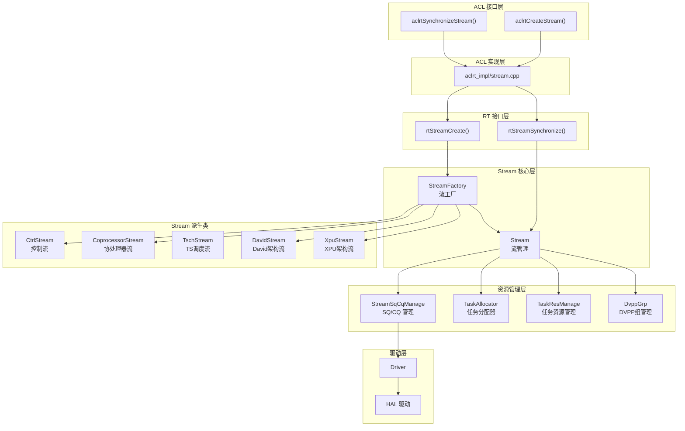
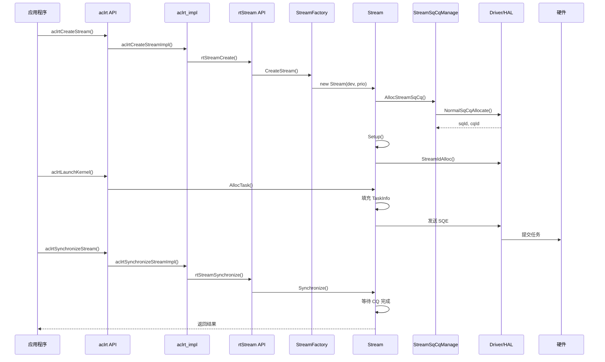
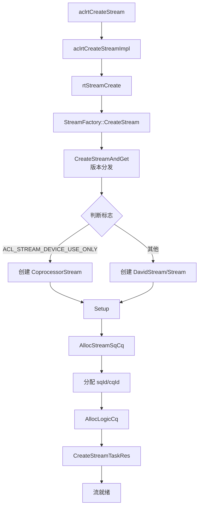
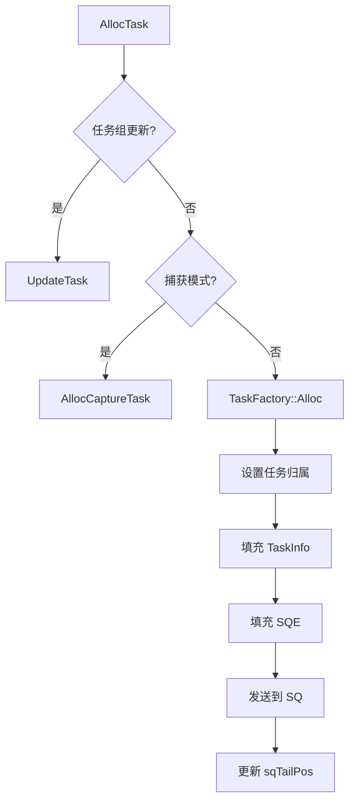
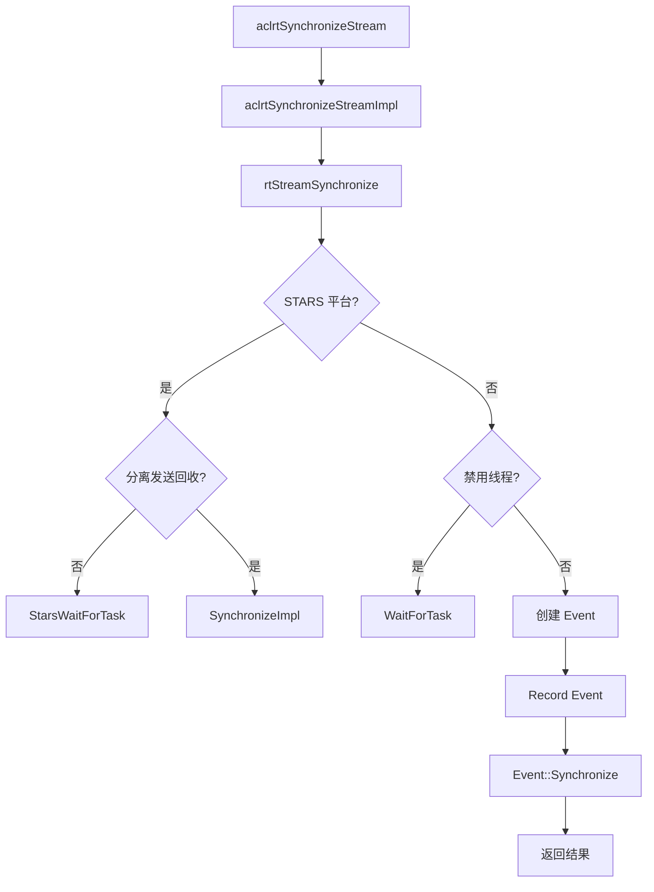
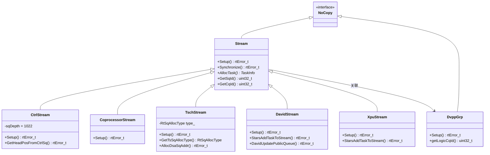
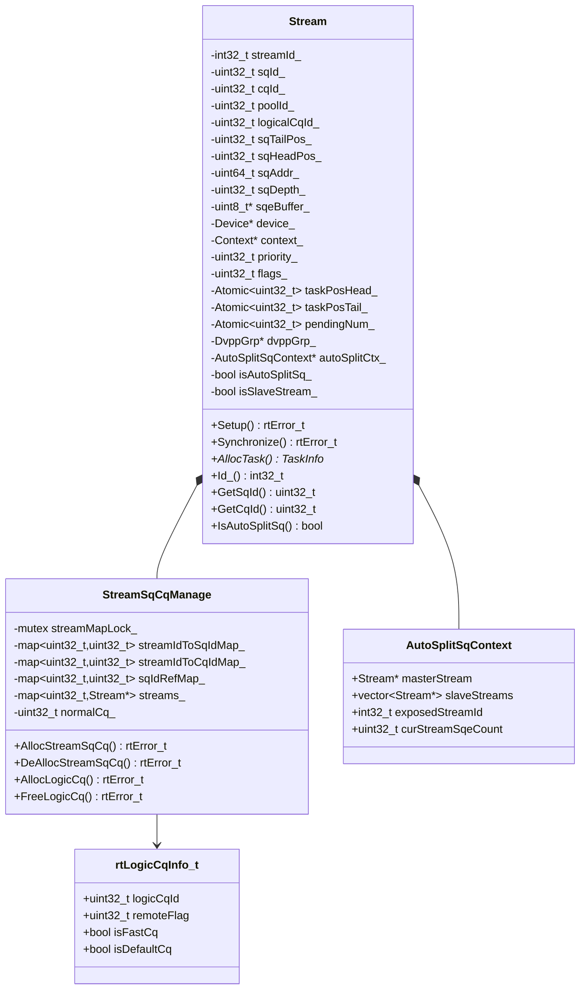

# Stream 模块架构

## 1. 模块概述

- **功能介绍**：Stream 模块负责管理任务队列，实现异步执行和同步机制。通过 SQ（Submission Queue）和 CQ（Completion Queue）机制与硬件交互，支持多种流类型（普通流、控制流、协处理器流、TSCH流、David流、XPU流）。
- **设计目标**：
  - 提供高效的异步任务执行机制
  - 支持多种流类型适配不同场景
  - 实现任务队列管理和同步机制
  - 支持 SQ/CQ 资源管理和复用
  - 支持流捕获功能（ACL Graph）
  - 支持自动切分 SQ 模式

## 2. 使用场景与对外接口

### 2.1 使用场景

- **场景一**：创建流并提交任务
  ```cpp
  aclrtStream stream;
  aclrtCreateStream(&stream);  // 创建流
  aclrtLaunchKernel(stream, ...);  // 提交内核任务
  aclrtSynchronizeStream(stream);  // 等待完成
  ```

- **场景二**：多流并行执行
  ```cpp
  aclrtStream stream1, stream2;
  aclrtCreateStream(&stream1);
  aclrtCreateStream(&stream2);
  // 在不同流上并行执行任务
  aclrtLaunchKernel(stream1, kernel1, ...);
  aclrtLaunchKernel(stream2, kernel2, ...);
  ```

- **场景三**：事件同步
  ```cpp
  aclrtRecordEvent(event, stream1);  // 在 stream1 记录事件
  aclrtStreamWaitEvent(stream2, event);  // stream2 等待事件
  ```

- **场景四**：带配置创建流
  ```cpp
  aclrtStream stream;
  aclrtCreateStreamWithConfig(&stream, 0, ACL_STREAM_FAST_SYNC);  // 创建快速同步流
  ```

### 2.2 对外接口

#### 核心接口

| 接口 | 头文件位置 | 说明 |
|------|------------|------|
| `aclrtCreateStream()` | `include/external/acl/acl_rt.h` | 创建流 |
| `aclrtCreateStreamWithConfig()` | `include/external/acl/acl_rt.h` | 带优先级和标志创建流 |
| `aclrtDestroyStream()` | `include/external/acl/acl_rt.h` | 销毁流 |
| `aclrtDestroyStreamForce()` | `include/external/acl/acl_rt.h` | 强制销毁流 |
| `aclrtSynchronizeStream()` | `include/external/acl/acl_rt.h` | 同步流 |
| `aclrtStreamQuery()` | `include/external/acl/acl_rt.h` | 查询流状态 |
| `aclrtStreamWaitEvent()` | `include/external/acl/acl_rt.h` | 流等待事件 |

#### 扩展接口

| 接口 | 头文件位置 | 说明 |
|------|------------|------|
| `aclrtSynchronizeStreamWithTimeout()` | `include/external/acl/acl_rt.h` | 带超时同步流 |
| `aclrtStreamGetPriority()` | `include/external/acl/acl_rt.h` | 获取流优先级 |
| `aclrtStreamGetFlags()` | `include/external/acl/acl_rt.h` | 获取流标志 |
| `aclrtStreamAbort()` | `include/external/acl/acl_rt.h` | 终止流执行 |
| `aclrtStreamGetId()` | `include/external/acl/acl_rt.h` | 获取流 ID |
| `aclrtGetStreamAvailableNum()` | `include/external/acl/acl_rt.h` | 获取可用流数量 |
| `aclrtStreamWaitEventWithTimeout()` | `include/external/acl/acl_rt.h` | 流等待事件带超时 |

#### 流属性接口

| 接口 | 头文件位置 | 说明 |
|------|------------|------|
| `aclrtSetStreamAttribute()` | `include/external/acl/acl_rt.h` | 设置流属性 |
| `aclrtGetStreamAttribute()` | `include/external/acl/acl_rt.h` | 获取流属性 |
| `aclrtSetStreamFailureMode()` | `include/external/acl/acl_rt.h` | 设置流失败模式 |
| `aclrtSetStreamOverflowSwitch()` | `include/external/acl/acl_rt.h` | 设置流溢出开关 |
| `aclrtGetStreamOverflowSwitch()` | `include/external/acl/acl_rt.h` | 获取流溢出开关 |

#### 流控制接口

| 接口 | 头文件位置 | 说明 |
|------|------------|------|
| `aclrtActiveStream()` | `include/external/acl/acl_rt.h` | 激活流 |
| `aclrtSwitchStream()` | `include/external/acl/acl_rt.h` | 切换流 |
| `aclrtStreamStop()` | `include/external/acl/acl_rt.h` | 停止流 |
| `aclrtPersistentTaskClean()` | `include/external/acl/acl_rt.h` | 清理持久任务 |

#### 流捕获接口（aclmdlRI）

| 接口 | 头文件位置 | 说明 |
|------|------------|------|
| `aclmdlRICaptureBegin()` | `include/external/acl/acl_rt.h` | 开始流捕获 |
| `aclmdlRICaptureEnd()` | `include/external/acl/acl_rt.h` | 结束流捕获 |
| `aclmdlRICaptureGetInfo()` | `include/external/acl/acl_rt.h` | 获取捕获信息 |
| `aclmdlRICaptureTaskGrpBegin()` | `include/external/acl/acl_rt.h` | 开始任务组捕获 |
| `aclmdlRICaptureTaskGrpEnd()` | `include/external/acl/acl_rt.h` | 结束任务组捕获 |
| `aclmdlRICaptureTaskUpdateBegin()` | `include/external/acl/acl_rt.h` | 开始任务更新捕获 |
| `aclmdlRICaptureTaskUpdateEnd()` | `include/external/acl/acl_rt.h` | 结束任务更新捕获 |

#### 流配置接口

| 接口 | 头文件位置 | 说明 |
|------|------------|------|
| `aclrtCreateStreamConfigHandle()` | `include/external/acl/acl_rt.h` | 创建流配置句柄 |
| `aclrtDestroyStreamConfigHandle()` | `include/external/acl/acl_rt.h` | 销毁流配置句柄 |
| `aclrtSetStreamConfigOpt()` | `include/external/acl/acl_rt.h` | 设置流配置选项 |
| `aclrtCreateStreamV2()` | `include/external/acl/acl_rt.h` | 带配置创建流 |

## 3. 架构总览

### 整体设计思路

Stream 采用 SQ/CQ 异步机制实现任务执行：任务通过 SQ 提交到硬件，硬件执行完成后通过 CQ 返回结果。Stream 维护任务队列（taskPosHead/taskPosTail），支持任务分配、回收和同步。继承自 NoCopy 基类防止拷贝。

### 架构分层图



### 核心模块交互图



## 4. 详细设计

### 4.1 核心流程

#### 流创建流程



**关键代码**：

```cpp
// 文件位置：src/acl/aclrt_impl/stream.cpp:33-50
aclError aclrtCreateStreamImpl(aclrtStream *stream) {
    rtStream_t rtStream = nullptr;
    const rtError_t rtErr = rtStreamCreate(&rtStream, 
        static_cast<int32_t>(RT_STREAM_PRIORITY_DEFAULT));
    if (rtErr != RT_ERROR_NONE) {
        return ACL_GET_ERRCODE_RTS(rtErr);
    }
    *stream = static_cast<aclrtStream>(rtStream);
    return ACL_SUCCESS;
}

// 文件位置：src/runtime/core/src/stream/stream.cc:606-788
rtError_t Stream::Setup() {
    // 设置 SQ 深度
    const uint32_t rtsqDepth = 
        (((flags_ & RT_STREAM_HUGE) != 0U) && 
         (device_->GetDevProperties().maxTaskNumPerHugeStream != 0)) ?
            device_->GetDevProperties().maxTaskNumPerHugeStream :
            device_->GetDevProperties().rtsqDepth;
    SetSqDepth(rtsqDepth);

    // 分配 streamId
    error = device_->Driver_()->StreamIdAlloc(&streamId_, device_->Id_(), 
                                               device_->DevGetTsId(), priority_);
    
    // 分配 SQ/CQ
    error = stmSqCqManage->AllocStreamSqCq(this, priority_, 0U, tmpSqId, tmpCqId);
    sqId_ = tmpSqId;
    cqId_ = tmpCqId;

    // 分配逻辑 CQ
    error = AllocLogicCq(isDisableThread, starsFlag, stmSqCqManage);
    
    // 创建任务资源
    CreateStreamTaskRes();
    error = CreateStreamArgRes();
    
    return RT_ERROR_NONE;
}
```

#### 任务提交流程



**关键代码**：

```cpp
// 文件位置：src/runtime/core/src/stream/stream.cc:4544-4579
TaskInfo* Stream::AllocTask(TaskInfo* pTask, tsTaskType_t taskType, 
                            rtError_t& errorReason, uint32_t sqeNum,
                            UpdateTaskFlag flag) {
    // 任务组更新场景
    if (IsTaskGroupUpdate()) {
        TaskInfo* updateTask = nullptr;
        if (flag == UpdateTaskFlag::SUPPORT) {
            errorReason = UpdateTask(&updateTask);
            return updateTask;
        }
    }

    // 捕获模式场景
    if (GetCaptureStatus() != RT_STREAM_CAPTURE_STATUS_NONE) {
        TaskInfo* captureTask = pTask;
        const rtError_t error = AllocCaptureTask(taskType, sqeNum, &captureTask);
        if (error != RT_ERROR_STREAM_CAPTURE_EXIT) {
            errorReason = error;
            return error == RT_ERROR_NONE ? captureTask : nullptr;
        }
    }

    // 正常分配
    if (taskResMang_ == nullptr) {
        return device_->GetTaskFactory()->Alloc(this, taskType, errorReason);
    } else {
        pTask->stream = this;
        return pTask;
    }
}
```

#### 流同步流程



**关键代码**：

```cpp
// 文件位置：src/acl/aclrt_impl/stream.cpp:132-149
aclError aclrtSynchronizeStreamImpl(aclrtStream stream) {
    const rtError_t rtErr = rtStreamSynchronize(static_cast<rtStream_t>(stream));
    if (rtErr != RT_ERROR_NONE) {
        return ACL_GET_ERRCODE_RTS(rtErr);
    }
    return ACL_SUCCESS;
}

// 文件位置：src/runtime/core/src/stream/stream.cc:1927-1982
rtError_t Stream::Synchronize(const bool isNeedWaitSyncCq, int32_t timeout) {
    // STARS 平台路径
    if (device_->IsStarsPlatform()) {
        if (!IsSeparateSendAndRecycle() || GetBindFlag()) {
            error = StarsWaitForTask(lastTaskId_, isNeedWaitSyncCq, timeout);
        } else {
            if (!IsSyncFinished()) {
                error = SynchronizeImpl(lastTaskId_, latestConcernedTaskId.Value(), timeout);
            }
        }
        return GetSynchronizeError(error);
    }

    // 禁用线程路径
    if (Runtime::Instance()->GetDisableThread()) {
        error = WaitForTask(lastTaskId_, isNeedWaitSyncCq, timeout);
        return GetSynchronizeError(error);
    }

    // 正常路径：通过 Event 同步
    Event *event = new Event(device_, RT_EVENT_DEFAULT, Context_(), true);
    error = event->Record(this);
    error = event->Synchronize(timeout);
    return error;
}
```

### 4.2 核心机制详解

#### SQ/CQ 异步机制

**设计思想**：通过 SQ（提交队列）和 CQ（完成队列）实现异步任务执行，任务提交到 SQ 后立即返回，硬件执行完成后通过 CQ 通知。

```cpp
// 文件位置：src/runtime/core/src/stream/stream.hpp
class Stream : public NoCopy {
protected:
    uint32_t sqId_;                     // SQ ID
    uint32_t cqId_;                     // CQ ID
    uint32_t sqTailPos_;                // SQ 尾位置
    uint32_t sqHeadPos_;                // SQ 头位置
    uint64_t sqRegVirtualAddr_;         // SQ 寄存器虚拟地址
private:
    uint64_t sqAddr_;                   // SQ 基地址 (最大 2M)
    uint32_t sqDepth_;                  // SQ 深度
    uint8_t* sqeBuffer_;                // SQE 缓冲区指针
    uint32_t sqeBufferSize_;            // SQE 缓冲区大小
    Atomic<uint32_t> taskPosHead_;      // 任务位置头 (Stars)
    Atomic<uint32_t> taskPosTail_;      // 任务位置尾 (Stars)
};
```

#### 多类型流支持

**设计思想**：支持多种流类型适配不同硬件架构和使用场景。



**派生类特点**：

| 类名 | 继承关系 | 特点 | 关键标志 |
|------|---------|------|---------|
| CtrlStream | Stream | 控制流，固定SQ深度1022 | isCtrlStream_=true |
| CoprocessorStream | Stream | 协处理器流，远程处理 | TSDRV_FLAG_REMOTE_ID |
| TschStream | Stream | TS调度流，DSA支持 | TSDRV_FLAG_ONLY_SQCQ_ID |
| DavidStream | Stream | David/Stars架构流 | 重写大量方法 |
| XpuStream | Stream | XPU架构流 | 重写核心方法 |
| DvppGrp | NoCopy | DVPP组管理（非Stream派生） | 提供logicCq |

#### 自动切分 SQ 模式

**设计思想**：当单个流的 SQ 深度达到上限时，自动创建 slave stream 扩展 SQ 容量，实现主从模式。

```cpp
// 文件位置：src/runtime/core/src/stream/stream.hpp:146-151
struct AutoSplitSqContext {
    Stream *masterStream{nullptr};            // slave stream 指向 master
    std::vector<Stream *> slaveStreams;       // master 的 slave 列表
    int32_t exposedStreamId{-1};              // 对外暴露的 streamId
    uint32_t curStreamSqeCount{0U};           // 当前已分配的 SQE 数量
};
```

**关键代码**：

```cpp
// 文件位置：src/runtime/core/src/stream/stream.cc:1003-1048
rtError_t Stream::SetupForAutoSplit() {
    error = InitAutoSplitBasicParams();
    error = AllocPosToTaskIdMap();
    error = CreateStreamArgRes();
    error = AllocStreamIdForAutoSplit();
    error = AllocAutoSplitContext();      // 创建 AutoSplitSqContext
    error = AllocSqeBufferForAutoSplit();
    error = AllocSqCqForAutoSplitWithRetry();
    SetMaxTaskId(isDisableThread);
    return RT_ERROR_NONE;
}
```

### 4.3 模块职责划分

| 模块 | 职责 | 位置 |
|------|------|------|
| aclrt API | 对外 ACL 接口 | `include/external/acl/acl_rt.h` |
| aclrt_impl | ACL 接口实现 | `src/acl/aclrt_impl/stream.cpp` |
| rt API | 内部 RT 接口 | `src/runtime/api/api_c_stream.cc` |
| Stream | 流管理核心类，继承自 NoCopy | `stream/stream.hpp` |
| StreamFactory | 静态流创建工厂，版本分发 | `stream/stream_factory.hpp` |
| StreamSqCqManage | SQ/CQ ID 管理与复用 | `stream/stream_sqcq_manage.hpp` |
| TaskAllocator | 任务对象分配器 | `task/task_allocator.hpp` |
| TaskResManage | 任务资源管理 | `task/task_res_manage/` |
| EngineStreamObserver | 流状态观察者 | `stream/engine_stream_observer.hpp` |
| DvppGrp | DVPP 组管理（非流类型） | `stream/dvpp_grp.hpp` |

### 4.4 核心数据结构



## 5. 关键文件索引

| 模块 | 文件路径 | 核心内容 |
|------|----------|----------|
| ACL 头文件 | `include/external/acl/acl_rt.h` | aclrt* 外部接口声明 |
| ACL 实现 | `src/acl/aclrt_impl/stream.cpp` | aclrt 接口实现（466行） |
| RT 接口 | `src/runtime/api/api_c_stream.cc` | rtStream* 内部接口 |
| Stream 核心类 | `src/runtime/core/src/stream/stream.hpp` | Stream 类定义（1700+行） |
| Stream 实现 | `src/runtime/core/src/stream/stream.cc` | Setup/Synchronize/AllocTask 实现（6000+行） |
| Stream 工厂 | `src/runtime/core/src/stream/stream_factory.hpp` | 静态 CreateStream 工厂方法 |
| SQ/CQ 管理 | `src/runtime/core/src/stream/stream_sqcq_manage.hpp` | SQ/CQ ID 分配与复用 |
| 控制流 | `src/runtime/core/src/stream/ctrl_stream.hpp` | CtrlStream 定义 |
| 协处理器流 | `src/runtime/core/src/stream/coprocessor_stream.hpp` | CoprocessorStream |
| TS调度流 | `src/runtime/core/src/stream/tsch_stream.hpp` | TschStream，DSA支持 |
| David流 | `src/runtime/core/src/stream/stream_david.hpp` | DavidStream，Stars架构 |
| XPU流 | `src/runtime/core/src/stream/stream_xpu.hpp` | XpuStream |
| DVPP组 | `src/runtime/core/inc/stream/dvpp_grp.hpp` | DvppGrp（非Stream派生） |
| 流创建分发 | `src/runtime/core/src/stream/v200/stream_creator_c.cc` | CreateStreamAndGet 实现 |

## 6. 性能优化策略

- **任务预分配**：TaskAllocator 预分配任务对象，减少分配开销
- **SQ/CQ 池化复用**：多 Stream 共享 SQ/CQ 资源，CQ 复用机制减少资源开销
- **原子状态管理**：taskPosHead/taskPosTail/pendingNum 使用原子操作，减少锁开销
- **异步回收**：支持异步任务回收，不阻塞任务提交
- **自动切分 SQ**：大任务量场景自动扩展 SQ 容量（主从模式）
- **快速同步模式**：ACL_STREAM_FAST_SYNC 标志支持快速同步
- **引用计数**：sqIdRefMap_ 管理 SQ ID 复用，避免频繁分配释放
- **版本分发工厂**：根据硬件版本（v100/v200/v201）自动选择最优 Stream 类型

_本模块文档基于源码分析，已验证所有 ACL 接口来自 `include/external/acl/acl_rt.h`，实现来自 `src/acl/aclrt_impl/stream.cpp`。_