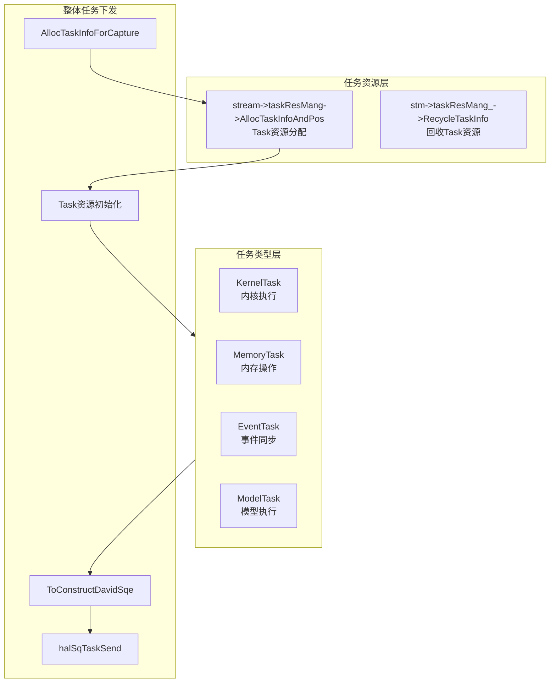
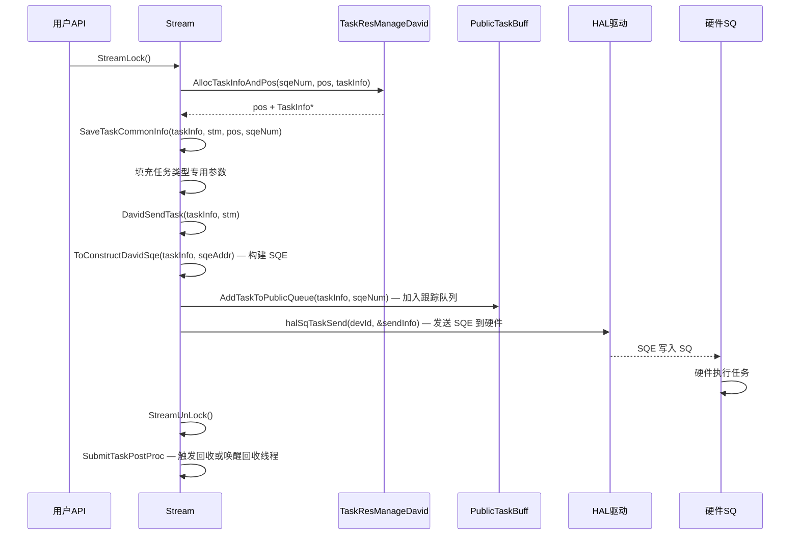
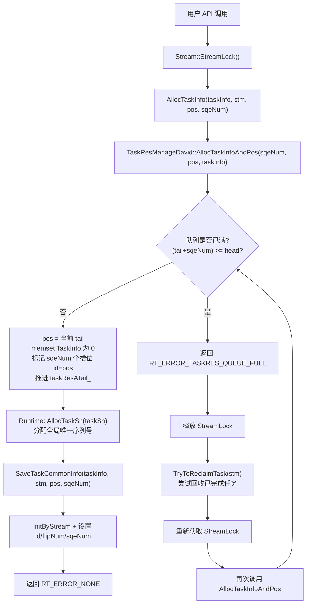
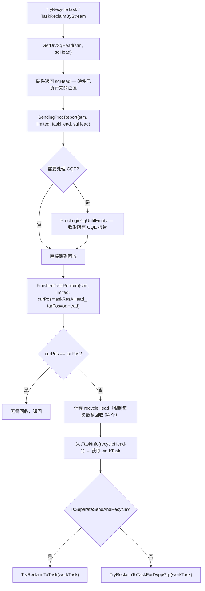

# Task 模块架构

## 1. 模块概述

- **功能介绍**：Task 模块负责管理各类任务的创建、执行和回收。支持多种任务类型（内核执行、内存操作、事件同步、模型执行等），通过 TaskInfo 结构体承载任务信息，Stream::taskResMang_ 负责任务对象分配和回收。
- **设计目标**：
  - 提供统一的任务管理接口
  - 支持多种任务类型扩展
  - 实现高效的任务分配和回收机制
  - 支持任务状态管理和错误处理

## 2. 使用场景与对外接口

### 2.1 使用场景示意

- **场景一**：内核执行任务
  ```cpp
  // 文件位置：src/runtime/core/src/launch/launch.cc
  DavinciKernelTask *task;
  stream->AllocTask(&taskInfo, TS_TASK_TYPE_KERNEL);
  // 填充内核参数
  task->kernel = kernel;
  task->args = args;
  stream->SubmitTask(taskInfo);
  ```

- **场景二**：内存操作任务
  ```cpp
  // 文件位置：src/runtime/core/src/task/memory_task.h
  MemoryTask *task;
  stream->AllocTask(&taskInfo, TS_TASK_TYPE_MEM);
  // 填充内存操作参数
  task->srcAddr = src;
  task->dstAddr = dst;
  task->size = size;
  ```

- **场景三**：事件同步任务
  ```cpp
  // 文件位置：src/runtime/core/src/task/event_task.h
  EventTask *task;
  stream->AllocTask(&taskInfo, TS_TASK_TYPE_EVENT_RECORD);
  task->event = event;
  ```

### 2.2 任务类型
| 任务枚举值 | 任务类型 | 头文件 | 说明 |
|------------|----------|--------|------|
| 0 | `TS_TASK_TYPE_KERNEL_AICORE` | `davinci_kernel_task.h` | AICore 内核执行 |
| 1 | `TS_TASK_TYPE_KERNEL_AICPU` | `davinci_kernel_task.h` | AICPU 内核 |
| 2 | `TS_TASK_TYPE_EVENT_RECORD` | `event_task.h` | 事件记录 |
| 3 | `TS_TASK_TYPE_STREAM_WAIT_EVENT` | `event_task.h` | 流等待事件 |
| 5 | `TS_TASK_TYPE_MEMCPY` | `memory_task.h` | 内存拷贝 |
| 6 | `TS_TASK_TYPE_MAINTENANCE` | `maintenance_task.h` | 维护操作（流/事件销毁） |
| 12 | `TS_TASK_TYPE_MODEL_MAINTAINCE` | `model_maintaince_task.h` | 模型绑定/解绑流 |
| 13 | `TS_TASK_TYPE_MODEL_EXECUTE` | `model_execute_task.h` | 模型执行 |
| 14 | `TS_TASK_TYPE_NOTIFY_WAIT` | `notify_task.h` | 通知等待 |
| 15 | `TS_TASK_TYPE_NOTIFY_RECORD` | `notify_task.h` | 通知记录 |
| 16 | `TS_TASK_TYPE_RDMA_SEND` | `rdma_task.h` | HCCL RDMA 拷贝 |
| 18 | `TS_TASK_TYPE_STREAM_SWITCH` | `cond_op_stream_task.h` | 条件流切换 |
| 19 | `TS_TASK_TYPE_STREAM_ACTIVE` | `cond_op_stream_task.h` | 激活流 |
| 20-22 | `TS_TASK_TYPE_LABEL_*` | `cond_op_label_task.h` | 标签控制流 |
| 23 | `TS_TASK_TYPE_PROFILER_TRACE` | `profiling_task.h` | 性能追踪 |
| 24 | `TS_TASK_TYPE_EVENT_RESET` | `event_task.h` | 事件重置 |
| 50 | `TS_TASK_TYPE_STARS_COMMON` | `common_task.h` | STARS 通用任务（DVPP/DSA） |
| 51-52 | `TS_TASK_TYPE_FFTS / FFTS_PLUS` | — | FFTS 任务 |
| 53 | `TS_TASK_TYPE_CMO` | `cmo_task.h` | 缓存维护操作 |
| 54 | `TS_TASK_TYPE_BARRIER` | `barrier_task.h` | 同步屏障 |
| 55 | `TS_TASK_TYPE_WRITE_VALUE` | `common_task.h` | 写值任务 |
| 56 | `TS_TASK_TYPE_MULTIPLE_TASK` | `davinci_multiple_task.h` | DVPP 多任务 |
| 57 | `TS_TASK_TYPE_TASK_SQE_UPDATE` | `model_update_task.h` | 更新任务 tiling/args |
| 66 | `TS_TASK_TYPE_KERNEL_AIVEC` | `davinci_kernel_task.h` | AI Vector 内核 |
| 68 | `TS_TASK_TYPE_MODEL_TO_AICPU` | `model_to_aicpu_task.h` | 模型加载/执行到 AICPU |
| 72 | `TS_TASK_TYPE_HOSTFUNC_CALLBACK` | `common_task.h` | Host 函数回调 |
| 86 | `TS_TASK_TYPE_TASK_TIMEOUT_SET` | `timeout_set_task.h` | 任务超时配置 |
| 92 | `TS_TASK_TYPE_REDUCE_ASYNC_V2` | `reduce_task.h` | 异步 Reduce V2 |
| 96 | `TS_TASK_TYPE_MODEL_LOAD` | `model_graph_task.h` | 模型加载 |
| 98 | `TS_TASK_TYPE_FLIP` | `common_task.h` | Flip 任务（taskId 回卷） |
| 100 | `TS_TASK_TYPE_UPDATE_ADDRESS` | `common_task.h` | Tiny 地址更新 |
| 101 | `TS_TASK_TYPE_MODEL_TASK_UPDATE` | `model_update_task.h` | 模型信息更新 |
| 107 | `TS_TASK_TYPE_FUSION_KERNEL` | `kernel_fusion_task.h` | 融合内核任务 |
| 110-112 | `TS_TASK_TYPE_DAVID_EVENT_*` | `event_task.h` | David 事件（record/wait/reset） |
| 113-114 | `TS_TASK_TYPE_MEM_WRITE/WAIT_VALUE` | `common_task.h` | 内存写值/等值 |
| 116-132 | `TS_TASK_TYPE_DQS_*` | — | DQS 任务族（enqueue/dequeue/prepare 等） |
| 126-127 | `TS_TASK_TYPE_CAPTURE_*` | — | Capture 记录/等待 |
| 129-130 | `TS_TASK_TYPE_IPC_*` | — | IPC 记录/等待 |

## 3. 架构总览

### 整体设计思路

Task 模块整体演进方向：Stream上的 taskResMang_ 作为分配器来管理Task对象资源。进行task资源分配和回收，配合业务api完成Task下发和任务回收。

### 架构分层图


### David 下发流程




## 4. 详细设计

### 4.1 核心流程

**关键代码**：

**DavidSendTask 核心逻辑** (`task_david.cc:497-589`)：

```cpp
rtError_t DavidSendTask(TaskInfo *taskInfo, Stream *stm) {
    const uint16_t pos = taskInfo->id;
    uint64_t sqBaseAddr = stm->GetSqBaseAddr();
    
    // 1. 确定 SQE 写入目标
    rtDavidSqe_t *sqeAddr = davidSqe;  // 默认栈上临时缓冲
    if (sqBaseAddr != 0ULL) {
        // 硬件 SQ 模式：直接写到设备 SQ 内存
        sqeAddr = RtPtrToPtr<rtDavidSqe_t*>(sqBaseAddr + (pos << SHIFT_SIX_SIZE));
    }
    
    // 2. 构建 SQE 内容
    ToConstructDavidSqe(taskInfo, sqeAddr, sqBaseAddr);
    
    // 3. 加入 public queue（用于回收时遍历）
    AddTaskToPublicQueue(taskInfo, taskInfo->sqeNum);
    
    // 4. Auto-split 模式：SQE 写入 host 缓冲
    if (stm->IsAutoSplitSq()) {
        return WriteAutoSplitSqeToHostBuffer(taskInfo, stm, sqeAddr);
    }
    
    // 5. Software SQ 模式：拷贝到 host SQ buffer
    if (stm->IsSoftwareSqEnable()) {
        memcpy_s(stm->GetSqeBuffer() + sizeof(rtStarsSqe_t) * taskInfo->pos, ...);
        return error;
    }
    
    // 6. 硬件 SQ 模式：通过 driver 发送
    struct halTaskSendInfo sendInfo = {...};
    drvError_t drvRet = halSqTaskSend(devId, &sendInfo);  // DRV 层提交
}
```

### 4.2 核心机制详解

#### 4.2.1 TaskInfo 任务信息结构

**设计思想**：TaskInfo 作为任务的统一载体，包含任务类型、参数、状态、位域标记等信息。通过 union 存储不同任务类型的专用信息结构。

```cpp
// 文件位置：core/inc/task/task_info.hpp
typedef struct tagTaskInfoStru {
    Stream *stream;              // 所属流
    const char_t *typeName;      // 任务类型名称
    tsTaskType_t type;           // 任务类型枚举
    uint64_t taskTrackTimeStamp; // 追踪时间戳
    uint32_t tid;                // 线程 ID
    uint32_t error;              // 错误码
    uint32_t drvErr;             // 驱动错误码
    uint32_t errorCode;          // 错误码
    uint32_t taskSn;             // 流水号（profiling 用）
    uint32_t pos;                // SQ 位置（David 用）
    uint32_t stmArgPos;          // 流参数位置
    uint32_t liteStreamResId;    // Lite 流资源 ID
    uint32_t modelSeqId;         // 模型序列 ID
    uint16_t liteTaskResId;      // Lite 任务资源 ID
    uint16_t mte_error;          // MTE 错误
    uint16_t id;                 // 任务 ID
    uint16_t flipNum;            // 翻转计数（taskId 回卷）
    uint8_t profEn;              // Profiling 启用标志
    uint8_t updateFlag;          // 更新标志（KEEP/UPDATE/DISABLE）
    // 位域标记：
    uint8_t serial : 1;          // 串行 ID 模式
    uint8_t terminal : 1;        // 终端标志
    uint8_t bindFlag : 1;        // 模型绑定流标志
    uint8_t preRecycleFlag : 1;  // 预回收标志
    uint8_t isCqeNeedConcern : 1; // CQE 需关注
    uint8_t isNeedStreamSync : 1; // 需流同步
    uint8_t isForceCycle : 1;    // 强制循环标志
    uint8_t isValidInO1 : 1;     // O1 回收模式有效
    uint8_t isRingbufferGet : 1;  // Ringbuffer 已获取
    uint8_t isUpdateSinkSqe : 1;  // 更新 Sink SQE
    uint8_t isNoRingbuffer : 1;   // 无 Ringbuffer
    uint8_t taskOwner : 1;        // 用户/内部任务
    uint8_t resv : 4;
    uint8_t sqeNum : 7;           // SQE 数量（David 多 SQE）
    uint8_t needPostProc : 1;     // 需后处理（DVPP cmdlist）
    std::shared_ptr<PCTrace> pcTrace; // PC 追踪
    union { ... } u;              // 各任务类型专用信息
    rtPkgDesc pkgStat[RT_PACKAGE_TYPE_BUTT]; // 包统计
} TaskInfo;
```
### 4.3 资源分配流程

### 4.3.1 TaskRes — 环形队列节点
```cpp
// task_res.hpp:25-28
struct TaskRes {
    TaskInfo taskInfo;     // 任务描述信息
    void* copyDev;         // PCIe BAR 缓冲区（仅 v100 使用，David/XPU 为 null）
};
```

### 4.3.2 David 分配流程



**核心分配代码**：

```cpp
// task_res_da.cc:110-144
rtError_t TaskResManageDavid::AllocTaskInfoAndPos(uint32_t sqeNum, uint32_t &pos, TaskInfo **task, bool needLog) {
    const uint16_t head = taskResAHead_.Value();
    uint16_t tail = taskResATail_.Value();
    const uint32_t taskDesTailIdx = (tail + sqeNum) % taskPoolNum_;
    
    // 满判断：考虑环形队列翻转
    if (((tail < head) && ((tail + sqeNum) >= head)) ||
        ((tail > head) && ((tail + sqeNum) >= taskPoolNum_) && (taskDesTailIdx >= head))) {
        return RT_ERROR_TASKRES_QUEUE_FULL;
    }
    
    pos = tail;
    *task = &taskRes_[pos].taskInfo;
    (void)memset_s(*task, sizeof(TaskInfo), 0, sizeof(TaskInfo));
    
    // 多 SQE 任务：所有 sqeNum 个槽位共享同一个 id（= pos）
    while (tail != taskDesTailIdx) {
        taskRes_[tail].taskInfo.id = pos;
        tail = (tail + 1U) % taskPoolNum_;
    }
    
    taskResATail_.Set(tail);   // 原子推进 tail
    allocNum_++;                // 累计分配计数（用于周期回收触发）
    return RT_ERROR_NONE;
}
```

**多 SQE 设计**：一个任务可能占用多个 SQE 槽位（如 `sqeNum=2`），所有槽位 `id` 都指向首位置 `pos`。回收时按 `sqeNum` 批量推进 head。

**队列满时的回收重试**：

```cpp
// task_david.cc:393-433
rtError_t AllocTaskInfo(TaskInfo **taskInfo, Stream *stm, uint32_t &pos, uint32_t sqeNum) {
    TaskResManageDavid *taskResMang = ...;
    rtError_t error = taskResMang->AllocTaskInfoAndPos(sqeNum, pos, taskInfo);
    
    while (error == RT_ERROR_TASKRES_QUEUE_FULL) {
        // 释放 StreamLock，尝试回收
        stm->StreamUnLock();
        TryToReclaimTask(stm, needLog);  // 调用 TaskReclaimByStream 或唤醒回收线程
        stm->StreamLock();
        // 重试分配
        error = taskResMang->AllocTaskInfoAndPos(sqeNum, pos, taskInfo, needLog);
    }
    if (error == RT_ERROR_NONE) {
        Runtime::Instance()->AllocTaskSn((*taskInfo)->taskSn);
    }
    return error;
}
```

## 5. 任务回收流程

### 5.1 David 回收触发时机

| 触发条件 | 调用方式 | 说明 |
|----------|---------|------|
| 每 64 个任务下发后 | `TryRecycleTask(stm)` | 周期性回收，`allocNum_ % 64 == 0` 时触发 |
| 队列满时 | `TryToReclaimTask(stm)` | 分配失败后主动回收腾出空间 |
| 流同步（Synchronize）时 | `TaskReclaimByStream(stm, false)` | 等待所有任务完成 |
| 流销毁（TearDown）时 | `TaskReclaimByStream(stm, false)` | 清空所有任务 |
| 独立回收线程 | `RecycleThreadDoForStarsV2` | `IsSeparateSendAndRecycle()` 模式 |

### 5.2 David 回收主流程



### 5.3 TryReclaimToTask 详细逻辑

```cpp
// task_recycle_common_base.cc:164-208
void TryReclaimToTask(TaskInfo *workTask) {
    Stream *stm = workTask->stream;
    const uint16_t endTaskSqPos = workTask->id;  // 回收终点位置
    uint16_t delPos = 0U;
    TaskInfo *delWorkTask = nullptr;
    bool earlyBreakFlag = false;
    
    // 遍历 publicTaskBuff_，从 head 到 endTaskSqPos
    do {
        GetPublicTask(stm, endTaskSqPos, delPos, &delWorkTask, earlyBreakFlag);
        if (breakFlag) break;
        
        // 回收 arg handle
        ArgManagePtr()->RecycleDevLoader(stm->GetArgHandle());
        
        // 释放任务类型专用资源 + Complete 回调
        TaskUnInitProc(delWorkTask);
        
    } while (delPos != endTaskSqPos);
    
    // 批量回收：推进 taskResAHead_
    if (delWorkTask != nullptr) {
        stm->SetRecycleEndTaskId(delWorkTask->id);
        // Arg 池回收
        davidStm->ArgReleaseStmPool(delWorkTask);
        // 环形队列 head 推进
        TaskResManageDavid::RecycleTaskInfo(delWorkTask->id, delWorkTask->sqeNum);
    }
}
```

### 5.4 RecycleTaskInfo 核心逻辑

```cpp
// task_res_da.cc:146-178
bool TaskResManageDavid::RecycleTaskInfo(uint32_t pos, uint32_t sqeNum) {
    const uint16_t tail = taskResATail_.Value();
    const uint16_t headBeforeRecycle = taskResAHead_.Value();
    const uint32_t taskDesHeadIdx = (pos + sqeNum) % taskPoolNum_;
    
    // 有效性校验...
    
    // 标记所有 sqeNum 个槽位为已回收
    uint16_t head = headBeforeRecycle;
    while (head != taskDesHeadIdx) {
        taskRes_[head].taskInfo.id = UINT16_MAX;      // 标记回收
        taskRes_[head].taskInfo.stmArgPos = UINT32_MAX;
        head = (head + 1U) % taskPoolNum_;
    }
    taskResAHead_.Set(head);  // 原子推进 head
    
    return true;
}
```

**批量回收**：一次性推进 `taskResAHead_` 跨越 `sqeNum` 个槽位，而非逐个回收。

### 5.5 独立回收线程

```cpp
// task_recycle.cc:310-341
void RecycleThreadDoForStarsV2(Device *deviceInfo) {
    // 遍历设备上所有 stream
    for (const auto &id : streamIdList) {
        stream->StreamRecycleLock();
        stream->ProcArgRecycleList();     // 处理 arg 回收列表
        
        // 跳过空队列 / DVPP 绑定 / 非独立回收模式
        if (taskResMang->IsEmpty() || stream->IsBindDvppGrp() || !stream->IsSeparateSendAndRecycle()) {
            continue;
        }
        
        TaskReclaimForSeparatedStm(stream);
        //   → ProcLogicCqUntilEmpty(stm)  // 先收 CQE
        //   → RecycleTaskBySqHeadForRecyleThread(stm)  // 再根据 drv sqHead 回收
        
        stream->StreamRecycleUnlock();
    }
}
```

---

## 6. 关键文件索引

| 功能模块 | 文件路径 | 核心内容 |
|----------|---------|---------|
| TaskRes 基类 | `core/inc/task/task_res.hpp` | TaskRes 结构、TaskResManage 类声明 |
| TaskResManageDavid | `core/inc/task/task_res_da.hpp` | 原子 head/tail、AllocTaskInfoAndPos |
| TaskResManage 实现 | `core/src/task/task_res_manage/task_res.cc` | v100 分配/回收/Load |
| TaskResManageDavid 实现 | `core/src/task/task_res_manage/v200/task_res_da.cc` | David 分配/回收/回滚 |
| TaskInfo 定义 | `core/inc/task/task_info.hpp` | TaskInfo 结构体 |
| Stream 声明 | `core/src/stream/stream.hpp` | `taskResMang_` 字段 |
| DavidStream | `core/src/stream/stream_david.cc` | CreateStreamTaskRes、TearDown |
| David 任务下发 | `core/src/task/task_submit/v200/task_david.cc` | AllocTaskInfo、DavidSendTask |
| David 任务回收 | `core/src/task/task_recycle/v200/task_recycle.cc` | TryRecycleTask、回收线程 |
| 回收公共逻辑 | `core/src/task/task_recycle/v200/task_recycle_common_base.cc` | FinishedTaskReclaim、TryReclaimToTask |
---

## 7. 性能优化策略

- **任务预分配**：Stream创建的时 TaskResManage 预分配任务对象池，减少分配开销
- **异步回收**：回收与下发解耦，不阻塞任务下发
---

_本模块文档基于源码 `src/runtime/core/src/task/` 分析。_